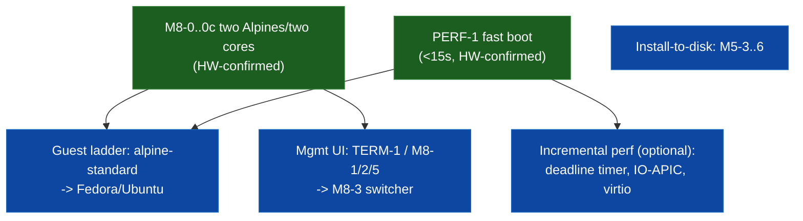

# Thin UEFI Hypervisor — Task List

Derived from `plan.md`. Each task has a stable ID and a `Deps:` line listing
the task IDs that must be **done** before it can start. Tasks with no unmet
deps are unblocked and can be picked up immediately; tasks in different
epics with no dependency between them can run in parallel.

Checkbox = done. `Deps: —` = no prerequisites.

---

## Execution status & dependency graph (reconciled 2026-07-20)

Snapshot of all open tasks vs. what's actually done. Done through: SETUP,
M0-1..4, M1, ADM, M2-1..7, M3-1..5, INT-1/2, INPUT-1..4, VIDEO-1/2/3,
M4-1..6 (incl. M4-6a/b1/b4/b5/c/d1..d4), CPUMSR-1/2, RAM-1/2, PCI-1/2,
ISO-1/2, M5-1/2, FW-1a..h, FW-2, VALID-1/3, RT-1 (a/b/c/d), RT-2 (a/b),
RT-3 (a/b), **M8-0, M8-0a, M8-0b (incl. own-AP bring-up + kvmclock +
per-vCPU de-globalization), M8-0c, and PERF-1**.

**THREE big HW-confirmed milestones since the last reconcile:**
1. **M4-6 (stock Alpine → `localhost login`)** — DONE, running entirely
   post-ExitBootServices on real AMD silicon.
2. **M8-0..0c (two Alpines on two dedicated cores)** — HW-CONFIRMED: two
   alpine-virt guests boot concurrently to `localhost login`, one per
   pinned AP (apic_id=1 and 2). Required de-globalizing the FW-1 singleton
   into `g_vms[]`, per-VM NPT, own-AP INIT-SIPI-SIPI bring-up, kvmclock,
   two per-vCPU concurrency fixes (pvclock map, pending-IRQ slot), and
   per-VM console routing.
3. **PERF-1 (the ~5-min boot)** — SOLVED: the guest VMCB's `g_pat` was
   uninitialized (=0=all-UC), so guest RAM was uncacheable under NPT. The
   one-line WB-default fix took boot from ~350-450s to **<15s to login on
   HW** (~25-30x; the stall VMRUN at RIP 0x835631 went 13629ms→94ms).

### Current frontier (the multi-VM foundation + fast boot are done)

Node colours: green = done · blue = ready (no unmet dep) · grey = blocked.



**READY NOW (no unmet dependency), roughly in value order:**
- **Guest ladder** (per the 2026-07-19 roadmap, now unblocked by M8-0..0c
  + PERF-1): boot **alpine-standard** under hype as the intermediate rung
  (also the clean same-kernel perf baseline vs the 90s native-standard),
  then a heavy distro (**Fedora/Ubuntu**).
- **Management UI / multi-VM UX**: `TERM-1` (GOP terminal), `M8-1`/`M8-2`/
  `M8-5`, → `M8-3` VM switcher — now that two VMs actually run.
- **Install-to-disk chain**: `M5-3 → M5-4 → M5-5 → M5-6` (VALID-3 ✓ done).
- **Optional incremental perf** (no longer urgent — boot is <15s): one-shot
  deadline host timer (trims now-tiny 1kHz INTR waste), IO-APIC (M4-6b3),
  virtio-blk/virtio-console. See the PERF-1 notes for why these were NOT the
  root cause.
- `RT-2c` (timebase/console polish) — minor leftover.
- Independent tracks: `NET-1`, `M7-1`/`M7-3`.
- real-hardware-gated (physical run, not code): `M0-5`, `M2-8`, `M3-6`.

**Critical paths (→ = "then"):**
- ~~Boot an OS installer: **FW-1h → M4-6**~~ — DONE (Alpine → login, HW).
- ~~Post-EBS execution: **RT-1 → RT-2 → RT-3**~~ — DONE (HW).
- ~~Multi-VM foundation: **M8-0 → M8-0a → M8-0b → M8-0c**~~ — DONE (two
  Alpines on two cores, HW-confirmed).
- ~~Fast boot: **PERF-1**~~ — DONE (<15s, HW-confirmed).
- Guest ladder (next): **alpine-standard → Fedora/Ubuntu** (needs no new
  infra; a driver/complexity climb + real-HW validation each rung).
- Install an OS to disk: **VALID-3 ✓ → M5-3 → M5-4 → M5-5 → M5-6**
  (M5-5 also needs NET-5)
- Networking: **NET-1 → {NET-2 (needs VALID-2), NET-3 (needs VALID-1 ✓),
  NET-4 → NET-4a → NET-4b} → NET-5**
- Windows guest: **M7-1 → M7-2 → M7-4** (M7-3 parallel)
- BSD guest: **M5-6 → M6-1 → M6-2**
- Multi-VM + management UI: **{M8-1, M8-2, M8-5} → M8-3 → M8-3a**, and
  **M8-4 (needs M6-2 + M7-4) → M8-6/M8-7 → M8-8 → M8-9 → M8-10**;
  **TERM-1 → TERM-2 (needs M8-2/4/7) / TERM-3 (needs M8-3)**
- Persistence/power: **M9-1..6**; hardening/polish: **M10**, `STRETCH-*`,
  `DOCS-1`; deferred to v2: `V2-TELEM-*`, `V2-MGMT-1`

**BLOCKED (immediate blocker in parens):**
VALID-2/4 (VALID-1 ✓ — now unblocked) · NET-2 (VALID-2) · NET-4/4a/4b/5 (NET-1) ·
M5-4 (M5-3) · M5-5 (M5-4/NET-5) · M5-6 (M5-5) ·
M6-1 (M5-6) · M6-2 (M6-1) · M7-2 (M7-1) · M7-4 (M7-2/M7-3) ·
M8-3 (M8-1) · M8-3a (M8-3) · M8-4 (M6-2/M7-4) · M8-6/M8-7 (M8-4) ·
M8-8 (M8-7) · M8-9 (M8-3/5/6/8) · M8-10 (M8-9) · TERM-2 (M8) · TERM-3 (M8-3) ·
M9/M10/STRETCH/DOCS (long chains) · V2-* (deferred).
(M8-0..0c and PERF-1 are no longer blocked — all DONE.)

**Decomposition status:** the READY set above is atomic and scoped (each is
a single, self-contained task with detailed scope notes in its section). The
BLOCKED set is already milestone-decomposed here with Deps + scope; per this
file's own "revisit when actually scoped/started" convention (see TERM-3),
deeper sub-scoping of far-off blocked milestones (M6, M7-2/4, M8-3..10, M9,
M10, NET-2..5) is deferred until they unblock — decomposing blocked work now
would be premature.

**Tracking model (decided 2026-07-18):** this file is the single source of
truth — the stable IDs, the `Deps:` graph, and the detailed `DONE — …`
engineering notes all live here, versioned with the code. The mermaid DAG
above is the visual dependency view for the active frontier (GitHub renders
it in-repo); refresh it whenever the frontier moves. The ephemeral session
task tracker (TaskCreate) holds only the *active working set*, not a mirror
of every task — task.md is authoritative. (Considered and declined a
GitHub-Projects kanban migration: it would exile the detailed notes out of
the tree for little gain on a solo, terminal-native project.)

### Priority-to-complete queue (reconciled 2026-07-20)

Audit note: all `[~]` in-progress tasks were found to be **actually done** and
were closed (`M4-6b`, `M4-6d4`, `FW-1f`) along with a batch of stale-`[ ]`
completed work (`M8-0/0a/0b/0c`, `PERF-1`, `RT-2/2c/3`, `M4-6b5`). **Abandoned
check:** no task is genuinely abandoned — every open task is either *deferred
but still valid* or *future/not-started*. The remaining open work in priority
order:

1. **GLADDER (active): alpine-standard bring-up** — `GLADDER-1` (absorb+log
   unhandled MMIO; the diagnostic enabler) → `GLADDER-2` (scope the enumerated
   MMIO regions) → `GLADDER-3` (GRUB drive-through) → `GLADDER-4` (two
   -standard on two cores + clean same-kernel perf baseline). Then a heavy
   distro (Fedora/Ubuntu).
2. **`M4-6b3` (IO-APIC)** — deferred M4-6 enhancement, now doubly relevant:
   it's what a fuller kernel's chipset/interrupt path wants (GLADDER) *and* an
   incremental-perf lever. **`M4-6b2` (ACPI MADT)** rides alongside it.
3. **Incremental perf (optional, boot is already <15s):** one-shot deadline
   host timer (trims the now-tiny 1kHz INTR waste); virtio-blk / virtio-console.
4. **Install-to-disk:** `M5-3 → M5-4 → M5-5 → M5-6` (VALID-3 ✓).
5. **Management UI:** `TERM-1`, `M8-1`/`M8-2`/`M8-5` → `M8-3` switcher.
6. **Deferred-but-valid (pick up when their track activates):** `VALID-2/4`
   (before NET-2 / other DMA), `VMX-1/2/3` (Intel path — future), `NET-*`,
   `M6-*` (BSD), `M7-*` (Windows), `M8-4..10`, `M9-*`, `M10-*`.
7. **Real-HW validation gates (need a physical run, not code):** `M0-5`,
   `M2-8`, `M3-6`, `M8-10`.

---

**Minimum supported guest target (plan.md §1, decided 2026-07-14): Windows
(any 64-bit), Linux (any 64-bit), and BSD (any 64-bit) — no 32-bit guests.**
M3 validates the core VM-exit loop via a Linux-specific direct `bzImage` boot
(cheapest path, not the only supported one); M4+ guest-firmware work and M6's
dedicated BSD milestone bring Windows and BSD (and firmware-booted Linux) to
the same bar.

---

## SETUP — Pre-M0 readiness (plan.md §11)

- [x] **SETUP-1** — `git init`; add `LICENSE` (full GPLv3 text) and
  `.gitignore` for build artifacts.
  Deps: —
- [x] **SETUP-2** — Install and pin versions: C cross-toolchain targeting
  `x86_64-unknown-uefi` (clang/lld or GNU-EFI), QEMU, OVMF firmware image.
  Deps: —
- [x] **SETUP-3** — Confirm Secure Boot can be disabled on both the Intel
  and AMD test machines.
  Deps: —
- [x] **SETUP-4** — Confirm both test machines expose a serial (or
  equivalent) fallback debug channel available before GOP init succeeds.
  Deps: —
- [x] **SETUP-5** — Settle debugging workflow: QEMU `-s -S` + GDB against a
  debug build with symbols, plus serial logging as the real-hardware path.
  Deps: SETUP-2
- [x] **SETUP-6** — Write minimal freestanding primitives: `printf`-equivalent
  over UEFI `ConOut`, and a panic/assert stub.
  Deps: SETUP-2

---

## M0 — UEFI hello world (plan.md §9 M0, §12)

- [x] **M0-1** — Scaffold repo layout per plan.md §7 (`/boot`, `/core`,
  `/arch`, `/devices`, `/storage`, `/net`, `/fw`, `/tools`, `/docs`).
  Deps: SETUP-1
- [x] **M0-2** — Minimal UEFI app: print "hype" via `ConOut`, return
  `EFI_SUCCESS` cleanly.
  Deps: M0-1, SETUP-6
- [x] **M0-3** — Dump the UEFI memory map.
  Deps: M0-2
- [x] **M0-4** — Validate build/boot/deploy loop in QEMU+OVMF.
  Deps: M0-3, SETUP-2
- [ ] **M0-5** — Validate build/boot/deploy loop on real Intel + AMD
  hardware.
  Deps: M0-3, SETUP-3, SETUP-4

  *AMD half confirmed 2026-07-14: full build/boot/deploy loop (own
  memory map dump, `ExitBootServices()`, own GDT/paging/IDT swap, timer
  tick loop) now runs cleanly on two different real AMD machines (a
  laptop and a Ryzen 9 5950X/B550 desktop, both 32GB RAM) via the USB
  test package (`tools/make-usb-package.sh`) -- see M2-8's note for the
  real bugs found and fixed along the way. Intel/VMX half still
  unvalidated -- no physical Intel test hardware reachable from this
  environment; that half of this checkbox stays open.*

---

## M1 — Boot Services exit + own kernel context (plan.md §9 M1)

- [x] **M1-1** — `hype.cfg` config parser (plan.md §5 schema: `vcpus`,
  `cpu_set`, `mem_mb`, `boot`, `install_media`, `target_disk`,
  `target_disk_size_gb`, `firmware`, `os_hint`, `net_mode`).
  Deps: M0-4, M0-5
- [x] **M1-2** — Own GDT/IDT.
  Deps: M0-4, M0-5
- [x] **M1-3** — Own paging.
  Deps: M0-4, M0-5
- [x] **M1-4** — `ExitBootServices()` sequence; hypervisor becomes the only
  kernel.
  Deps: M1-2, M1-3
- [x] **M1-5** — Serial console driver.
  Deps: M1-4
- [x] **M1-6** — GOP linear-framebuffer text renderer (bitmap font blitter)
  — reused later by the dashboard (§6b) and guest firmware GOP exposure
  (§6/§6c).
  Deps: M1-4
- [x] **M1-7** — Panic handler: halt cleanly with a message, via M1-5/M1-6.
  Deps: M1-5, M1-6
- [x] **M1-8** — Timer tick (PIT/HPET bring-up for the host itself).
  Deps: M1-4

---

## ADM — Startup admission control (plan.md §6i, §10 decision #14/#16)

- [x] **ADM-1** — Sum configured `mem_mb` across all VMs; reject startup if
  it (plus hypervisor/device reserve) exceeds physical RAM from the UEFI
  memory map.
  Deps: M1-1, M0-3
- [x] **ADM-2** — Sum configured `vcpus` against physical core count;
  reject if it can't be satisfied under 1:1 pinning.
  Deps: M1-1
- [x] **ADM-3** — Validate explicit `cpu_set` entries: cores exist, count
  matches `vcpus`, and no two VMs' `cpu_set` ranges overlap (hard reject on
  overlap, not a warning).
  Deps: ADM-2
- [x] **ADM-4** — Reject startup if any two VMs' `target_disk` resolve to
  the same `file:` path or `physical:` serial/GUID, or if any two VMs would
  resolve to the same persisted varstore file (security-critical — closes
  the gap between §6d's "exclusively owned" claim and what's actually
  enforced; found in security review, §10 decision #20).
  Deps: M1-1
- [x] **ADM-5** — Validate `net_peers`: every listed name resolves to a VM
  actually defined in `hype.cfg`, and both VMs in a pairing have
  `net_mode = nat`; reject startup otherwise (§10 decision #21) — keeps
  guest-to-guest connectivity an explicit, auditable opt-in rather than a
  typo silently no-op'ing or leaving an unintended VM reachable.
  Deps: M1-1

*Note: ADM-1..5 gate VM startup and must be complete before M8's
multi-VM concurrency milestone, even though early single-guest milestones
(M2/M3) don't yet exercise the multi-VM overlap checks.*

---

## M2 — VMX/SVM bring-up, single vCPU (plan.md §9 M2, §10 decision #6/#17)

- [x] **M2-1** — CPU feature detection (VMX/EPT vs. SVM/NPT) and
  `vmm_ops` vtable dispatch (`vmx_ops` / `svm_ops`).
  Deps: M1-4
- [x] **M2-2** — VMXON (Intel) / SVM mode enable (AMD).
  Deps: M2-1
- [x] **M2-3** — Minimal VMCS (Intel) / VMCB (AMD) construction.
  Deps: M2-2
- [x] **M2-4** — Enable APICv (Intel) / AVIC (AMD) — required from this
  milestone, not deferred.
  Deps: M2-3
- [x] **M2-5** — VM-exit handler dispatch loop skeleton.
  Deps: M2-3
- [x] **M2-6** — Guest RAM zeroing before first VM-entry, on every
  (re)start (§10 decision #15).
  Deps: M2-3
- [x] **M2-7** — Launch a hand-written `hlt`-loop guest; confirm VM-exit
  round trip.
  Deps: M2-4, M2-5, M2-6
- [ ] **M2-8** — Real-hardware validation (Intel + AMD).
  Deps: M2-7, SETUP-3, SETUP-4

  *AMD half confirmed 2026-07-14 on two real machines (a laptop and a
  Ryzen 9 5950X/B550 desktop, both 32GB RAM), via a dedicated USB test
  package (`tools/make-usb-package.sh`) carrying every M2-M4-5 test
  guest plus screen-visible debug checkpoints (`hype_debug_print()`,
  core/fatal.h/halt.c) bracketing every real-hardware-risky step --
  added specifically because `hype_fatal()` never printed via UEFI's
  own ConOut, and GOP console registration originally happened only
  after the test guests ran, making an early panic indistinguishable
  from a silent hang on a screen-only setup with no serial capture.
  Two real, non-obvious bugs found this way, neither reproducible under
  this project's QEMU/KVM nested-SVM dev environment:
  1. `HYPE_NPT_MAX_GB`/M3-5's guest-CR3 identity map were both hardcoded
     to 4GB while the host's own paging already used 64GB -- QEMU's
     small test VMs always load the image under 4GB, but real UEFI
     firmware on a 32GB machine loaded it just past 5GB, leaving the
     guest's own entry point unmapped and triple-faulting
     (VMEXIT_SHUTDOWN) on its first fetch. Fixed by tying both to
     `HYPE_PAGING_MAX_GB` directly (arch/x86_64/svm/npt.h).
  2. M2-7's real-mode guest pointed CS.base/SS.base straight at a
     static buffer's address; AMD SVM only implements the low 32 bits
     of most VMCB segment base fields (vmcb.h's own `hype_vmcb_seg_t`
     comment already flagged this), so real silicon silently truncated
     CS.base whenever that buffer landed above 4GB -- nested SVM under
     QEMU/KVM apparently honors the full 64-bit field regardless. Fixed
     by wiring up `EFI_BOOT_SERVICES.AllocatePages` (previously an
     unused stub) and explicitly allocating that guest's code+stack
     below 4GB via `AllocateMaxAddress` (boot/main.c).
  VMX/Intel half still completely open -- no physical Intel test
  hardware reachable from this environment, and VMX's vcpu_create/
  vcpu_run trampoline (deferred at M2-7, see vmx_ops.c) still doesn't
  exist. Downstream milestones have proceeded past this point by the
  same explicit user decision (2026-07-13) as M0-5.*

  *INTEL PROGRESS 2026-07-16 (commit a82c8b1): first real Intel-hardware
  run, on an Intel CPU (vmx=1 svm=0), 2611 MHz, 1024 MiB guest. The
  existing build LOCKED at "vmm: about to enable VMX" -- VMXON #GP into
  UEFI's exception handler. Root cause (confirmed on the metal): CR0.NE
  (bit 5) was clear but IA32_VMX_CR0_FIXED0=0x80000021 requires it, so
  VMXON faulted. Fixed by applying the SDM CR0/CR4 fixed bits before
  VMXON (hype_vmx_cr_with_fixed_bits, (cr|fixed0)&fixed1). Screen
  confirmed: CR0 0x80010013->0x80010033 (NE set), CR4 0x660->0x2660
  (VMXE), VMX_BASIC=0x3da0500..013 rev_id=0x13, **VMXON returned
  CF/fail=0 -> "vmm: VMX enabled"**. So **M2-2 VMXON is validated on real
  Intel silicon** (parity with the AMD SVM-enable). Guests then skip
  (vcpu_run still NULL) and it proceeds into the post-ExitBootServices
  runtime, where it HUNG at "about to load own paging (identity-mapping
  64 GB)...". Root cause (2nd finding, commit below): this machine's GOP
  framebuffer BAR is at host-physical 0x4000000000 (256GB) -- the iGPU's
  high-MMIO aperture, far above both the 8GB of RAM and hype's 64GB
  identity map. Loading hype's own CR3 (mapping only the low 64GB)
  unmapped the framebuffer, so the next hype_debug_print faulted (no IDT
  loaded yet) -> hard hang. The old code even commented "the framebuffer
  is just memory, identity-mapped by our own paging" -- true only when
  the BAR is under HYPE_PAGING_MAX_GB; a latent bug AMD's test machines
  never hit (their framebuffers sat under 64GB). Fixed by
  hype_paging_map_region_2mb(): after the low identity map, explicitly
  map the GOP FrameBufferBase/Size range (from gop->Mode) into hype's
  tables before the CR3 load. CONFIRMED on the next Intel run
  (2026-07-16): boot now reaches "vmx enabled" -> "vCPU launch not
  implemented yet" -> [remaining guests skip] -> screen blanks (GOP
  console-clear) -> "hype: Boot Services exited, hypervisor now running".
  So the full post-ExitBootServices runtime bring-up (own paging +
  framebuffer, IDT, timer/PIC/PIT + sti) executes on real Intel. All
  output after the console-clear is hype_serial_print (serial only),
  ending in hype_halt_forever(), so on this screen-only box the blanked
  "Boot Services exited" screen holding steady IS the successful terminal
  state -- the timer-loop proof-of-life just goes to an uncaptured serial
  port. **VMXON + the whole vendor-neutral runtime path are validated on
  real Intel silicon = M2-2 parity with AMD.** Not positively
  distinguishable on-screen from a hang at sti; a GOP-visible timer
  heartbeat (hype_debug_print renders to the framebuffer post-EBS, unlike
  serial-only hype_serial_print) would make it conclusive if wanted.
  NEXT for full Intel parity: the VMX vcpu_create/vcpu_run VM-entry/exit
  trampoline so guests actually launch (bigger piece; needs a longer HW
  window).*

  *REAL-AMD FW-1 finding 2026-07-16 -- RESOLVED, NOT A BUG (and a big
  validation win). FW-1 was run end-to-end on a real AMD box (ASUS
  VivoBook) for the first time (M2-8's AMD pass only covered M2-M4-5).
  Initial symptom: the guest OVMF reaches the UEFI Shell "Press ESC in
  5s to skip startup.nsh" prompt and appears to hang. A compact
  diagnostic build (commit 4d07a8e: decode-assist one-shot + ATAPI
  command/READ(10) counters surfaced as FW-1 milestones) showed on the
  metal:
    - "1st ATAPI READ(10) done -- CD data I/O works on real HW",
      READ(10) count climbing to 64+ (cmds=197) -- **the whole FW-1
      AHCI/ATAPI CD-read path works on real AMD, including the
      decode-assist MMIO decode that QEMU+KVM nested SVM never exercises
      (num_bytes_fetched is always 0 under QEMU).** This validates M4-5/
      ISO-2/FW-1h + the AHCI MMIO decode on real AMD silicon.
    - "BdsDxe: loading/starting Boot0002 UEFI HYPE VIRTUAL CD-ROM" then
      "UEFI Interactive Shell v2.2" + "FS0: .../CDROM(0x0)". OVMF
      correctly read + booted the CD; it lands in a shell because the
      disc IS a shell: tools/make-usb-package.sh defaults
      TEST_ISO=/usr/share/edk2/ovmf/UefiShell.iso (the 2.8MB ISO ISO-1
      reported: "read a real 2895872-byte ISO9660 image"), NOT the ~64MB
      Alpine ISO used in QEMU. So "drops to shell" = booted the shell ISO
      as designed.
    - It then panicked "exceeded 200000000 VM-exits ... guest stuck
      (reason=0x78 HLT)". Also expected: the UEFI shell busy-polls the
      keyboard (productive IOIO exits), so the 10s wall-clock idle-giveup
      (M4-6d2b) never triggers and the run hits the MAX_EXITS runaway
      guard. Correct guard behaviour for a guest that never progresses.
  CONCLUSION: no hype bug -- FW-1 works on real AMD; it was booting the
  wrong (shell) ISO. NEXT: rebuild the USB with the full Alpine ISO
  (TEST_ISO=<alpine>.iso tools/make-usb-package.sh) and watch the real
  Linux boot on real AMD -- the first chance to see whether M4-6d's
  QEMU-side stall (M4-6d2's libata async-probe plateau) reproduces on
  real AMD or behaves differently (real decode assists + real timing).*

- [ ] **VMX-1** — VMX vcpu_create + vcpu_run VM-entry/exit trampoline.
  The Intel counterpart of SVM's hype_svm_vcpu_run, deferred since M2-7
  because it needs real Intel HW to develop (vmx_ops.c's own comment;
  now unblocked -- VMXON validated on real Intel, M2-8). Scope: (a)
  vcpu_create -- finish the guest+host VMCS state (vmcs_hw.c already
  builds much of it; host RIP/RSP currently point at a halt stub) so a
  guest is launchable; (b) a hand-written VM-entry/exit asm trampoline
  (VMLAUNCH first entry, VMRESUME after) that saves/restores host GPRs
  around the transition and, because the CPU jumps to VMCS HOST_RIP on
  #VMEXIT (not "the next instruction" like SVM's VMRUN), re-enters C at a
  known point -- analogous to isr_stubs.S but for the VMX control-
  transfer model; (c) populate hype_vmexit_info_t from the VMCS
  (exit reason/qualification/guest-RIP/instruction-length via VMREAD).
  Ground it in the archived Intel SDM Vol 3C (VMCS fields, VM-entry/exit
  behaviour, App B field encodings). Develop via the USB build-and-report
  loop on the Intel box (screen-visible checkpoints, same as M2-8).
  Deps: M2-8 (VMXON validated on Intel), M2-3.
- [ ] **VMX-2** — Un-gate the M2-M4-5 test guests on VMX + port the guest
  handlers to read the VMCS. Every run_*_test has an `if (kind != SVM)
  return;` guard and the handlers (hype_svm_vcpu_handle_ioio/npf/cpuid/
  msr/ahci_npf, request_interrupt) read VMCB fields. Add the VMX
  equivalents (EPT for NPF, exit-qualification/instruction-info decode,
  VM-entry interruption-info for injection) so the same guests run on
  VMX. Most of this is writable + unit-testable WITHOUT Intel HW; only
  the run validation needs the box. Deps: VMX-1.
- [ ] **VMX-3** — Real Intel HW validation of VMX-1/VMX-2: the M2-M4-5
  guest set runs on the Intel box, reaching AMD's M2-8 parity (currently
  only VMXON-enable + the vendor-neutral runtime path are Intel-
  validated). Deps: VMX-2, M2-8.

---

## M3 — EPT + first real guest boot (plan.md §9 M3)

- [x] **M3-1** — EPT/NPT table construction (identity-mapped).
  Deps: M2-7
- [x] **M3-2** — 1:1 vCPU-to-pCPU pinning, including explicit `cpu_set`
  support.
  Deps: ADM-3, M2-7

  *Scope note: the real pinning mechanism is built and QEMU-validated
  -- EFI_MP_SERVICES_PROTOCOL dispatches the test guest's vCPU onto a
  specific, chosen non-BSP physical core (core/mp.c, boot/main.c),
  confirmed 5/5 clean runs with `-smp 2`. `hype_mp_pick_target_ap()`
  currently picks "any enabled non-BSP processor," not yet a specific
  core number driven by hype.cfg's parsed `cpu_set` list (ADM-3
  already validates that config, but nothing wires it to a real
  per-VM pinning decision yet) -- that's deferred to M8 alongside the
  rest of real multi-VM concurrency, matching every other
  single-instance-for-now scoping decision through M2/M3 (single VMCB,
  single AVIC/NPT table, ...).*
- [x] **M3-3** — Basic Linux boot protocol shim (direct `bzImage` boot, no
  firmware).
  Deps: M3-1

  *Scope note: parsing/construction logic only (setup-header
  validation, payload offset, 64-bit entry address, zero-page/E820
  construction), pure and 100%-tested against the documented Linux
  boot protocol -- not yet wired into an actual guest launch. That
  integration (loading a real bzImage, building guest page tables,
  VMRUNning it, confirming it actually runs) is M3-5's job once M3-4's
  device stubs exist too, per task.md's own dependency graph.*
- [x] **M3-4** — Minimal guest-visible device stubs: PIC/IOAPIC, PIT/HPET.
  Deps: M3-1

  *Scope note: implements the classic i8259 PIC + i8254 PIT pair (the
  same minimal choice real minimal VMMs like Firecracker make) rather
  than IOAPIC/HPET -- sufficient for a guest's early boot
  interrupt-controller/timer programming. Both are pure, tested
  register-level state machines (ICW1-4 init, OCW1/2/3, PIT
  mode/access/latch programming) -- not yet wired into an actual SVM
  IOIO-intercept dispatch (no guest has ever executed IN/OUT yet); that
  wiring, and validating a real guest programming these without
  hanging, is M3-5's job.*
- [x] **M3-5** — Boot a minimal Linux kernel end-to-end; validate
  APICv/AVIC interrupt delivery and the VM-exit loop under real device I/O.
  Deps: M3-3, M3-4, M2-4

  *Scope note: "boot a minimal kernel" done via a synthetic,
  hand-built bzImage (real setup_header validated through M3-3's
  shim, not bypassed) rather than a real production kernel -- same
  reasoning as M2-7's hand-written test guest: full control over the
  outcome, proving every new piece of plumbing actually works
  end-to-end (guest identity paging, long-mode VMCB construction, RSI
  delivery per the boot protocol, SVM IOIO interception with a real
  VM-exit loop that resumes the guest across exits, dispatch to
  M3-4's PIC/PIT stubs) before attempting a real, unpredictable
  kernel. Confirmed 5/5 clean QEMU/KVM runs: the guest halts cleanly
  after masking all PIC IRQs and latching+reading PIT channel 0,
  both observably reflected in the emulated devices' own state
  afterward. Real Fedora kernel boot attempt deferred as a stretch
  goal (user decision, 2026-07-14) -- expected to reach only early
  boot messages before panicking/hanging on missing ACPI/PCI/
  initramfs, which this hypervisor doesn't provide. Full AVIC
  interrupt-delivery validation (a guest's own ISR actually firing)
  is also deferred -- this pass enables AVIC's structural
  prerequisites (NPT via M3-1) but the test guest has no IDT of its
  own to receive an injected interrupt; that's a materially bigger
  lift (guest-side IDT + ISR) saved for real guest OS boot work.
  Two real, non-obvious bugs found and fixed along the way:
  HYPE_SVM_INTERCEPT_IOIO_PROT only enables the IOIO-intercept
  mechanism -- the IOPM bitmap (left all-zero, correct for M2-7's
  real-mode guest) must be explicitly filled to actually mark ports
  as intercepted, or guest port I/O silently reaches real hardware;
  and VMRUN clobbers every general-purpose register a guest touches,
  not just the ones given explicit asm constraints -- a missing
  clobber let the compiler assume a live pointer survived in RSI
  across VMRUN, corrupting it once guest code actually used RSI.*
- [ ] **M3-6** — Real-hardware validation (Intel + AMD).
  Deps: M3-5, SETUP-3, SETUP-4

  *AMD half confirmed 2026-07-14, same real-hardware pass as M2-8's
  note (two AMD machines, laptop + Ryzen 9 5950X/B550): M3-1's NPT,
  M3-2's pinning, and M3-5's full synthetic-bzImage guest launch
  (IOIO-intercept dispatch to the PIC/PIT stubs, clean HLT exit) all
  now confirmed on real AMD silicon, not just QEMU/KVM nested SVM --
  see M2-8's note for the two real-hardware-only bugs found and fixed
  (NPT/guest-paging map size, real-mode guest segment-base placement).
  The two bugs M3-5 itself found under QEMU (IOPM bitmap fill, VMRUN
  register clobbering) did not resurface on real hardware, for what
  that's worth. VMX/Intel half still completely open -- no physical
  Intel test hardware reachable from this environment, and VMX's
  still-nonexistent vcpu_run trampoline (deferred since M2-8) would
  still need to be written and debugged against real Intel hardware
  for the first time. Downstream milestones have proceeded past this
  point by the same explicit user decision (2026-07-13) as M0-5/M2-8.*

---

## INT — SVM guest-interrupt injection infrastructure

Discovered as a genuine prerequisite while scoping INPUT-1 (2026-07-15):
this project has no way to actually deliver an interrupt to a guest yet.
`devices/pic.h`'s `hype_pic_emu_raise_irq()` only sets an internal IRR
bit; nothing reads it or writes anything into the VMCB.
`arch/x86_64/svm/vmcb.h`'s own `eventinj`/`vintr` fields (offsets
0xA8/0x060) are already laid out from the AMD SDM but never populated,
and `arch/x86_64/cpu/vmexit.h` already flags this directly:
"[exception/interrupt] injection doesn't exist until M3+, so there is
nothing else this project can do with a VM-exit yet" -- still true. A
guest-facing PS/2 keyboard (INPUT-1) genuinely needs this: real OSes'
PS/2 drivers are IRQ1-driven, not purely polling, and this is
foundational infrastructure well beyond PS/2 (AHCI/virtio storage and
networking will eventually want it too, though everything built so far
has gotten away with pure guest-side polling). User decision
(2026-07-15): build this now, before INPUT-1, rather than starting with
a polling-only keyboard and deferring real interrupt delivery.

- [x] **INT-1** — EVENTINJ-based immediate interrupt injection: inject a
  maskable (INTR-type) interrupt directly via the VMCB's EVENTINJ field
  when the guest can accept it right now (RFLAGS.IF=1, no interrupt
  shadow). Pure bit-encoding logic unit tested; the actual VMCB write
  is exempt glue, same split as every other VMCB-touching function
  here.
  Deps: M3-1
- [x] **INT-2** — VINTR-window-based deferred injection: when the guest
  can't accept an interrupt immediately, request an interrupt-window
  VMEXIT (V_IRQ in the VINTR/int_ctl field, VINTR intercept enabled)
  and actually inject once that VMEXIT fires -- the real-hardware-
  correct path a guest with IF=0 (or mid-interrupt-shadow) needs.
  Deps: INT-1

  *Implemented together (one test guest proves both). `arch/x86_64/svm/
  vmcb.h`'s EVENTINJ/VINTR/interrupt_shadow bit-layout constants and
  `HYPE_SVM_EXITCODE_VINTR`/`HYPE_SVM_INTERCEPT_VINTR` were fetched and
  verified against the real AMD64 Architecture Programmer's Manual
  Volume 2, Rev 3.30 (Sept 2018) -- not reconstructed from memory,
  matching this file's own established rigor for AMD-specific fields.
  New pure functions in `vmcb.c` (100%/100%/100% unit tested,
  `core/tests/test_vmcb.c`): `hype_svm_encode_eventinj_intr()`,
  `hype_svm_can_accept_interrupt()` (RFLAGS.IF + interrupt-shadow
  gating), `hype_svm_arm_vintr_request()`/`_disarm_vintr_request()`.
  Exempt glue (`svm_vcpu.c`): `hype_svm_vcpu_request_interrupt()` (the
  device-facing API -- injects directly if the guest can accept now,
  otherwise arms a VINTR window and remembers the pending vector, one
  at a time, matching this project's own current single-IRQ-source
  scope) and `hype_svm_vcpu_handle_vintr_window()` (disarms + retries
  once the window genuinely opens). Also added
  `hype_svm_vcpu_set_idt()`/`_set_gdt()`/`_set_cs_ss_selectors()`,
  since every prior long-mode test guest's default GDTR/IDTR (base=0,
  no real table) and null CS/SS selectors were fine for VMRUN's own
  direct state load but not for a *genuine* hardware-validated
  interrupt delivery + IRETQ return.

  Proven end-to-end by a new dedicated test guest (`run_int_test()`,
  boot/main.c) -- a real guest GDT (flat code/data descriptors) + IDT
  (one populated 64-bit interrupt gate) in guest memory, a payload that
  loads a marker address, STIs, and busy-polls the marker until HLT,
  plus an ISR at a fixed offset that sets the marker and IRETQs.
  `hype_svm_vcpu_request_interrupt()` is called *before* the first
  VMRUN (RFLAGS.IF=0 at that point), deliberately exercising INT-2's
  deferred path first (arms the window) and INT-1's direct path second
  (once the guest's own STI opens it, firing EXITCODE_VINTR). Two real
  bugs found and fixed getting a clean run:
  - ***Bug***: the guest's own `vmcb->save.cs.selector`/`ss.selector`
    (0, this project's existing convention -- fine for VMRUN's direct
    state load, which never validates selectors against a real GDT)
    caused a SHUTDOWN (triple fault) right at the ISR's own IRETQ: a
    real interrupt delivery pushes the *current* CS selector onto the
    stack (and, in 64-bit mode, always SS too, unlike 32-bit mode)
    and IRETQ genuinely reloads both from the popped values --
    reloading the null selector is architecturally invalid for CS/SS
    (#GP), cascading into a triple fault with no #GP/#DF handler
    installed. Fixed via the new `hype_svm_vcpu_set_cs_ss_selectors()`
    setter, pointing both at real, present descriptors in the test's
    own constructed GDT.
  - Confirmed clean QEMU run: "vector 0x31 delivered via an armed
    VINTR window (INT-2) then direct EVENTINJ (INT-1), ISR ran and set
    the marker" -- every other existing test guest still halts
    cleanly.*

---

## INPUT — Input devices (plan.md §6b, §6c)

- [x] **INPUT-1** — Guest-facing PS/2 keyboard device.
  Deps: M3-4, INT-2

  *New `devices/ps2_keyboard.h/.c` (100%/100%/100% unit tested,
  `core/tests/test_ps2_keyboard.c`): a real i8042 controller/keyboard
  channel model (ports 0x60 data, 0x64 status/command) -- self-test
  (0xAA), interface test (0xAB), read/write config byte (0x20/0x60),
  enable/disable keyboard port (0xAE/0xAD), and a generic ACK for any
  keyboard-device command sent via 0x60, plus the single-pending-byte
  scancode buffer every real read ultimately goes through. Also closed
  the loop on `devices/pic.h`'s own long-dead
  `hype_pic_emu_raise_irq()`: a new `hype_pic_emu_acknowledge_highest_priority()`
  performs the real 8259 INTA-cycle equivalent (finds the
  highest-priority pending+unmasked IRQ, moves it IRR->ISR, computes
  its real vector from the chip's own ICW2-programmed offset) --
  fully unit tested, `core/tests/test_pic_emu.c`. Exempt glue
  (`svm_vcpu.c`): `hype_svm_vcpu_handle_ps2_kbd_ioio()` and the
  reusable `hype_svm_vcpu_deliver_pic_irq()` (raise + acknowledge +
  INT-1/INT-2 injection in one call -- every future PIC-routed device
  should reuse this same entry point).

  Proven end-to-end by a new test guest (`run_input_1_test()`,
  boot/main.c) -- a *realistic* OS-shaped sequence, not just a
  synthetic harness: the guest programs the master 8259 itself
  (ICW1-4, unmasking only IRQ1), enables interrupts, and busy-waits;
  its own ISR reads the delivered scancode from port 0x60, sends a
  real EOI, and sets a marker. Two real timing bugs found and fixed
  getting a clean run:
  - ***Bug***: the initial design raised IRQ1 *before* the guest's
    first VMRUN, expecting it to stay masked-but-pending through the
    guest's own PIC init -- but a real 8259's own ICW1 unconditionally
    clears IRR as part of a fresh initialization (discarding any
    previously pending state, matching real hardware), wiping out the
    pre-raised bit before the guest ever unmasks it. A real keypress
    arriving before an OS has initialized its own PIC is genuinely
    lost on real hardware too -- fixed by only raising IRQ1 once the
    guest's own PIC initialization has genuinely finished (tracked via
    `hype_pic_emu_chip_t`'s own `init_state` reaching 0), matching
    realistic timing instead.
  - ***Bug***: an early retry design called the combined
    raise+acknowledge+inject helper on *every* subsequent PIC port
    write (to catch the guest's OCW1 unmask) -- since raising is
    unconditional, this re-raised and redelivered the same keypress
    forever, including via the EOI write the ISR's own interrupt
    handler performs (an infinite redelivery loop). Fixed by
    separating "raise" (done exactly once) from "acknowledge" (safe to
    retry speculatively any number of times -- a genuine no-op once
    IRR's bit is already serviced).
  - Confirmed clean QEMU run: "scancode 0x1e delivered via PS/2 -> PIC
    (vector 0x21) -> INT-1/INT-2, ISR read it back correctly" -- every
    other existing test guest still halts cleanly.*
- [x] **INPUT-2** — Guest-facing PS/2 mouse device (for GUI installers,
  §6c).
  Deps: INPUT-1

  *New `devices/ps2_mouse.h/.c` (100%/100%/100% unit tested,
  `core/tests/test_ps2_mouse.c`): the i8042's own "auxiliary" channel
  -- RESET (queues ACK+self-test-pass+device-ID, matching real
  power-on semantics), enable/disable data reporting, get device ID,
  set defaults, a generic ACK for anything else, and a small FIFO
  (unlike the keyboard's single-pending-byte scope -- RESET's own
  3-byte response and every movement packet both need in-order,
  multi-byte reads). `devices/ps2_keyboard.h/.c` (INPUT-1) extended
  with the controller-level routing every real i8042 needs to
  multiplex both channels through the same ports: 0xA7/0xA8/0xA9
  (aux port disable/enable/test) and 0xD4 (write-to-aux, a one-shot
  prefix consumed by the new `hype_ps2_kbd_take_aux_data_write()`)
  plus `hype_ps2_kbd_has_pending_byte()` (mirroring the mouse's own
  query, letting the combined status byte reflect either channel).
  New exempt glue `hype_svm_vcpu_handle_ps2_ioio()` (`svm_vcpu.c`)
  routes port 0x60 writes to keyboard or mouse based on that one-shot
  flag, and reads (0x60 data, 0x64 status) prefer the mouse's own
  pending byte when present, setting `HYPE_PS2_STATUS_AUX_DATA` --
  matching real hardware's single shared data path. Delivery reuses
  INPUT-1's own `hype_svm_vcpu_deliver_pic_irq()` unchanged, now
  targeting the *slave* PIC's IRQ4 (IRQ12 overall) instead of the
  master's IRQ1.

  Proven end-to-end by a new test guest (`run_input_2_test()`,
  boot/main.c) -- a genuinely realistic mouse-enable sequence: the
  guest initializes *both* the master 8259 (unmasking only IRQ2, the
  slave's own cascade line -- required for any slave-originated IRQ to
  reach the CPU at all) and the slave 8259 (unmasking only IRQ4),
  enables the controller's aux port, then speaks to the mouse itself
  through the 0xD4 prefix to enable data reporting -- reading back its
  ACK before proceeding, exactly as a real driver must. The ISR reads
  the delivered 3-byte movement packet from port 0x60 and sends EOI to
  *both* the slave (ending this specific IRQ) and the master (ending
  the cascade's own in-service state), a real driver detail this
  project's own PIC model doesn't enforce but every real OS observes.
  Clean QEMU run on the first attempt (the timing lessons from
  INPUT-1's own two bugs -- gate the device event on the guest's own
  readiness, never re-raise on retry -- applied directly this time):
  "mouse packet 0x8/0x5/0xfb delivered via PS/2 -> PIC (vector 0x2c)
  -> INT-1/INT-2, ISR read it back correctly" -- every other existing
  test guest still halts cleanly.*
- [x] **INPUT-3** — Host-level keyboard controller ownership + raw scancode
  interception, beneath any guest.
  Deps: M1-4

  *A real hardware driver (not guest emulation) -- once M1-4's
  `ExitBootServices()` has run, UEFI's own Simple Text Input Protocol
  is gone for good, so the host itself must read the real i8042
  controller directly for its own purposes (the dashboard leader
  chord, INPUT-4). Same split as every other host driver here
  (`arch/x86_64/cpu/pit.c`/`pit_hw.c`): new `arch/x86_64/cpu/ps2_host.h/.c`
  (a pure ring buffer, 100%/100%/100% unit tested,
  `core/tests/test_ps2_host.c`) plus `ps2_host_hw.c` (exempt -- real
  `inb` from port 0x60, `hype_isr_register()`, `hype_pic_unmask_irq()`),
  wired into `efi_main()` right after M1-8's own timer/PIC setup
  (`HYPE_HOST_KBD_VECTOR = HYPE_TIMER_VECTOR + 1`, reusing the SAME PIC
  remap the timer already did rather than remapping again, which would
  re-mask every line). `hype_host_kbd_poll_scancode()` is the API the
  dashboard/leader-chord recognizer (INPUT-4) will poll.

  Structurally identical to `hype_timer_isr()`'s own shape (already
  validated on real AMD hardware, M2-8/M3-6's own notes) -- same
  ISR-register + IRQ-unmask + EOI pattern, just a different port/
  vector. **Not live-verified via an actual keypress this session**:
  attempted via QEMU's own monitor (`sendkey`) while hype.efi was
  running, but discovered that `run_all_test_guests()` (line ~3609)
  executes *before* this timer/keyboard bring-up block (line ~3719) in
  `efi_main()`'s own sequential flow -- meaning FW-1's own parked,
  deliberate panic (`hype_fatal()` -> `hype_halt_forever()`) halts the
  entire host before execution ever reaches this code at all. This is
  a genuine, pre-existing ordering quirk (test-guest dispatch blocks
  all host-level bring-up that comes after it), not something INPUT-3
  itself introduced -- worth revisiting whether host kernel bring-up
  should happen *before* test-guest dispatch instead, once FW-1 is
  unparked or the test-guest sequence is reworked. Deferred rather than
  reordering boot-critical code as a side effect of this task.*
- [x] **INPUT-4** — Leader-chord recognition: `Right-Ctrl+Right-Alt` held +
  action key (`D`, `1`-`9`, `Left`/`Right`, `Esc`).
  Deps: INPUT-3

  *Scope was deliberately narrow, matching the task's own title -- pure
  chord *recognition* over raw host scancode bytes, not the dashboard/
  VM-switching it will eventually drive (that's M8-1's job, per
  plan.md §6b). New `arch/x86_64/cpu/leader_chord.h/.c`: a pure decoder
  (100% line, 91.30% branch coverage, `core/tests/test_leader_chord.c`,
  13 tests) that tracks Right-Ctrl/Right-Alt held state byte-by-byte
  and, once both are held, recognizes `D` (toggle dashboard), `1`-`9`
  (jump to VM N), `Left`/`Right` (cycle prev/next), `Esc` (return to
  dashboard) -- returning one of `HYPE_CHORD_ACTION_*` plus a `vm_index`
  for the digit case. No hardware access at all; feed it bytes
  (`hype_host_kbd_poll_scancode()`, INPUT-3), get back actions.

  Scan Code Set 1 make/break byte values (Right-Ctrl `E0 1D`/`E0 9D`,
  Right-Alt `E0 38`/`E0 B8`, `D` `20`/`A0`, `1`-`9` `02`-`0A`/`82`-`8A`,
  `Esc` `01`/`81`, Left-Arrow `E0 4B`/`E0 CB`, Right-Arrow `E0 4D`/
  `E0 CD`) were fetched and confirmed against a real reference table at
  implementation time, not reconstructed from memory -- same rigor this
  project applies to every other hardware protocol constant. Left-Ctrl/
  Left-Alt share the same base byte as their right-side counterparts
  but arrive with no `0xE0` prefix -- a dedicated test
  (`test_left_ctrl_alt_are_not_confused_with_right_variants`) confirms
  they're correctly rejected rather than accidentally satisfying the
  chord.

  Wired a minimal driving loop into `efi_main()`'s existing ~1s tail
  loop (right after the M1-8 timer/PIC bring-up block): drains
  `hype_host_kbd_poll_scancode()`, feeds each byte through the decoder,
  and reports any recognized action via `hype_serial_print()` -- the
  only currently-observable proof available, since no dashboard/VM
  list exists yet to actually act on it. **Live keypress verification
  is blocked by the same pre-existing ordering issue documented under
  INPUT-3**: `run_all_test_guests()` runs before this code, and FW-1's
  parked panic halts the host before it's ever reached. Unit tests are
  the full verification for this task until that ordering issue is
  resolved (post-FW-1-unpark) or M8-1 gives this a real consumer to
  exercise end-to-end.*

---

## VIDEO — Display devices (plan.md §6, §6b)

- [x] **VIDEO-1** — (= M1-6) GOP linear-framebuffer text renderer.
  Deps: M1-6
- [x] **VIDEO-2** — Guest-facing GOP protocol exposure, pre-OS-driver
  (writes into a per-VM framebuffer in guest RAM).
  Deps: M1-6, M3-1

  *Implemented as QEMU's "ramfb" protocol (`devices/ramfb.h`/`.c`),
  not a custom scheme -- this project's vendored, unmodified OVMF
  (M4-2) already ships `OvmfPkg/QemuRamfbDxe` (confirmed present in the
  vendored build), which discovers a writable fw_cfg file `"etc/ramfb"`
  and writes a 28-byte `RAMFB_CONFIG` struct (guest-chosen framebuffer
  address + format/width/height/stride, every field big-endian) back
  into it once it has allocated its own framebuffer in guest RAM --
  struct layout and field order transcribed directly from
  `edk2/OvmfPkg/QemuRamfbDxe/QemuRamfb.c`, not reconstructed from
  memory. Required extending `devices/fw_cfg.c` (M4-4) with its first
  writable file: `hype_fw_cfg_add_writable_file()` plus a
  `hype_fw_cfg_dma_execute()` WRITE path that copies guest-supplied
  bytes into the file's own backing buffer (bounds-checked against a
  guest-supplied length, per VALID's own invariant) -- every other file
  this project serves via fw_cfg stays structurally read-only by
  construction (a separate `write_data` field, not a dropped `const`),
  so this doesn't loosen guest-isolation for the ACPI content M4-4
  already serves. Confirmed OVMF's own `QemuFwCfgWriteBytes()` uses the
  DMA write path here, not the classic port-based one, since this
  project's fw_cfg model already advertises DMA support (M4-4).
  Validated end-to-end with a synthetic long-mode test guest, same
  rigor/pattern as M4-4's own fw_cfg DMA test with the roles reversed:
  host pre-builds a RAMFB_CONFIG in guest memory (standing in for what
  a real OVMF driver computes), the guest payload triggers/polls the
  DMA write, and the host decodes the fw_cfg file's resulting backing
  buffer (`hype_ramfb_decode_config()`) and confirms every field
  matches byte-for-byte. Multiple clean QEMU runs.
  Scope is the protocol/transport only -- actually presenting the
  guest's framebuffer content on the host's real screen is VIDEO-3's
  job, and a real OVMF instance actually driving this (not a synthetic
  test guest mimicking its wire behavior) is M4-6's job, same
  "primitive now, integration later" split as M4-3/M4-4/M4-5.*
- [x] **VIDEO-3** — Post-boot VGA/Bochs-VBE-class virtual display adapter
  (for Windows' inbox Basic Display Adapter and Linux/BSD `vesafb`/`efifb`).
  Deps: VIDEO-2

  *Modeled after QEMU's "bochs-display" device specifically (vendor
  0x1234/device 0x1111, class 0x03/0x80/0x00 -- deliberately not the
  combined legacy-VGA "std-vga" device, matching this project's own
  "simplest device that satisfies real guest drivers" bias). Register
  indices, the MMIO-window addressing formula (BAR2 offset 0x500 +
  register*2), ENABLE flag bits, and framebuffer/mode semantics were
  fetched and confirmed directly from QEMU's own source
  (`hw/display/bochs-display.c`, `include/hw/display/bochs-vbe.h`) via
  a dedicated research pass, not reconstructed from memory -- same
  discipline as this project's other wire-format structs.

  New `devices/bochs_vbe.h/.c`: a pure DISPI register model
  (`hype_bochs_vbe_mmio_read/_write`) plus `hype_bochs_vbe_get_mode()`,
  which computes stride/fb-offset from XRES/YRES/BPP/VIRT_WIDTH/
  X_OFFSET/Y_OFFSET, auto-raising a too-small VIRT_WIDTH/HEIGHT to the
  requested resolution (the well-documented real Bochs VBE "auto-
  configure" convention). 100% line, 97.06% branch coverage
  (`core/tests/test_bochs_vbe.c`, 12 tests). Only bpp 16/32 are real,
  matching bochs-display's own restricted mode set.

  New `devices/fb_blit.h/.c`: the other half of VIDEO-2's own note that
  "the actual blit of the guest's framebuffer content onto the host's
  real screen is VIDEO-3's job" -- a pure pixel-format-converting
  row-copy (XRGB8888/XBGR8888/RGB565), clipped to the smaller of
  source/destination dimensions. 97.50% line, 93.18% branch coverage
  (`core/tests/test_fb_blit.c`, 11 tests).

  PCI wiring follows PCI-2's exact established pattern: exempt
  `hype_svm_vcpu_handle_bochs_vbe_npf()` (`arch/x86_64/svm/svm_vcpu.c`)
  NPT-traps only BAR2 (the MMIO register window, both-bounds-checked
  like the ECAM handler, rejecting anything but a 2-byte-wide MOV since
  DISPI registers are architecturally 16-bit-only) -- BAR0 (the
  framebuffer) is deliberately **never** NPT-trapped, so pixel writes
  take zero VM-exits, matching real VRAM's own behavior. This is also
  why BAR0's chosen address is the test's own real static buffer
  address (`g_video_3_framebuffer`), not an arbitrary formula-based GPA
  the way BAR2/ECAM are -- pixel writes need genuinely backed, readable
  memory, unlike a register window that's always intercepted.

  New synthetic test guest `run_video_3_test()` (`boot/main.c`):
  discovers the device via PCI/ECAM (byte-for-byte PCI-2's own
  enumeration idiom, extended to place a second BAR), programs
  XRES=320/YRES=200/BPP=32/ENABLE via BAR2, writes a first/last-pixel
  test pattern directly into BAR0, then HLTs. Host verifies
  `hype_bochs_vbe_get_mode()` decodes the expected mode, the pixel
  writes round-tripped through the framebuffer, and
  `hype_fb_blit_copy()` correctly carries both pixels into a
  stand-in "host screen" buffer -- proving the blit against this
  device's own real, guest-driven output, not just synthetic unit-test
  buffers. **Clean QEMU run on the second attempt**: the first attempt
  used a test pixel value with a nonzero top ("reserved"/X) byte, which
  `pack_rgb()` legitimately zeroes on every repack (it's padding, not
  real color data) -- not a blit bug, just an unrealistic test value;
  fixed by choosing pixel values with a zero reserved byte.

  Wiring an actual *live* blit into `efi_main()`'s own tail loop
  (rendering onto the real GOP framebuffer) was deliberately NOT done
  here -- there's no "current VM"/console-focus concept yet for a live
  blit to attach to (that's M8's dashboard job), and the same
  `run_all_test_guests()`-before-host-bringup ordering issue already
  documented under INPUT-3/INPUT-4 means it couldn't be live-verified
  yet regardless. Revisit once M8 gives this a real consumer.*

---

## VALID — Guest-supplied input validation (plan.md §6j, §10 decision #19)

Found during security review: the actual guest-escape vector isn't
EPT/NPT (that only stops direct guest-to-guest memory access) — it's the
hypervisor trusting a guest-supplied address/length in device emulation
code. Foundational to every device model task below; not optional.

- [x] **VALID-1** — Guest-physical-address translation/bounds-check helper:
  given a VM, a guest-physical address, and a length, validate against that
  VM's own EPT/NPT-mapped range before returning a host-virtual pointer. All
  device emulation code paths must go through this, never dereference a
  raw guest-supplied address directly.
  Deps: M3-1

  *New pure-logic module `core/guest_mem.h`/`.c`: a `hype_gpa_map_t`
  describes one VM's guest-physical -> host layout as up to
  HYPE_GPA_MAP_MAX_REGIONS contiguous regions (e.g. FW-1's guest RAM
  [0, GUEST_RAM) + the flash window near 4GB). `hype_gpa_to_host(map,
  gpa, len)` returns a host address ONLY if `len > 0` and the whole
  [gpa, gpa+len) range lies within a single region; it returns 0
  (reject) for out-of-range, region-straddling, region-overrunning,
  zero-length, or arithmetic-overflowing requests -- never a bogus
  pointer, and a range that runs past a region end is rejected outright,
  not retried against a later region (a device buffer must be contiguous
  in one region). `hype_gpa_map_add()` rejects malformed regions
  (zero length, or base+length overflowing 2^64) so the lookup's
  containment math never wraps. `hype_gpa_range_valid()` is the
  validate-only variant, kept distinct from the address so a legitimate
  host address of 0 is never mistaken for "invalid". Fully unit-tested
  (`core/tests/test_guest_mem.c`: translate/reject/straddle/overrun/
  overflow/zero-length/capacity, plus the host-base-0 and top-of-space
  edge cases). This is the VALID-1 primitive; routing each device's
  guest-supplied buffers through it is VALID-2 (virtio), VALID-3 (AHCI/
  NVMe + LBA range), VALID-4 (other).*
- [ ] **VALID-2** — Apply VALID-1 to virtio queue descriptor processing
  (virtio-blk, virtio-net).
  Deps: VALID-1
- [x] **VALID-3** — Apply VALID-1 to AHCI/NVMe command FIS buffer pointers,
  plus explicit LBA+sector-count bounds-checking against the backing
  store's actual size (file length or physical disk capacity) before any
  read/write — reject out-of-range requests, never clamp/truncate silently.
  Deps: VALID-1

  *AHCI DMA path (svm_vcpu.c process_ahci_command_slot0): every guest-
  supplied guest-physical address the command carries -- the Command
  List header (32B), Command Table (0x80 + prdtl*16, so a malicious
  prdtl is caught), each PRDT data buffer (chunk bytes), and the
  Received-FIS area (0x54B) -- is now translated through the VALID-1
  bounds-checked `hype_gpa_to_host()` with its access length before it
  is dereferenced; a rejected (out-of-range / straddling / overrun /
  overflow) address fails the command instead of steering the copy at
  hypervisor or another VM's memory. The faulting-instruction fetch uses
  the same map when decode assists are absent. Threaded via a
  `const hype_gpa_map_t *dma_map`: `hype_svm_vcpu_handle_ahci_npf_map()`
  (FW-1, passing g_fw_1_dma_map = its RAM+flash layout) bounds-checks;
  the plain `hype_svm_vcpu_handle_ahci_npf()` passes NULL for the
  trusted identity-mapped M4-5/ISO-2/PCI-2 test guests (whose DMA
  addresses this project wrote itself), a zero-cost `gpa == host` path.
  LBA+sector-count bounds-checking against the backing store was already
  enforced by the device models and is retained: ATAPI READ(10)
  (devices/atapi.c handle_read10) rejects lba >= total_sectors or a
  count that overruns with CHECK_CONDITION/ILLEGAL_REQUEST, and the ATA
  disk path uses hype_ata_disk_range_in_bounds() (IDNF on out-of-range)
  -- never clamped/truncated. Verified under QEMU+KVM: FW-1's real OVMF
  boots the UEFI Shell AND GRUB+the Linux kernel entirely through the
  now-bounds-checked AHCI DMA (legitimate in-range DMA passes; only
  out-of-range is rejected). All 56 unit binaries pass. (A future
  hardening could complete a rejected command with an error status
  rather than the current fail-closed fatal, and VALID-2/4 extend the
  same helper to virtio and the remaining device buffers.)*
- [ ] **VALID-4** — Apply VALID-1 to any other guest-supplied buffer used
  by device emulation (PS/2, framebuffer-adjacent paths) as those devices
  are built.
  Deps: VALID-1

*Note: M5's `blk_backend` (file and physical implementations) and NET's
guest-facing devices depend on VALID-1/2/3, not just their own device-model
tasks — see updated deps below.*

---

## M4 — Guest UEFI firmware + ACPI synth (plan.md §9 M4, §10 decision #1)

- [x] **M4-1** — EDK2 build pipeline for the guest firmware blob (separate
  from `hype.efi`'s own toolchain).
  Deps: SETUP-2

  *`edk2` vendored as a git submodule pinned to `edk2-stable202511`,
  plus one local commit fixing a real NASM 3.x regression (see that
  commit's message) -- this dev environment's Fedora release ships
  NASM 3.01 with no older version available, and 3.x rejects "push
  strict dword <imm>"/"push dword <imm>" in 64-bit mode, which
  UefiCpuPkg's X64 IDT stub generation relies on. `tools/build-fw.sh`
  automates the whole pipeline (BaseTools built with clang, then
  OvmfPkg/OvmfPkgX64.dsc via the CLANGDWARF tag) end-to-end,
  confirmed reproducible by re-running it.*
- [x] **M4-2** — Vendor/strip an OVMF build as the guest firmware base.
  Deps: M4-1

  *`fw/OVMF_CODE.fd`/`fw/OVMF_VARS.fd` committed (plan.md §7's "vendored
  blob," not just a build script -- downstream consumers get a working
  firmware pair without needing the EDK2 toolchain themselves).
  Smoke-tested standalone (reaches BdsDxe correctly) and booting
  `hype.efi` itself through its own full existing test suite exactly
  as `edk2-ovmf` already does. Not yet used as actual guest-facing
  firmware for a VM -- that's M4-3 onward.*
- [x] **M4-3** — Emulated flash/varstore, persisted to disk.
  Deps: M4-2

  *CFI (Common Flash Interface) NOR-flash command-protocol emulation
  (`devices/pflash.h`/`.c`: WRITE_BYTE/BLOCK_ERASE/CLEAR_STATUS/
  READ_STATUS/READ_DEVID/WRITE_TO_BUFFER/READ_ARRAY) backed by an
  in-memory buffer, fully unit-tested. MMIO trapping via NPT: guest
  accesses to the flash's 2MB range are forced to fault
  (`hype_npt_mark_not_present()`) into a real SVM NPF (#VMEXIT_NPF)
  handler (`hype_svm_vcpu_handle_npf()`) that decodes the faulting
  MOV/MOVZX instruction (a narrow, purpose-built x86_64 decoder,
  `arch/x86_64/cpu/mmio_decode.h`/`.c`, scoped to exactly the forms
  EDK2's own MmioRead8/MmioWrite8-style library calls compile to;
  fully unit-tested including ModRM/SIB/disp8/disp32/RIP-relative
  addressing) and dispatches to the flash model. Originally planned to
  read the faulting instruction via AMD SVM Decode Assist
  (VMCB `num_bytes_fetched`/`guest_instruction_bytes`, confirmed
  present via CPUID on this dev environment's host CPU) but confirmed
  empirically, via real QEMU/KVM runs, that nested SVM does not
  reliably populate those fields even when the CPU advertises the
  feature -- switched to reading guest memory directly at RIP instead
  (a plain host pointer dereference, since this project's guest/NPT
  setup is a flat identity map), which is more portable and no longer
  depends on that hardware feature at all. `hype_svm_vcpu_run()`'s
  VMRUN sequence was also extended to capture/restore every
  general-purpose register (previously only RAX/RSI), needed so the
  NPF handler can read a write's source register or patch a read's
  destination register for any register compiled MMIO-accessor code
  happens to use.
  Validated end-to-end with a synthetic long-mode test guest
  (hand-written machine code, same rigor as M3-5): issues a real
  WRITE_BYTE command and data byte through genuine memory-mapped
  stores, reads the byte back through a genuine memory-mapped load,
  then writes that read-back value out to a second offset -- so the
  host can confirm both the write and read paths from the flash's
  backing array alone. 5/5 clean QEMU runs, plus confirmed on real AMD
  hardware 2026-07-14 (see M2-8's note).
  Real persistence to a host file explicitly deferred -- that needs a
  disk driver, M5's job; this milestone's own dependency graph would
  otherwise be circular. The in-memory device model and NPT-based MMIO
  trap mechanism are both reusable as-is once M5 exists.*
- [x] **M4-4** — Per-VM ACPI table synthesis (RSDP/XSDT/FADT/MADT/MCFG).
  Deps: M4-2, M3-2

  *Since M4-2 uses real, vendored OVMF (not custom-written firmware),
  its stock AcpiPlatformDxe driver never builds ACPI content itself --
  it fetches it via QEMU's own fw_cfg device and a "linker/loader"
  script that tells firmware how to allocate memory for the blob,
  patch cross-table pointers, and recompute checksums once real
  addresses are known. Implementing genuine fw_cfg + linker-loader
  support (rather than patching our own OVMF build to skip it) was an
  explicit user choice, so stock OVMF works unmodified. `devices/acpi.h`/
  `.c` builds RSDT-independent XSDT+FADT+MADT+MCFG+DSDT content as one
  relocatable blob (every cross-table pointer field pre-filled with
  the *target's offset within that blob*, not a final address; every
  checksum byte left 0) -- FADT targets ACPI's Hardware-Reduced
  profile, needing no legacy PM1a/PM-timer/GPE emulation; DSDT is a
  header-only placeholder (no AML), deferred until a real device
  actually needs one. `devices/acpi_loader.h`/`.c` builds the exact
  128-byte-entry "etc/table-loader" wire format QEMU/OVMF define
  (ALLOCATE/ADD_POINTER/ADD_CHECKSUM), struct layout and field order
  fetched from QEMU's own bios-linker-loader.h, not reconstructed from
  memory. `devices/fw_cfg.h`/`.c` is the device model itself (classic
  selector/data ports 0x510/0x511 plus the real DMA interface at
  0x514/0x518) -- port numbers, well-known keys, and the DMA struct's
  big-endian wire encoding fetched from QEMU's own
  standard-headers/linux/qemu_fw_cfg.h and cross-checked directly
  against this project's own vendored OVMF driver source
  (edk2/OvmfPkg/Library/QemuFwCfgLib), which is also what caught that
  OVMF's actual DMA-support probe reads a classic-interface feature bit
  (FW_CFG_ID) rather than reading back the DMA address register's
  "QEMU CFG" signature -- this device doesn't need that probe path at
  all. Every one of these three modules is pure logic, 100%/100%
  region/line covered (acpi.c, acpi_loader.c) or 96.9%/97.5%/93.5%
  region/line/branch (fw_cfg.c); wiring into the exempt SVM IOIO glue
  (`hype_svm_vcpu_handle_fw_cfg_ioio()`, arch/x86_64/svm/svm_vcpu.c) is
  a thin adapter, same layering as M3-4's PIC/PIT and M4-3's pflash.
  Validated end-to-end with a synthetic long-mode test guest
  (hand-written machine code, same rigor as M3-5/M4-3): the guest
  speaks fw_cfg's real DMA protocol to fetch "etc/acpi/rsdp" into a
  guest buffer, and the host confirms every byte matches what
  `hype_acpi_build_rsdp()` built. 5/5 clean QEMU runs, plus confirmed
  on real AMD hardware 2026-07-14 (see M2-8's note). Found and fixed
  one real bug this way: an 8-byte little-endian immediate-patch helper
  was reused against a 4-byte immediate slot in the test payload,
  silently corrupting the following instruction's opening bytes.
  NOT yet validated: real, vendored OVMF actually booting as a nested
  guest and its AcpiPlatformDxe successfully consuming this content
  end-to-end (confirming the linker-loader script itself, not just the
  fw_cfg transport) -- that integration is M4-6's job, matching this
  project's own "build the primitive now, defer the harder integration"
  pattern (e.g. M4-3's flash persistence).*
- [x] **M4-5** — Virtual optical drive device (read-only ISO passthrough,
  AHCI/ATAPI or virtio-scsi CD-ROM).
  Deps: M3-1

  *AHCI/ATAPI chosen over virtio-scsi (explicit user decision): every
  guest OS family (Linux/BSD/Windows) has inbox AHCI/ATAPI drivers, so
  this is reusable as-is for M7's Windows installer boot later instead
  of needing a second CD-ROM transport built then. Register offsets,
  bit layouts, and the Command Header/PRDT/Register-FIS wire formats
  (`devices/ahci.h`/`.c`) are transcribed directly from the Linux
  kernel's own AHCI driver (drivers/ata/ahci.h,
  drivers/ata/libata-sata.c's ata_tf_to_fis()/ata_tf_from_fis()) --
  fetched and read for this task, not reconstructed from memory.
  Scoped to exactly one port with one ATAPI device attached (this
  milestone's own scope). `devices/atapi.h`/`.c` is the ATAPI/SCSI
  command layer (TEST UNIT READY, INQUIRY, READ CAPACITY(10),
  READ(10), REQUEST SENSE -- the commands a real ATAPI driver actually
  issues to enumerate and read a disc), backed by an in-memory "ISO"
  buffer -- real host-file reading needs M5's disk driver, the same
  circular-dependency situation M4-3's flash persistence and M4-4's
  ACPI blob already had, so real media is deferred the same way.
  Both modules are pure logic, 100%/100%/99%+ region/line/branch
  covered; MMIO wiring reuses M4-3's NPF/hype_mmio_decode() mechanism
  unchanged (AHCI registers are accessed via ordinary MOV instructions,
  same as pflash's), with a new exempt command-processing step
  (`hype_svm_vcpu_handle_ahci_npf()`/`process_ahci_command_slot0()`,
  arch/x86_64/svm/svm_vcpu.c) that walks the guest's Command List/
  Command Table/PRDT on a PxCI (Command Issue) write and copies the
  ATAPI response into the guest's own PRDT-described buffer(s).
  Validated end-to-end with a synthetic long-mode test guest
  (hand-written machine code for the register setup/trigger/poll
  sequence; the Command Header/Table/CDB/PRDT content itself is
  host-built directly into guest memory, same convention as M4-4's
  fw_cfg test): issues a real READ(10) for one sector via the actual
  AHCI/ATAPI protocol, and the host confirms the transferred sector
  matches the backing buffer byte-for-byte. 5/5 clean QEMU runs, plus
  confirmed on real AMD hardware 2026-07-14 (see M2-8's note).
  NOT yet validated: a real guest OS's own AHCI/ATAPI driver (Linux's
  ahci+sr_mod, or UEFI's own AhciBusDxe during M4-6's boot) actually
  enumerating and reading from this device -- that's M4-6's job.*
- [x] **M4-6** — Boot a stock Linux UEFI installer ISO end-to-end
  through GRUB. DONE 2026-07-17 (commit da2d863). A stock, unmodified
  alpine-virt 3.21 UEFI ISO boots through hype to a userspace
  `localhost login:` prompt on ttyS0: OVMF/GRUB -> Linux kernel -> /init
  -> mount CD -> apk installs the base system -> switch_root -> OpenRC ->
  agetty login prompt. The full decomposition (M4-6a/b/c/d1/d2/d3 below)
  is complete; the last blocker was guest serial TX-interrupt generation
  (see M4-6d3). Validated in QEMU under -accel kvm; real-hardware
  re-validation (AMD/Intel) is the remaining follow-up.
  Deps: FW-1h, ISO-2 (FW-2, CPUMSR-2, RAM-2, PCI-2 all done)

  *Verified under QEMU+KVM with a real Alpine 3.21.7 virt ISO (64 MB,
  UEFI/GRUB-bootable): OVMF's BDS auto-discovers the CD (FW-1h) and boots
  it -> `GNU GRUB version 2.12` menu -> auto-selects "Linux virt" ->
  `Booting 'Linux virt'` -> the real Linux kernel runs through early
  setup (percpu/GS, its own IDT exceptions, MSRs, xAPIC MMIO) and reaches
  PIT-based delay calibration. Getting there required real-guest
  infrastructure the earlier synthetic/OVMF guests never exercised, each
  grounded in the AMD APM / the observed guest behavior, not guessed:*

  - *MSR handling for a real OS (`svm_vcpu.c`): the CPUMSR-2 blanket
    "intercept every MSR, fail-closed" is impractical for a kernel that
    touches dozens. `configure_guest_msrpm()` opens an MSRPM passthrough
    set for the MSRs VMSAVE/VMLOAD already context-switch via the guest
    VMCB (FS/GS/KernelGS base, STAR/LSTAR/CSTAR/SFMASK, SYSENTER_*) --
    correct + isolated because `hype_svm_vcpu_run()` vmload/vmsaves the
    guest VMCB and hype never uses those MSRs. PAT (0x277) stays
    intercepted and is emulated into the VMCB's own `g_pat` (not in the
    VMSAVE set, so a native write would corrupt the host). Any other
    unrecognized MSR is, for the FW-1 guest only, logged + isolation-
    safely stubbed (RDMSR->0, WRMSR->ignored; `hype_svm_set_msr_trace`)
    rather than fatal -- the synthetic test guests keep fail-closed.*
  - *Exception interception off for the real-OS guest
    (`hype_svm_vcpu_set_exception_intercepts(ctx, 0)`): the builders'
    strict `0xFFFFFFFF` (every vector -> #VMEXIT) is right for the
    synthetic tests and was invaluable for OVMF bring-up, but fatal to a
    real OS, which handles its own #PF (demand paging), #GP/#UD (feature
    probing), #NM (lazy FPU), ... A triple fault still returns as
    SHUTDOWN.*
  - *MMIO instruction decode for a paging guest: once the kernel runs in
    its own virtual address space, RIP is a high-canonical virtual
    address, so the OVMF-era "translate RIP as guest-physical" no longer
    reaches the faulting instruction. Now prefers AMD decode-assists
    (`num_bytes_fetched`/`guest_instruction_bytes`, the correct source on
    real AMD HW); since QEMU+KVM nested SVM does NOT populate them, falls
    back to a 4-level guest page-table walk (`fw_1_guest_virt_to_phys`,
    honoring 1G/2M pages) rooted at the guest CR3.*

  Progress (2026-07-16): **M4-6a** (port 0x61 / PIT ch2 calibration) and
  **M4-6c** (kernel console visible on ttyS0) are DONE, and M4-6d's AHCI
  MMIO decode for a virtual-RIP guest is done -- the real Linux 6.12
  kernel now boots observably through end-of-initcalls, binding its AHCI
  driver to our controller. The remaining blocker is **M4-6b** (a working
  clockevent: the kernel idle-HLTs before `/init` because it runs in a
  degraded platform -- no real-time timebase, ACPI interpreter disabled,
  IO-APIC skipped). M4-6b and M4-6d are now decomposed into M4-6b1..b4
  and M4-6d1..d3 below; the ordering is roughly
  M4-6b1 -> M4-6b2 -> M4-6b3 -> M4-6b4 -> M4-6d1 -> M4-6d2 -> M4-6d3.

  *Scoping this task out (2026-07-14) surfaced that "boot a stock
  Linux ISO through GRUB" actually needs ~7 substantial new subsystems
  never separately planned: CPUID/MSR interception (currently neither
  exists at all -- every guest CPUID/RDMSR/WRMSR reaches real hardware
  unmediated, a guest-isolation gap), dynamic per-VM guest RAM
  allocation + NPT sizing (currently a fixed blanket map, not driven by
  hype.cfg's mem_mb), a real OVMF reset-vector boot path (every guest
  so far starts at a hand-picked entry_phys, never real firmware), and
  PCI configuration-space emulation (devices/acpi.h's own MCFG comment
  already flagged this as unbacked -- without it no guest driver can
  even discover M4-5's AHCI device). Real ISO loading, by contrast,
  does NOT need M5 (which depends on M4-6, not the reverse) -- UEFI's
  own Boot-Services file I/O can read a file from the same ESP hype.efi
  boots from. Split into the new CPUMSR/RAM/PCI/FW/ISO sections below
  rather than attempted as one task -- M4-6 itself is now the final
  GRUB+Linux integration step once all five are done.*

  *Second scope discovery (2026-07-16, from actually booting Alpine):
  "the final integration step" is itself a staged sequence of Linux
  guest-device gaps, revealed one at a time as the kernel boots. The
  reusable hypervisor infrastructure (real-OS MSR/exception/MMIO-decode
  handling above) is done and committed under M4-6; what remains is
  per-device emulation the kernel demands in order, decomposed below.
  These gate "kernel reaches userspace", not the GRUB milestone (done).*

- [x] **M4-6a** — Port 0x61 (NMI status/control + PIT channel-2 gate +
  refresh-clock toggle). DONE + verified: the Alpine kernel now runs
  well past PIT delay calibration (previously spun on port 0x61 to
  HYPE_FW_1_MAX_EXITS) into serial-port probing and AHCI driver init.

  *Extended the guest PIT model (devices/pit.{h,c}) with a System
  Control Port B (0x61) surface: a write latches the software-writable
  low nibble (channel-2 GATE in bit 0, speaker in bit 1); a read returns
  those plus the RAM-refresh clock (bit 4, flipped every read so a
  refresh-watching delay loop always sees it change) and channel 2's OUT
  pin (bit 5). OUT follows a mode-0 one-shot: driven low when ch2 is
  programmed (control word 0xb0), high once the counter reaches terminal
  count. hype_pit_emu_tick() now sets ch2 OUT at TC, and the FW-1 loop
  ticks the guest PIT once per VM-exit (alongside the LAPIC tick), so
  each poll of port 0x61 advances ch2 -- exactly what Linux's
  pit_calibrate_tsc polls (set gate, load count, `while ((inb(0x61) &
  0x20) == 0)`). Wired port 0x61 into hype_svm_vcpu_handle_ioio.
  Unit-tested (test_pit_emu.c: OUT low-after-program, high-at-TC,
  reprogram-resets, refresh toggle, writable-bit mask); devices/pit.c
  stays well above the coverage floor. The default UefiShell boot is
  unaffected. The kernel's NEXT blocker is a separate one -- its AHCI
  driver's MMIO decode needs a guest-page-table walk for the faulting
  instruction (the kernel runs in virtual address space), addressed in
  the M4-6d/AHCI work.
  Deps: M4-6 infra (done).
- [x] **M4-6b** — Guest timer-interrupt delivery at scale (the current
  M4-6 blocker). IN PROGRESS. Fixed one half: dmesg showed "TSC deadline
  timer available", so the kernel armed its LAPIC timer via the
  IA32_TSC_DEADLINE MSR (0x6e0) -- a mode this project doesn't model, so
  no tick ever fired. cpuid_emulate.c now clears CPUID leaf-1 ECX bit 24
  (TSC_DEADLINE) so the guest falls back to the LAPIC timer's initial-
  count mode that FW-1b drives+injects (unit test updated; UefiShell
  unaffected). Remaining: the kernel still idle-HLTs at the end of
  do_initcalls (~0.13s guest-time, right before "Run /init") waiting for
  a working clockevent to schedule its init thread. FW-1b's LAPIC timer
  is a fixed synthetic per-exit countdown that does NOT correlate with
  the PIT/TSC the kernel calibrates it against, so the kernel's LAPIC-
  timer calibration likely computes an unusable rate (or the fixed
  cadence doesn't match its expectation) and the scheduler never
  advances to userspace. The genuinely hard part: a calibratable,
  real-time-proportional guest timer (LAPIC timer count decrementing at
  a rate consistent with the guest's TSC/PIT reads), and/or PIT-IRQ0
  clockevent delivery.

  *Deeper root cause (from the now-visible dmesg, M4-6c): the kernel
  boots in a DEGRADED platform mode that leaves it with no usable
  clockevent -- `tsc: Fast TSC calibration using PIT` then `Detected
  17165.295 MHz processor` (a bogus ~17 GHz, because the guest PIT ticks
  once per VM-exit rather than in real time, so the PIT/TSC correlation
  the kernel measures is meaningless); `ACPI: Interpreter disabled` +
  `pnp: PnP ACPI: disabled` (M4-4's ACPI is a hardware-reduced FADT with
  a header-only DSDT -- the kernel finds it insufficient and turns the
  interpreter off); `Not enabling interrupt remapping due to skipped
  IO-APIC setup` + `smpboot: SMP disabled`. So beyond the timer itself,
  reaching a scheduling kernel needs a real platform: an ACPI MADT the
  kernel accepts (real LAPIC/IO-APIC entries), an IO-APIC model,
  real-time-proportional PIT/TSC, and either LAPIC-timer or PIT-IRQ0
  clockevent delivery through it. This is a multi-part platform-
  emulation milestone, decomposed into M4-6b1..b4 below.* Deps: M4-6a.

- [x] **M4-6b1** — Real-time-proportional guest timebase. DONE +
  verified: the kernel's `tsc: Fast TSC calibration using PIT` now
  reports `Detected 3400.812 MHz processor` (matching the host TSC
  calibrated at 3401 MHz), where it previously measured a nonsense
  ~17 GHz. efi_main calibrates the real host TSC frequency once via a
  Boot-Services `Stall(20ms)` (g_fw_1_host_tsc_hz); the FW-1 loop then
  converts each exit's real host-TSC delta into 1.193182 MHz ticks and
  advances the guest PIT + LAPIC timer by that many (new
  hype_pit_emu_advance() / hype_guest_lapic_advance(), the O(1) bulk
  forms of the per-tick functions; fractional remainder carried so no
  ticks are lost, delta capped at ~1s to avoid overflow). So guest time
  is now a stable fraction of the TSC the guest reads natively, making
  both the PIT-based TSC calibration and any LAPIC-timer calibration
  accurate and consistent. Unit-tested (test_pit_emu.c + test_guest_lapic.c
  advance cases). This is the prerequisite for a usable clockevent; it
  does not by itself reach userspace -- the kernel still idle-HLTs at
  end-of-initcalls because the clockevent IRQ isn't delivered through a
  working interrupt path (M4-6b2/b3/b4). Deps: M4-6a.
- [ ] **M4-6b2** — ACPI MADT/tables the kernel keeps enabled. M4-4's
  hardware-reduced FADT + header-only DSDT make Linux print
  `ACPI: Interpreter disabled` / `PnP ACPI: disabled`, leaving it with
  no ACPI-described interrupt controllers. Extend devices/acpi.* to emit
  a MADT with real Local-APIC + IO-APIC entries (and interrupt-source
  overrides) and a DSDT with enough valid AML that Linux keeps the
  interpreter enabled and enumerates the platform. Deps: M4-4.
- [ ] **M4-6b3** — IO-APIC device model. Linux logs "Not enabling
  interrupt remapping due to skipped IO-APIC setup"; with no IO-APIC it
  cannot route legacy IRQs (the PIT's IRQ0 timer, the AHCI IRQ, ...).
  Emulate a minimal IO-APIC (MMIO window at 0xFEC00000: IOREGSEL/IOWIN,
  the redirection-table entries) so the guest can program IRQ routing,
  and deliver routed IRQs to the guest LAPIC via the INT-1/INT-2 path.
  Deps: M4-6b2.
- [x] **M4-6b4** — Clockevent IRQ delivery (legacy PIT/8259 path). DONE +
  verified: the guest's clockevent now receives ticks. A per-run
  diagnostic first showed the kernel delivered **0** LAPIC-timer IRQs
  (init_count stayed 0) -- it does NOT use the LAPIC timer; with no
  ACPI/IO-APIC (see M4-6b2) it runs fully legacy and uses **PIT IRQ0
  through the 8259 PIC**. So the FW-1 loop now, when
  hype_pit_emu_advance() reports channel-0 terminal-count crossings
  (new return value), raises IRQ0 on the master PIC
  (hype_pic_emu_raise_irq), then -- gated on IRQ0 not already in service
  (ISR bit 0), so a fast cadence can't flood nested IRQs -- acknowledges
  the highest-priority unmasked IRQ (honouring the guest's IMR) and
  injects the guest-programmed vector (ICW2 base + IRQ) via the
  INT-1/INT-2 path. Verified: master ISR returns to 0 between ticks (the
  guest IS servicing + EOI'ing them) with IMR=0xe8 (guest unmasked IRQ0),
  42 IRQ0s delivered over ~0.46s of a boot. The LAPIC-timer advance from
  M4-6b1 stays wired too, for any guest that does use it.

  *Does not by itself reach userspace: the kernel now has a live
  clockevent but still idle-HLTs at end-of-do_initcalls, because
  `async_synchronize_full()` (run before `/init`) waits on the libata
  AHCI port-scan async probe, which completes via an AHCI controller
  INTERRUPT the guest enabled -- and this project completes AHCI commands
  by PxCI/PxIS polling only, never firing the AHCI IRQ. Delivering that
  (PCI INTx via the PIC when a command completes with PxIE/GHC.IE set) is
  M4-6d2's core.* Deps: M4-6b1.

- [x] **M4-6b5** — Realistic guest LAPIC-timer clockevent so Linux keeps it
  (the fix for the ~22x-slow real-HW boot). Discovered via the RT-2c boot-perf
  investigation (2026-07-19): symbolising the hot guest RIPs against the real
  Alpine 6.12.81 kernel (extracted from the ISO + its System.map) showed the
  guest is NOT spinning -- the hot spots are `finish_task_switch`,
  `default_idle`/`pv_native_safe_halt`, `_raw_spin_*`, and mm work
  (`__handle_mm_fault`, maple-tree). That's the signature of a guest that
  schedules -> blocks -> idles (HALT) -> waits for a wakeup, thousands of
  times, on a coarse clock. TIMERHIST confirms: `lapic_irq=4`, LVT masked
  (0x10000), and `PIT0 mode=2 reload=11932` = the guest fell back to the
  **100 Hz periodic PIT**, so every timer wait is quantised to 10 ms. Boot
  takes ~325s of guest execution (vs QEMU's ~15s, where the LAPIC timer works
  and gives sub-ms timing).

  ROOT CAUSE (confirmed in code): the FW-1 loop advances the guest LAPIC timer
  by the **same tick count as the PIT, at PIT_HZ = 1.193182 MHz**
  (boot/main.c hype_guest_lapic_advance call), ~100x slower than a real
  bus-clock LAPIC timer, and hype_guest_lapic_advance **ignores
  divide_config**. So Linux calibrates an implausible ~1.19 MHz LAPIC
  frequency, its clockevent fails verification / is deemed unusable, and it
  masks the LAPIC timer and uses the 100 Hz PIT. NOTE vs M4-6b4 (which saw
  init_count stay 0): the kernel now DOES program the LAPIC timer
  (init=10M) -- behaviour changed -- so making it usable is now the lever.

  STATUS 2026-07-19: b5a DONE (correct, lapic_irq 4->479), b5b AUDITED
  (no bug), b5c DONE (ARAT, correct) -- but NONE fixed the boot speed. The
  guest arms the LAPIC timer then re-masks it regardless (ever_armed=0x20020,
  svr=0x3ff, dcr=0xb confirmed on HW), and vmrun_tot stayed ~325-340s. The
  LAPIC-timer path is a DEAD END for boot speed. Root cause of the 22x-slow
  boot re-identified by disassembling the #1 hot RIP against the extracted
  vmlinux: it's finish_task_switch+0x9d -- the return from local_irq_enable
  (pv_ops+0x100 = pv_native_irq_enable, an indirect paravirt call through a
  retpoline/__x86_return_thunk) after raw_spin_unlock. So the guest is CHURNING
  THE SCHEDULER (context-switching heavily, tasks blocking on events), not
  spinning or HLT-idling. Why the same guest that QEMU boots in ~15s churns for
  340s on hype (scheduler/event-latency churn) is not cleanly pinpointable from
  the RT-3 tail; remaining hypotheses (un-inlined paravirt/retpoline overhead;
  dropping the CPUID hypervisor bit for fully-native guest paths) are
  speculative/risky. PARKED: the boot works (reaches login on real HW), the
  slowness is pre-existing (~5 min since M4-6), and it's an iteration annoyance
  not a correctness blocker. Real fix (if pursued) is substantial: async device
  completion, or a high-res clockevent the guest actually keeps. b5a/b5c stay
  in (correct improvements). ORIGINAL SCOPE below for reference.

  SCOPE (concrete):  [b5a DONE, b5b AUDITED, b5c DONE -- none fixed boot speed]
  - **b5a — correct count rate. DONE.** guest_lapic.c advance() now divides the
    base-rate advance by the guest's Divide Configuration Register
    (hype_guest_lapic_divisor, SDM bits[3,1,0], with a fractional carry in
    divide_accum). The FW-1 loop advances the LAPIC at PIT_HZ x
    HYPE_GUEST_LAPIC_MULT (=100 -> ~119.3 MHz, a realistic bus-clock rate)
    instead of PIT_HZ. Unit-tested (divisor decode + divide-with-carry + the
    existing advance tests set divide-by-1). QEMU no-regression (LAPIC stays
    masked there -- QEMU guest uses the PIT -- so this is HW-only).
  - **b5b — reliable delivery. AUDITED, no bug.** The single deferred-IRQ slot
    in hype_svm_vcpu_request_interrupt() CANNOT clobber a pending LAPIC-timer
    request: the FW-1 loop gates the PIC acknowledge on
    !hype_svm_vcpu_deliver_pending_if_ready() (which also guards a freshly
    staged EVENTINJ), so a deferred/immediate LAPIC IRQ is delivered before any
    PIC IRQ can overwrite it. The lapic_irq=4 under-delivery was therefore the
    SYMPTOM of the wrong rate (b5a) -- the guest calibrated an implausible
    frequency and masked the timer -- not a delivery race. No code change.
  - **b5c — frequency consistency. HELD pending the b5a HW result.** With b5a,
    the LAPIC and PIT are both advanced proportionally to real time, so the
    guest's calibration (LAPIC ticks measured against the PIT/TSC) lands on
    hype's exact ~119.3 MHz rate -- self-consistent, no CPUID hint needed. Only
    if the HW run shows the guest STILL abandons the LAPIC timer despite the
    correct rate is CPUID 0x15/0x16 advertisement warranted; doing it blind
    risks advertising a frequency that mismatches the advance rate and makes it
    worse. Measure first.
  - **(original scope for reference below)**
  - **b5a(orig) — correct count rate.** Give the LAPIC timer its OWN advance rate at
    a realistic, constant LAPIC/bus frequency (e.g. a nominal 1 GHz base, its
    own fractional accumulator like tb_accum), DECOUPLED from PIT_HZ, and
    **honour divide_config** (real rate = base >> log2(divide)). Linux then
    calibrates a plausible high frequency and derives fine-grained one-shots.
    Pure count/divide math in hype_guest_lapic_advance -> unit-tested.
  - **b5b — reliable delivery.** Fix the under-delivery (lapic_irq=4). Ensure
    every armed expiry that the guest expects is delivered: audit the
    timer_in_service/EOI gate and the LAPIC-vs-PIT-IRQ competition in the loop
    so the LAPIC timer IRQ stream isn't starved by IRQ0. Delivery is
    host-tick-granular (~1 ms via RT-2b) -- that's the effective resolution and
    is fine (10x better than the 100 Hz PIT).
  - **b5c — frequency consistency (choose one).** EITHER advertise the
    crystal/bus frequency via CPUID leaf 0x15/0x16 so Linux skips calibration
    and uses hype's exact rate, OR ensure the calibration path lands on the
    advertised rate. Whichever, the advertised/derived frequency and the
    actual advance rate MUST match, or programmed one-shots fire at the wrong
    real time and Linux re-disables the timer.
  - **b5d — one-shot/tickless correctness.** Confirm one-shot mode (NO_HZ
    tickless arms a one-shot for the next event) fires exactly once per arm at
    the right count, serviced at the next host tick after expiry.
  - **b5e — HW verification.** On real HW: the guest keeps the LAPIC timer
    (LVT unmasked, lapic_irq climbs into the thousands, PIT goes
    tickless/quiet), and vmrun_tot collapses from ~325s toward tens of
    seconds. Measure via the RT-3 tail (COSTHIST/TIMERHIST/RIPHIST).

  Unit-testable: the rate+divide math and the delivery-gating predicate (pure,
  in guest_lapic.c). Exempt: the FW-1-loop advance/inject wiring.
  Deps: M4-6b1, FW-1b, RT-2b (host-tick delivery granularity). Related:
  M4-6b2 (ACPI MADT may further steer the kernel toward the LAPIC).
- [x] **M4-6c** — Kernel console visibility. DONE + verified: the Linux
  kernel's own dmesg flows to hype's forwarded console. No hype code
  change was needed -- FW-1e's guest COM1 UART model already serves the
  kernel's 8250 driver correctly (the kernel programs it and its output
  appears). The only requirement is the guest kernel cmdline routing to
  ttyS0: Alpine's stock cmdline is `... quiet` with no console=, so its
  dmesg goes to tty0 (a framebuffer we don't render). Confirmed by
  remastering the test ISO with `xorriso ... -update grub.cfg` to a
  cmdline of `console=ttyS0,115200 earlyprintk=serial,ttyS0,115200` (no
  quiet): full boot log now visible -- "Linux version 6.12.81-0-virt",
  the e820 map matching FW-1's, clocksource setup, AHCI driver binding
  our controller ("ata1: SATA ... abar m4096@0x80000000"), i8042 probe,
  network/crypto init, "Unpacking initramfs" -- through end of
  do_initcalls. (A stock installer that already sets console=ttyS0, or a
  build-time remaster step, avoids the manual ISO edit.) Deps: M4-6a.
- [x] **M4-6d** — Root/initramfs handoff to userspace. The AHCI MMIO
  decode for a virtual-RIP guest is DONE (091ccaa) -- the kernel probes
  and binds the emulated AHCI controller ("ata1: SATA ... abar
  m4096@0x80000000"). Reaching a userspace prompt is gated on M4-6b (a
  working clockevent so the scheduler runs `/init`) and then the block/
  rootfs path; decomposed into M4-6d1..d3 below. Deps: M4-6b, M4-6c.

- [x] **M4-6d1** — Kernel reaches and runs `/init`. DONE 2026-07-16.
  Confirmed on the forwarded console: "Freeing unused kernel image (initmem)
  memory" -> "Run /init as init process" -> "squashfs: version 4.0" ->
  Alpine's initramfs "Mounting boot media..." -> "sr 0:0:0:0: [sr0]" ->
  "Mounting boot media: ok." Reaching this took the M4-6d2 fixes below
  (the STI;HLT timer-wedge fix that lets the async libata probe complete,
  and processing every AHCI command slot so the scsi scan finishes) --
  without them the kernel never left async_synchronize_full. Deps: M4-6b4,
  M4-6c.

  *Diagnostic findings (2026-07-16), NOT yet [x]: with the clockevent
  live (M4-6b4), a long instrumented run shows the kernel now drives the
  AHCI/ATAPI CD hard -- libata resets the link (PxSCTL COMRESET
  0x301->0x300), runs the ATAPI IDENTIFY PACKET DEVICE, and then issues
  a sustained run of ~150 READ(10) (CDB 0x28) commands of ~640KB each
  (655360/589824/32768 B), LBA advancing by 320 sectors per command
  (low byte cycling +64 mod 256), interleaved with TEST UNIT READY
  (0x00) and REQUEST SENSE (0x03). Every command completes status=GOOD
  through our model's PxCI/PxIS polling path (PxIE was written 0 and
  stays 0 the whole time -- interrupt-driven completion is NOT in play
  yet; GHC.IE=1 was set but the port IE is off, i.e. this is libata's
  polled scan/EH phase). BUT: (a) the console never prints "Freeing
  unused kernel image memory" / "Run /init as init process", so it may
  still be inside `kernel_init_freeable`/`async_synchronize_full` rather
  than in `/init`; and (b) the read total (~150 x 640KB ~= 96MB from a
  64MB ISO) means the same regions are being RE-READ -- a retry loop,
  not linear forward progress -- and it plateaus at ~150 (no new reads,
  no new console) without reaching userspace. Interpretation: the
  commands "complete GOOD" from our side but are not fully satisfying
  libata's DMA-ATAPI completion expectations, so it retries. Resolving
  this (correct D2H FIS / PxTFD / PxIS completion semantics, and almost
  certainly delivering the AHCI completion IRQ once PxIE is re-enabled)
  is M4-6d2's core. Also noted: the FW-1 dispatch loop's idle-exit
  heuristic (HYPE_FW_1_KEY_WAIT_EXITS, tuned for OVMF's idle-HLT) cuts a
  booting kernel off too early; a booting-OS run needs a progress-based
  exit (run while console/AHCI activity advances) rather than the OVMF
  heuristic. Deps: M4-6b4, M4-6c.*
- [x] **M4-6d2** — Block reads at scale for the rootfs mount. Alpine's
  `/init` mounts the squashfs rootfs from the CD via libata ->
  ScsiDisk -> our AHCI/ATAPI model, at scale (many READ(10)s over a
  ~60MB image).

  **RE-SCOPED (2026-07-16, per M4-6d2a): the AHCI completion INTERRUPT is
  NOT required.** The Linux guest polls the port (PxIE=0) -- it never
  arms AHCI interrupts -- so item (2) below (deliver the IRQ) is dropped
  from the Linux critical path (kept only as a note for a future
  interrupt-driven guest). The remaining, real work for reaching the
  rootfs mount is: (0) stop the FW-1 dispatch loop from ending the run
  while the kernel legitimately idle-waits on the async libata probe
  (the OVMF-tuned idle-exit heuristic; the immediate blocker -- likely a
  new task M4-6d2b), then (1) verify polled ATAPI DMA read completion is
  correct enough that libata doesn't retry/re-read (the deeper plateau
  the raised-limit run hit). Original notes retained below.

  Per M4-6d1's 2026-07-16 findings, the kernel already
  issues these READ(10)s at scale and our polling path returns GOOD, but
  it re-reads/retries and never advances -- the concrete work here is
  therefore: (1) verify the ATAPI DMA read completion exactly matches
  what libata's `ahci`/`ata_qc_complete` path expects (D2H Register FIS
  in the port's FIS-receive area, PxTFD status/error, PRDBC/byte-count,
  and the PxIS bits DHRS/PSS set in the right order before PxCI clears);
  (2) deliver the AHCI controller completion INTERRUPT -- PCI INTx
  raised through the 8259 PIC (legacy mode; no IO-APIC, see M4-6b2/b3)
  when a command completes with PxIE (port IE) and GHC.IE both set --
  rather than relying on polling alone; (3) sustain correctness under
  the kernel's queueing/retry. Bounds-checking already applied
  (VALID-3). Deps: M4-6d1.

  *STEP-1 DIAGNOSIS (2026-07-16, traced boot). CORRECTED after checking
  the trace timeline against guest boundaries -- the first pass
  (commit 655b623) misattributed OVMF/GRUB's CD reads to the kernel:*

  The traced boot has three phases by log line: FW-1/OVMF launches at
  L587, "Linux version" at L14352, the kernel's `scsi host0: ahci` at
  L14673, plateau `fscrypt-provisioning registered` at L14711.
    - **The TUR+SENSE-per-read pattern (150x READ(10), 151x TUR, 151x
      REQUEST SENSE, 2x INQUIRY, 1x READ CAPACITY) is all in L913-14337 --
      i.e. OVMF + GRUB reading the CD to load vmlinuz/initramfs. It is
      SLOW (a TUR+SENSE brackets each read) but FUNCTIONAL: the kernel
      loaded and ran. NOT the Linux kernel, NOT the boot blocker.** (So
      the "completion-semantics mismatch / D2H FIS / INQUIRY version"
      theory from the first pass is not on the critical path -- those may
      still be worth tidying for EDK2's benefit but do not gate M4-6.)
    - **The real blocker is the KERNEL's own libata probe (L14673+).** It
      does exactly one thing then stalls: stop engine (clear PxCMD.ST),
      clear PxSERR/PxIS/global-IS, then a hardreset COMRESET
      (PxSCTL 0x300->0x301->0x300) -- and then issues NO further AHCI
      access at all: no PxSSTS (0x128) debounce poll, no PxTFD (0x120)
      BSY-wait, no PxSIG read, no IDENTIFY, no READ. It idle-HLTs ->
      plateau -> the FW-1 loop's 10s idle detector fires. So libata is
      stuck in the post-COMRESET wait (sata_link_resume's msleep, before
      the PxSSTS debounce).
    - Timer state at exit: PIT IRQ0 IRQs=50 for the whole run, **master
      ISR=0x1 (IRQ0 stuck IN-SERVICE, never EOI'd)**. If IRQ0 delivery is
      wedged, jiffies stop -> the kernel's post-COMRESET `msleep` never
      returns -> exactly this stall. That points at the timer-IRQ
      delivery / PIC-acknowledge path (INT-1/INT-2), NOT the ATAPI model.
      Caveat: a prior clean run (M4-6d2b val2) plateaued at the same spot
      with master ISR=0x0, so "stuck IRQ0" may be one instance of a more
      general post-COMRESET stall (or nested-SVM flakiness) -- not yet
      proven the sole cause.
  STEP-2 PLAN (revised): the fix is NOT the ATAPI completion. Instrument
  the kernel-phase timer delivery + libata reset: (a) boot with kernel
  `libata`/`ata` dynamic-debug (or ignore_loglevel) so libata prints what
  it does after the COMRESET ("hard resetting link" / "SATA link up" /
  "link resume failed") -- authoritative vs. guessing; (b) check whether
  IRQ0 stops being delivered after the COMRESET (add a stuck-in-service
  detector / count ticks during the post-reset window) and whether the
  PIC-acknowledge path strands ISR bit 0 when the guest can't accept the
  IRQ (IF=0 during libata's reset critical section). Fix whichever of
  {timer-IRQ wedge, post-reset link-state re-presentation} is the cause,
  then confirm the probe proceeds to PxSSTS/IDENTIFY/READ. Nested-SVM
  flakiness confound -> real-HW confirmation applies.*

  *REAL-AMD CONFIRMATION 2026-07-16 (VivoBook, full Alpine ISO): the
  plateau REPRODUCES on real hardware -- kernel reaches ata1 registration
  + "Key type fscrypt-provisioning registered", the async libata probe
  stalls, the guest idles, and the FW-1 loop exits cleanly via the 10s
  idle detector (PIT IRQ0 IRQs=239, clockevent fine). So the M4-6d2 stall
  is a REAL hype bug, not a QEMU nested-SVM artifact -- fixing it fixes
  both. NOT a login prompt (same wall as QEMU). Two NEW real-AMD-only
  signals to chase: (1) a kernel WARNING backtrace during the AHCI PCI
  probe -- stack `ahci_pci_driver_init -> do_one_initcall ->
  kernel_init_freeable`, "---[ end trace ]---" -- the driver tripped a
  WARN_ON during probe (the "WARNING: ... at <file>:<line>" header wasn't
  captured yet; get it next -- a strong lead on what the AHCI model does
  that the driver rejects). (2) TSC marked UNSTABLE: "tsc-early skewed
  119ms over a 510ms watchdog interval" -> kernel drops TSC for
  refined-jiffies. host_tsc_hz calibration (via BootServices->Stall) is
  inaccurate on real AMD firmware (QEMU's Stall was exact); a separate
  real-HW timebase bug (M4-6b1), not the plateau cause but worth fixing.*

  *WARN header captured 2026-07-16 -- PIVOTAL, reverses M4-6d2a's "IRQ not
  needed" call. The AHCI-probe WARNING is `drivers/ata/libata-core.c:6058
  ata_host_activate+0x12e` from `ahci_init_one` = the `WARN_ON(irq_handler)`
  in ata_host_activate's `if (!irq)` polling branch: libata was handed
  **irq == 0** (no PCI interrupt) yet ahci still passed a handler. So the
  kernel polls NOT by choice but because the AHCI function advertises no
  interrupt (Interrupt Pin=0 -- we reverted hype_pci_set_interrupt after
  the flaky segfault), so OVMF assigns no line and dev->irq==0. libata's
  forced polling probe is exactly what stalls post-COMRESET. M4-6d2a's
  "kernel polls, so no IRQ needed" was circular (no IRQ advertised ->
  polls -> "no IRQ needed"). CORRECT FIX = the AHCI-IRQ delivery whose
  building blocks are already committed (aa40591: hype_ahci_irq_pending,
  hype_pci_set_interrupt, global-IS latch) and whose FW-1-loop wiring was
  reverted: (1) advertise the AHCI Interrupt Pin/Line so libata gets
  irq != 0 and uses its well-tested INTERRUPT-driven path (enabling PxIE);
  (2) deliver the completion IRQ through the 8259 PIC. Re-wire + test in
  QEMU (expect: WARN gone, PxIE set, probe completes past the plateau),
  then re-validate on real AMD. The earlier segfault is a non-issue
  (established flaky/environmental in M4-6d2a).*

  *IRQ WIRING DONE 2026-07-16 (commit a0b2b2d), partial result. Advertised
  AHCI Interrupt Pin INTA + delivery on config-0x3C's line via a new
  cascade-aware PIC path (hype_pic_emu_raise_global_irq +
  hype_pic_emu_acknowledge, master/slave with the slave->IR2 cascade;
  hype_pci_get_interrupt_line). QEMU result: **the WARN is GONE** --
  libata now runs interrupt-driven, request_irq(11)s and unmasks the slave
  cascade (slave IMR=0xf7 bit3 clear, master IMR=0xe8 bit2 clear); no
  segfault. BUT the fscrypt plateau persists: p_ie=0x0, AHCI IRQs=0,
  GHC.IE set but PxIE never set. So the async probe stalls in the
  **COMRESET/reset phase, BEFORE libata enables PxIE or issues a
  command** -- the completion IRQ is necessary but can't help a stall that
  precedes any completion. NEXT SUB-TASK (the actual milestone blocker):
  make the AHCI model complete libata's hardreset. After the guest writes
  PxSCTL DET=1 then DET=0 (COMRESET), libata (ahci_hardreset ->
  sata_link_resume/ahci_check_ready) waits for the device to come back --
  our PxSCTL write is a plain store that presents nothing. Need to model
  COMRESET: on DET->0, (re)present the device -- PxSSTS DET=3, PxSIG =
  ATAPI signature, PxTFD !BSY, and deliver the initial D2H Register FIS
  into the FIS-receive area + PxIS (raise the IRQ if PxIE/GHC.IE) so
  libata's reset-completion wait is satisfied and the probe proceeds to
  IDENTIFY/READ. Get a traced kernel-phase capture (poll vs interrupt
  wait) to confirm exactly what libata blocks on after DET->0.*

  *ROOT CAUSE NARROWED 2026-07-16 -- it's the INT path, NOT the AHCI
  model. Traced kernel-phase capture: after the COMRESET (PxSCTL
  0x300->0x301->0x300) libata makes NO further AHCI access -- it never
  reaches the PxSSTS/PxTFD poll, so it's stuck in sata_link_resume's
  msleep, i.e. jiffies frozen. INT-path counters (new
  hype_svm_vcpu_get_int_diag) confirmed a stranded timer IRQ:
  EVENTINJ/VINTR-defer/VINTR-window with defer exceeding window by one
  and master PIC ISR=0x1 stuck (IRQ0 acknowledged, never EOI'd) => timer
  wedged at the async libata probe (~41 ticks in, right at fscrypt) ->
  msleep hangs -> plateau. Tried hype_svm_vcpu_deliver_pending_if_ready()
  (deliver a deferred IRQ the moment the guest can accept, not only on
  the VINTR VMEXIT): it works (VINTR-window 38->3, deferrals now deliver
  directly) and is a correct latency improvement, but the plateau
  PERSISTS -- same fscrypt stop, ISR still 0x1. So the wedge isn't just
  VINTR-window latency: the guest ends up halted/idle WITHOUT the pending
  timer IRQ ever being taken+EOI'd. NEXT: determine the guest's state at
  the wedge -- is it HLT with IF=0 (a dead halt; would mean our injection
  or an earlier event left IF wrong), or IF=1 (then why isn't the
  delivered IRQ0 handled+EOI'd)? Instrument save.rflags.IF + eventinj
  state at the stuck point, and whether the guest ever runs its IRQ0
  handler after the wedge. Committed so far: AHCI IRQ wiring (a0b2b2d,
  WARN gone/interrupt mode), INT diag counters + deliver_pending_if_ready
  (this commit). The AHCI-completion IRQ path is correct and ready; it's
  gated behind fixing this timer-IRQ wedge so the probe can progress.*

  *BREAKTHROUGH 2026-07-16/17 -- two fixes cleared the probe/scan and the
  boot reached userspace:
    1. STI;HLT interrupt-shadow timer wedge (commit 317026f): the wedge
       dump (IF=1, interrupt_shadow=0x1, can_accept=0, timer vec pending,
       ISR stuck) showed Linux idle/msleep does `sti; hlt`; intercepting
       the HLT before it retired left the STI shadow set forever, blocking
       the timer -> jiffies frozen -> libata's post-COMRESET msleep hung.
       Fix: hype_svm_vcpu_wake_hlt() retires the HLT (RIP+1) + clears the
       shadow when delivering the waking IRQ. Result: probe completes --
       "ata1: SATA link up", ATAPI IDENTIFY, PxIE set, AHCI IRQs firing.
    2. Multi-slot AHCI commands (commit 8fbac6d): the handler only ran the
       slot-0 command; libata cycles slots by tag and issued slot 1
       (PxCI=0x2) -> never executed -> scsi scan blocked. Fix:
       process_ahci_command_slot(slot), caller loops over every set PxCI
       bit. Result: scan completes, "Run /init", "sr0", "Mounting boot
       media: ok." -- M4-6d1 done, block/mount path works.
  So M4-6d2's block-reads-at-scale is essentially working (reads to 193,
  CD mounted). NEW stall (the next frontier, ~M4-6d3): the boot now reaches
  Alpine's "Installing packages to root filesystem..." then stalls -- reads
  frozen at 193, guest busy (no idle give-up) but no console progress for
  minutes. Next: trace what the guest does in that phase (a specific
  command/port it spins on, or a still-missing device) -- distinct from the
  now-fixed probe/scan path.*

  *Building blocks landed (2026-07-16, commit aa40591), inert until the
  loop wiring is made safe:*
  - `hype_ahci_irq_pending()` (devices/ahci.c) -- the HBA interrupt-
    generation predicate. **AHCI 1.3.1 SS5.5.3 (interrupt generation):**
    a port raises an interrupt when `(PxIS & PxIE) != 0`; the HBA sets
    the port's bit in the global IS register; the HBA asserts its PCI
    interrupt (INTx/MSI) only while `GHC.IE` (bit 1) is also set.
    Software deasserts by clearing PxIS then IS (both RW1C). One-port
    model, so it reduces to `GHC.IE && (p_is & p_ie)`. (Spec was
    consulted in-code; PDF not archived -- add to research/ per AGENTS.md
    on next fetch. Related in-code cite: ahci.c GHC.HR self-clear, SS3.1.2.)
  - `hype_pci_set_interrupt()` (devices/pci.c) -- sets config Interrupt
    Pin 0x3D / Line 0x3C. `hype_pci_add_device` left both 0, so a
    no-ACPI-_PRT guest (ours) saw the AHCI function as interrupt-less
    (Pin 0 => "uses no interrupt"), forcing the degraded polled path in
    M4-6d1's findings.
  - global-IS latch at both completion sites (svm_vcpu.c), guarded by
    PxIE so it stays inert for the polling test guests.

  *Wiring attempt FAILED and was reverted:* injecting master IRQ5 (the
  declared Interrupt Line) on `hype_ahci_irq_pending()`, with the FW-1
  ack gate relaxed from IRQ0-only to single-in-service, turned the
  previously-working boot into a SEGFAULT during OVMF's DXE/BDS phase
  ("BdsDxe: failed to load Boot0002 ...", host QEMU `Segmentation fault
  (core dumped)`), long before the kernel -- i.e. delivering an AHCI IRQ
  disturbs OVMF's own (polled) AHCI usage. **Next session:** find a
  delivery gate that cannot fire during the OVMF phase (candidates:
  require the guest to have unmasked IRQ5 in the PIC IMR *and* set
  GHC.IE+PxIE, which real OVMF in polled mode does not; or defer AHCI-IRQ
  delivery until a kernel-stage signal), reproduce/bisect the segfault to
  confirm the exact trigger (injection vs. the ack-gate change), then
  validate a full boot reaches further before landing the wiring.
  Note the coupling: the PCI Interrupt Line and the IRQ delivery must
  ship together -- advertising Line=5 without delivering IRQ5 would make
  libata `request_irq(5)` then hang waiting for interrupts that never come.
- [x] **M4-6d2a** — Root-caused the AHCI-IRQ wiring segfault. DONE
  (2026-07-16). Two safe diagnostic boots (a "would-inject" counter that
  logs when `hype_ahci_irq_pending()` goes true but never injects; run
  once without and once with the PCI Interrupt Line advertised) settled
  it decisively -- **both booted clean to the same plateau, no segfault**:
  - The earlier wiring-run segfault was **flaky/environmental** (nested
    SVM under QEMU), NOT a bug in the wiring. Proof: the IRQ5-injection
    code is gated on `hype_ahci_irq_pending()`, which was **never true**
    in either run (`AHCI irq_pending-true iters=0`), because the guest
    never sets PxIE (see below) -- so the injection code never executes,
    and the ack-gate change is provably inert without it. Advertising the
    Interrupt Line alone also does not crash (falsifies "OVMF interrupt
    setup faults").
  - **Key finding that re-scopes M4-6d2: the Linux guest polls AHCI --
    it never enables PxIE.** Exit state both runs: `ghc=0x80000002`
    (GHC.IE set by OVMF) but `p_ie=0x0`, `p_is=0x0`. `ata1` comes up as
    `SATA max UDMA/133 abar m4096@0x80000000 port 0x80000100 irq 11`
    (OVMF reprogrammed Interrupt Line 0x3C to its own Q35 PIRQ result,
    11, over the 5 we set -- config 0x3C is guest/firmware-writable), but
    libata drives the port by polling PxCI/PxIS, not by interrupt. So an
    AHCI completion INTERRUPT is NOT needed to boot Linux; the polling
    path (already working, M4-6d1: 150 GOOD READ(10)s) is what the kernel
    uses. The interrupt building blocks (commit aa40591) are harmless and
    retained (a future interrupt-driven guest, e.g. Windows, may use
    them), but M4-6d2 no longer needs the IRQ-delivery wiring.
  - **The actual blocker is the FW-1 dispatch loop's exit heuristic.**
    Last kernel line before the plateau is `Key type fscrypt-provisioning
    registered` -- end of `do_initcalls`, right before
    `async_synchronize_full()`. The libata port scan runs as async work
    (COMRESET + ~1-2s ATA reset delay + IDENTIFY), during which the
    kernel legitimately idle-HLTs. The loop's OVMF-tuned heuristic
    (HYPE_FW_1_KEY_WAIT_EXITS=20000 idle exits => "hung") fires during
    that wait and ends the run before the probe finishes -- no
    `ata1: SATA link up`, no IDENTIFY in the clean build. (The earlier
    raised-limit TEMP-DIAG run confirmed that with more tolerance the
    probe completes and the rootfs reads proceed, then plateaus deeper.)
  Deps: M4-6d2 (building blocks).
- [x] **M4-6d2b** — Booting-OS-appropriate FW-1 loop exit. DONE
  (2026-07-16). Replaced the OVMF-tuned give-up test
  (`total_exits - inject_total >= HYPE_FW_1_KEY_WAIT_EXITS`, which
  measured from the OVMF-prompt keystroke and so fired on a booting
  kernel's very first idle-HLT -- long after the key) with a WALL-CLOCK
  idle detector: track `last_progress_tsc` (host TSC of the last
  productive, non-HLT exit) and stop only after
  `HYPE_FW_1_IDLE_GIVEUP_SECONDS` (10s) of real time with zero productive
  work -- a genuine stable idle (a prompt) or a true hang. An exit count
  can't be used: the HLT/VMRUN idle-spin rate is far too high/variable.
  Also raised `HYPE_FW_1_MAX_EXITS` 5M -> 200M (last-resort ceiling for
  real HW; the wall-clock idle detector + `make run` timeout are the
  primary stops). Falls back to the old exit-count test if TSC
  calibration was unavailable. Verified: clean build; the FW-1 run now
  runs the kernel to a genuine 10s stable idle then exits cleanly
  ("real OVMF BOOTED + INTERACTIVE ... 41829 chars", PIT IRQ0 IRQs=41,
  host_tsc_hz calibrated) and the harness proceeds to later test guests
  -- OVMF + every other guest unaffected. Deps: M4-6b4.

  *What it revealed (feeds M4-6d2 step 1): even with the loop no longer
  cutting it off, the kernel plateaus at the SAME point -- last dmesg
  `Key type fscrypt-provisioning registered` (end of do_initcalls), then
  it idle-HLTs and the 10s detector fires. The idle detector firing
  proves the kernel is genuinely QUIESCENT there, i.e. the async libata
  probe (awaited by `async_synchronize_full()` right after
  do_initcalls) is BLOCKED, not slow: a progressing probe polls PxCI/
  PxSSTS (productive exits) which would keep resetting the idle timer.
  Yet the raised-limit TEMP-DIAG run (AHCI trace ON) DID complete the
  probe + reads -- so probe completion is timing-sensitive/racy (or the
  earlier run was a non-flaky instance). Two confounds to separate in
  M4-6d2: (a) the probe stall itself; (b) intermittent nested-SVM-under-
  QEMU flakiness -- across this session's FW-1 boots one segfaulted and
  one failed TSC calibration ("Unable to calibrate against PIT") while
  others booted clean, so a real-hardware run (AGENTS.md gate) is needed
  to tell a hype bug from an emulation artifact.*
- [x] **M4-6d3** — Userspace login prompt. DONE 2026-07-17 (commit
  da2d863). A STOCK, unmodified alpine-virt 3.21 UEFI ISO boots through
  hype end-to-end to `localhost login:` on ttyS0 (and ttyS1): kernel ->
  /init -> mount CD -> apk installs 25 packages -> switch_root -> OpenRC
  brings up services (mdev/syslog/firstboot/filesystems all [ ok ]) ->
  agetty prints the login prompt. Validated in QEMU under -accel kvm.

  *ROOT CAUSE of the final blocker (the "Installing packages" hang): the
  guest serial TX interrupt was never generated. The kernel's printk
  uses the polled console path (LSR.THRE, always ready in our UART
  model), so kernel messages always appeared -- but a userspace tty
  write goes through the 8250 driver's INTERRUPT-DRIVEN TX: it enables
  IER.ETBEI and sleeps until the TX-holding-register-empty IRQ (IRQ4 for
  COM1) fires. Our UART returned IIR='no interrupt pending' (0x01)
  unconditionally and never raised IRQ4/3, so apk's --progress console
  writes blocked the process forever. This was the single thing wedging
  every earlier "Installing packages" stall. Fix: IIR now reports the
  highest-priority enabled+asserted source (RDA/THRE) +
  hype_guest_uart_irq_pending(), and the FW-1 loop raises COM1=IRQ4/
  COM2=IRQ3 when pending (gated on not-in-service). Also silenced the
  SPEC_CTRL(0x48)/PRED_CMD(0x49) MSR-trace flood (Linux toggles them per
  kernel entry/exit; the per-write GOP trace crawled the boot) and added
  a prompt-aware partial-line flush so agetty's newline-less "login: "
  actually surfaces. How it was found: remastered the initramfs with
  step markers (isolated the hang to `apk add`), then to /dev/console
  writes -- NOT entropy (crng init done, entropy_avail=256) and NOT AHCI
  (drain experiment ruled it out). The p_ci=0xe8 chase was a red herring
  (compiler/serial-drop artifact). Remaining: re-validate on real AMD/
  Intel hardware.*

  Original scope note: drive the remaining device/
  console gaps until Alpine's OpenRC/init brings up an interactive login
  prompt on ttyS0 -- the true end-to-end bar for M4-6. Larger installer
  ISOs that stream from the CD (rather than a GRUB-loaded initramfs)
  exercise the same M4-6d2 block path harder; a from-disk install is
  M5's job. Deps: M4-6d2.

  *DIAGNOSIS 2026-07-17 (alpine-virt-console.iso, QEMU -accel kvm -cpu
  host). The boot now reaches deep into userspace: kernel -> `/init` ->
  "Mounting boot media: ok." -> "Installing packages to root
  filesystem..." with 237 ATAPI READ(10)s all completing GOOD (128KB
  each). It then enters a persistent idle-HLT wait and makes no further
  console progress. Characterised the stall with a per-exit histogram:*
    - *During the stall the guest is a pure idle loop at a FIXED kernel
      RIP (0xffffffff..b3bbde = native idle/`default_idle`): ~710k HLT
      exits / 3s, ~1200 IOIO/3s (timer housekeeping only), **npf=0** --
      it issues NO new AHCI commands. So the guest CPU is genuinely
      idle, woken each timer tick, waiting on a non-device event. It is
      NOT CPU-spinning and NOT waiting on a read it is issuing.*
    - *`read10_count` is frozen at 237; no new CDBs (read or TUR/SENSE).*
    - *The idle-detector never fires because the timer IOIO churn counts
      as "progress" -- the guest is legitimately idle, not wedged in the
      earlier M4-6d2 sense.*

  *RED HERRING RESOLVED: the AHCI model shows `p_ci=0xe8` at idle (looks
  like 4 outstanding commands on slots 3/5/6/7), but this is NOT real
  outstanding work:*
    - *Slots 3/5/6/7 all completed GOOD earlier; the reads use
      incrementing slots (libata cycles tags 0..31).*
    - *The multi-slot AHCI handler provably leaves `p_ci=0` at every
      entry/exit (added ungated latched entry/exit/post-loop probes:
      none ever fired). Only `hype_ahci_mmio_write`'s CI case sets
      `p_ci` bits, and FW-1 uses only the ATAPI multi-slot handler.*
    - *A main-loop probe showed `p_ci` reads 0xe8 at the histogram-state
      print but a reload'd dump-guard a few lines later never fired
      (82 idle windows), despite `p_ci!=0` and `read10==hist_last` both
      apparently true. I first read this as a concurrent writer, but
      that is REFUTED: `run_all_test_guests` (which holds the FW-1 loop)
      is dispatched to a SINGLE pinned AP via `StartupThisAP` (or inline
      on the BSP) -- FW-1 runs the guest on ONE vCPU, so there is no
      second thread touching `g_fw_1_ahci`. The state-print-vs-guard
      discrepancy is therefore a compiler/probe artifact (or a guard-
      logic bug), NOT concurrency. NET: whether `p_ci=0xe8` is real
      stuck commands or an instrumentation artifact is UNRESOLVED -- all
      the p_ci probes were confounded by serial-line drops during the
      high-volume read burst (16k NPF/3s >> serial throughput). The one
      solid point stands: while idle the guest issues NO new AHCI
      commands (npf=0), so it is not actively waiting on our AHCI model.*
    - *`ghc=0x0` at idle is normal, not corruption: the AHCI model has
      no GHC-write case, so GHC is never stored (aside: this means
      `hype_ahci_irq_pending()` = GHC.IE && ... is always false -- worth
      revisiting, though the Linux guest's completions worked via the
      per-command PxIS latch).*
    - *FW-1 guest RAM is NOT the corruption source: it is properly
      remapped (guest-phys [0,GUEST_RAM) -> a dedicated allocated buffer
      via hype_npt_map_range + the dma map, [GUEST_RAM,4GB) marked
      not-present), so guest RAM writes cannot reach hypervisor `.bss`.*

  *OPEN QUESTIONS / NEXT STEPS (the real d3 blocker is the idle-wait,
  not the p_ci artifact):*
    1. *AHCI ruled out as the idle-wait cause (drain experiment, 2026-
       07-17): added a one-shot `hype_svm_vcpu_drain_ahci_stuck()` that
       force-completes every set PxCI slot + raises the completion IRQ
       after ~8s of idle with `p_ci != 0`. It NEVER fired across ample
       idle -- i.e. at the loop's decision point `g_fw_1_ahci.p_ci`
       reads 0 (the wall-clock term works; the histogram used the same
       `host_tsc_hz` gate and fired every 3s). So there are no reliably-
       detectable stuck AHCI commands; the earlier `0xe8` was an
       instrumentation/compiler read artifact, not real outstanding
       work. Combined with the guest issuing NO new AHCI commands while
       idle, the AHCI/ATAPI model is NOT the blocker. (Experiment
       reverted.)*
    2. *THE remaining blocker: identify the guest-side idle-wait cause.
       The guest CPU is idle at the native idle RIP, issuing no AHCI
       commands, waiting on a non-device event -- most likely a
       userspace block during `apk` (package install): getrandom/CRNG
       entropy is the leading hypothesis (RDRAND is passed through in
       CPUID leaf-1 ECX, so it is plausible-but-uncertain), or a futex/
       pipe/timer wait. Needs guest-side visibility: boot with a more
       verbose Alpine cmdline (e.g. keep the random-subsystem prints /
       `ignore_loglevel`), or provide a guest entropy source (virtio-rng
       is a new device model; simplest test would be a kernel-cmdline
       entropy-trust flag if the ISO's bootloader config can be edited).*
    3. *Validate on real AMD hardware: the guest runs at native speed
       there (no nested-SVM overhead) and with real timing/entropy, so a
       real-HW run would show whether this stall is QEMU-nested-SVM-
       specific or a genuine hype bug (as the M4-6d2 plateau turned out
       to be a real bug). This is the M4-6d2-established discipline.*

  *Console is verbose (confirmed 2026-07-17): the ISO's UEFI/GRUB
  cmdline is `... console=ttyS0,115200 earlyprintk=serial,ttyS0,115200`
  with NO `quiet` (the `quiet` is only on the BIOS/syslinux path, which
  FW-1 doesn't use). So the stall is real output-wise, not suppressed.
  "Installing packages to root filesystem..." is printed by Alpine's
  initramfs `/init` (mkinitfs) right before it populates the root via
  `apk`; the init SHELL SCRIPT then blocks (CPU idle). To see which
  command it blocks on, the cleanest next step is to remaster the
  initramfs with `set -x` on `/init` (or add a debug shell), since the
  kernel is already verbose but the script's steps are not.*

  *Diagnostics used were reverted before commit (clean tree); the
  characterisation above is the deliverable. Session logs under the
  scratchpad (m46d3-*.log) hold the raw histograms.*

- [x] **M4-6d4** — Real-hardware timer-tick starvation (soft lockups).
  IN PROGRESS 2026-07-17 (commits 098e857, ab110e4); BLOCKED on a
  real-HW log from the new build. On real AMD hardware the STOCK
  alpine-virt boot is no longer wedging or crashing (M4-6d3's serial-TX
  and the PIT one-shot IRQ0 fixes hold): it reaches deep into OpenRC
  (modloop verify, mdev, "Scanning hardware for mdev ... [ ok ]") at
  ~195s guest time. But it is SLOW, with two watchdog soft lockups
  (`blkid` stuck 24s, `kworker` stuck 26s) and the guest's own
  `clocksource: Long readout interval ... cs_nsec 22.6s / wd_nsec 22.6s`
  -- i.e. ~22s of real time passed with the scheduler tick absent. NOT
  a crash (no GIVEUP/PANIC anywhere) and NOT a stuck-in-service IRQ (the
  WEDGE dump, gated on ISR!=0, never fired; PIC ISRs were clear).

  *Exit-histogram (EXHIST) analysis: two regimes. Busy "Installing
  packages" phase is ioio-dominated (+167k, hlt=0). The OpenRC phase is
  HLT-dominated (0 -> 641k HLTs) -- the guest idles waiting on a
  one-shot clockevent whose delivery rate collapses, starving specific
  tasks 20+s. io80 is only 0.4% of ioio (port 0x80 confirmed a
  non-factor); TSC calibration is correct (guest detects 2096.61 MHz =
  our calibrated host_tsc_hz), so timekeeping READS are fine -- it is
  purely timer-IRQ DELIVERY.*

  *Root-cause narrowing (this session): the real-HW guest is tickless
  (stable TSC) and arms a ONE-SHOT clockevent; QEMU runs the FW-1 guest
  with a PERIODIC PIT (mode 2, ~100 Hz) and the LAPIC timer MASKED, so
  QEMU exercises NEITHER one-shot path -- which is why it boots smoothly
  and why the bug is real-HW-only. Added a periodic TIMERHIST diagnostic
  (companion to EXHIST: cumulative PIT-IRQ0 / LAPIC-timer / AHCI IRQ
  counts + live clockevent programming + PIC IMR/ISR) so diffing two
  lines across the stall shows which source stalls. Added the missing
  one-shot RE-ARM cycle unit tests to both device models (arm -> fire ->
  re-arm -> fire again, several rounds) -- both PASS, proving the PIT
  and LAPIC one-shot device models are sound, so the fix belongs in the
  FW-1 loop's IRQ delivery/gating, not the device layer. Validated in
  QEMU (real FAT-image ESP, not fragile vvfat); no regression. USB image
  repackaged. NEXT: real-HW TIMERHIST run to pick the exact fix.
  Deps: M4-6d3.

  *TIMERHIST RESULT (2026-07-17, 2nd real-HW run, commit 14bffca): the
  clockevent walks LAPIC-periodic -> PIT-periodic (mode 2) -> PIT-
  one-shot (mode 4); the LAPIC timer is ABANDONED after 2 ticks (masked,
  lapic_irq frozen at 2). Soft lockups straddle BOTH the periodic and
  one-shot phases -> not a one-shot-specific bug but a general timer-IRQ
  DELIVERY-RATE collapse: real HW delivers ~8 PIT ticks/s where QEMU
  delivers ~100/s from the IDENTICAL periodic-PIT code (QEMU-measured
  pit_irq0 +500 per 5s) and reaches login. Boot otherwise correct,
  reaches "Scanning hardware for mdev" ~196s, no crash. The WEDGE dump
  (gated on 2s quiescence) can't see it because the stalls occur while
  the guest is BUSY with an AHCI-IRQ storm (ahci_irq climbs 7x faster
  than pit_irq0). Added a TIMER-STARVE detector that fires when IRQ0
  sits raised-but-undelivered in the master IRR >2s and dumps the reason
  (stuck in-service ISR blocking the both-ISRs-clear gate / can_accept
  IF=0 / defer-overwrite). QEMU-validated: no false positive, no
  regression. The next real-HW run's TIMER-STARVE line names the fix.*

  *3rd real-HW run (TIMER-STARVE build): TIMER-STARVE NEVER fired ->
  REFUTES the delivery-gate hypothesis. pit_irq0 climbs steadily the
  whole boot (never freezes) -> the timer IS raised and delivered
  promptly (<2s). Reframed by the hard numbers: 899,152 exits over
  196.9s = ~219us/exit on real HW, vs QEMU running the SAME boot in 26M
  exits at ~6us each. The soft lockups are a symptom of the whole loop
  being ~38x slower per exit, not a timer bug. QEMU COSTHIST (added
  this session, commit 0371011) localised the dominant cost: 24.6M of
  24.8M exits (99%) are the guest busy-spinning HLT while idle-waiting
  for its next timer edge -- each a full VMRUN world-switch. FIX shipped:
  host-side idle wait -- when the guest HLTs with IF=1 and nothing
  deliverable, busy-wait on the host TSC until the nearest armed timer
  is due (cap 10ms) instead of re-entering; advances real time (and the
  TSC-derived guest timebase) identically, NO skew, nothing else wakes
  an idle guest in this model. QEMU: total exits 24.8M -> 191k, HLT
  24.6M -> 6.5k (~130x), boot unaffected. NOTE: idle spin is
  real-time-proportional so this saves host CPU but may not by itself
  cut wall-clock-to-login; the remaining cost is in PRODUCTIVE exits
  (~219us each on real HW). NEXT (user will run on a 5950x bare-metal):
  COSTHIST vmrun-vs-body split on real HW localises that 219us to either
  the SVM world-switch (ASID/TLB/microcode) or our loop body (GOP
  framebuffer flush -- hype_debug_print flushes the whole FB to VRAM per
  console line -- / real-serial / drain), which dictates the next fix.*

  *5950x BARE-METAL run (2026-07-17, idle-wait + COSTHIST build): idle
  wait CONFIRMED on real HW -- HLT exits 657k -> 97, total 899k -> 260k.
  COSTHIST split CLEARS our loop body as the cost: body_tot=13s (~50us/
  exit, 5%); the other 95% (246s) is INSIDE vcpu_run (guest execution +
  world-switch), NOT the GOP/serial/drain code -- so the framebuffer-
  flush theory is refuted. Guest runs at ~0.67x real time (guest kernel
  clock 174s vs ~259s wall) -- respectable, not a gross overhead.
  Still stalls at the SAME "Scanning hardware for mdev" ~174s with soft
  lockups. THE lead: only 707 PIT IRQ0 delivered over 174s guest-seconds
  = ~4 Hz, while the guest arms one-shots as short as reload=234 (196us)
  and periodic reload=11932 (100 Hz) -- the scheduler-tick clockevent is
  under-delivered ~25x. NOT the in-service gate (mISR=sISR=0x0 at the
  sample points). And the soft lockup is blkid/kworker STUCK ON the CPU
  24s (spinning), not starved off it -- consistent with a task busy-
  waiting on a timer/IO deadline that our under-delivered tick keeps
  pushing out. NEXT (real-HW iteration, QEMU can't reproduce -- it runs
  periodic-PIT at ~100 Hz and boots): instrument WHY PIT IRQ0 edges are
  lost between arm and delivery under the idle-wait + AHCI-storm load
  (candidate: a mode-4 one-shot re-armed by the guest before we sampled/
  delivered its prior edge; or the idle-wait computing the wrong
  next-deadline so short one-shots are serviced late). That is the fix
  that gets to login.*

  *QEMU CANNOT REPRODUCE (verified 2026-07-17): even with -cpu
  host,+invtsc, QEMU stays on periodic-PIT (mode 2, ~100 Hz) and its
  guest actually falls back to refined-jiffies -- QEMU's TSC never
  passes the kernel's clocksource-stability watchdog, so the guest never
  goes tickless and never arms the short mode-4 one-shots that under-
  deliver on real HW. The failing regime is real-HW-only; iterating the
  fix needs the bare-metal loop, with the TIMERHIST/TIMER-STARVE/COSTHIST
  instrumentation already in place. Recommended next-session experiment:
  log, per PIT ch0 re-arm, the (mode, reload) the guest writes and
  whether the PRIOR one-shot's edge was delivered before the re-arm -- a
  re-arm that clobbers an undelivered edge is the likely ~25x loss, and
  the fix is to latch the pending edge across re-arm (raise IRQ0 on
  re-arm if the prior count had not been consumed).*

  *REFRAME 2026-07-17 (both machines FORCE-REBOOT where the log ends):
  this is a CRASH, not slowness. The soft lockup was a symptom; the real
  event is a full machine reset right after "Scanning hardware for mdev"
  (~174s on 5950x, ~196s on laptop), deterministic across two very
  different CPUs, with NO PANIC/GIVEUP in the log. Every hype_fatal path
  (unhandled NPF, unhandled AHCI MMIO, unhandled MSR, loop-exit, guest
  SHUTDOWN/triple-fault) flushes the log first -- so the ABSENCE of a
  PANIC means the crash bypasses all of them: a HOST-SIDE fault (bad
  deref in one of our exit handlers) -> CPU triple fault -> reset. The
  host exception IDT is only installed AFTER the guest loop returns
  (boot/main.c:6288); during the loop (which runs pre-ExitBootServices so
  the log flush works) the firmware's IDT is active, and on these two
  boards an unhandled host #PF resets the machine. Static audit RULED
  OUT the obvious host-deref paths: AHCI DMA dest (bounds-checked, fails
  safe), ATAPI media source (read10 clamps lba/count to media_size),
  hype_gpa_to_host (overflow-safe containment), and the ptwalk insn
  fetch (real HW gives decode-assist n=15, so the ptwalk fallback is
  never taken). FOUND + FIXED one real host-deref hazard on the way: a
  hype_vsnprintf width bug (%02x unsupported -> consumed no vararg ->
  shifted every later arg; a %02x before a %s fed a bad pointer to
  put_str) -- commit e2ef906. That is a plausible cause of the reset in
  any hot-path diagnostic using %02x before a pointer, so worth a HW
  retest with the fixed build before deeper work.
  DEFINITIVE next step if the format fix doesn't clear it: a hybrid IDT
  for the guest loop -- sidt the firmware's IDT, copy its 32-255 entries
  (so firmware IRQs / Boot-Services storage keep working for the log
  flush), override only exception vectors 0-31 with our fatal-flush
  stubs (+ capture CR2 for #PF), lidt it around the FW-1 loop, restore
  firmware's after. Converts the silent reboot into "PANIC: EXCEPTION
  #PF at RIP=.. CR2=.." pinpointing the faulting host instruction.
  QEMU can't reproduce the reset (guest config differs), so this
  in-guest catch is the way to localise it.*

  *UPDATE 2026-07-18: format fix did NOT clear it (laptop retest resets
  at the same mdev point) -- so the %02x arg-shift wasn't the crash.
  Implemented the exception catcher (commit bbdce28), simpler than the
  full hybrid IDT: patch ONLY the 32 exception vectors (0-31) in the
  live firmware IDT in place (sidt + encode gates at our existing ISR
  stubs with the current CS), restore after the loop; IRQ vectors and
  Boot-Services storage untouched. A host fault now flushes
  "PANIC: unhandled interrupt: vector=N (#PF/...) rip=0x.." instead of
  silently resetting. QEMU-validated: arms, no spurious fire, no
  regression (boot reaches Loading-hardware-drivers). NEXT real-HW run
  with this build should print the PANIC line naming the faulting vector
  + RIP; disassemble hype.efi at that RIP to find the offending
  handler/deref, then fix it (add the missing bounds check / fail the
  operation). If instead the machine STILL resets with no PANIC, the
  fault is a double/triple fault our single-level handler can't catch
  (e.g. a bad stack), pointing at a stack/GDT issue rather than a data
  pointer.*

  *ROOT CAUSE FOUND 2026-07-18 (commit 7347780): the exception catcher
  armed but did NOT fire -- so it was never a catchable CPU fault. The
  reset is the UEFI WATCHDOG TIMER. Firmware arms a 5-minute watchdog
  when it hands control to a boot app and force-RESETS the machine if
  the app runs that whole period without ExitBootServices(). The FW-1
  guest loop runs many minutes BEFORE ExitBootServices (the log flush
  needs Boot Services), and COSTHIST vmrun_tot clustered at 250-280s on
  both machines -- right under 300s. Every clue fits: no panic (firmware
  reset, not a CPU fault), uncatchable by our IDT, deterministic ~5-min
  timing, real-HW-only (QEMU's OVMF watchdog never fired in-window, so
  every QEMU boot was fine while both real machines reset identically).
  Fix: SetWatchdogTimer(0,0,0,0) in efi_main right after serial init.
  This retroactively corrects the whole M4-6d4 arc: the timer-tick
  starvation / soft-lockups were a real but SEPARATE slowness (the guest
  Linux soft-lockup detector firing because our emulated tick is slow),
  NOT the reboot. The idle-wait, TIMERHIST/TIMER-STARVE/COSTHIST
  instrumentation, format-%02x fix, and exception catcher all remain
  valid improvements; the exception catcher in particular is what proved
  (by NOT firing) that the reset was non-CPU-fault, pointing straight at
  the watchdog. NEXT real-HW run should blow past ~5 min -- if it reaches
  login, M4-6 real-HW validation is met; if it still soft-locks slowly,
  the tick-delivery rate (M4-6d4's other half) is the remaining
  quality-of-life work, no longer a hard blocker.*

  *[x] DONE 2026-07-18 -- REAL-HARDWARE END-TO-END LOGIN REACHED. With
  the UEFI watchdog disabled, the Zen2 laptop booted the STOCK
  alpine-virt 3.21 ISO all the way through: full OpenRC (modules,
  fsck/remount/mount, kernel params, user login records, syslog,
  firstboot -- all [ok]) -> "Welcome to Alpine Linux 3.21 / Kernel
  6.12.81-0-virt on an x86_64" -> `localhost login:` on BOTH ttyS0 and
  ttyS1, then idles at the prompt. No PANIC (the one "PANIC" token in the
  log is inside the catcher-armed banner text). This is the M4-6
  real-hardware validation bar met on bare metal (AMD), matching the
  QEMU result from M4-6d3. Root-cause chain that got here: (1) UEFI
  watchdog was force-resetting at 5 min (commit 7347780) -- THE blocker;
  (2) 8259 priority-aware delivery (commit eab470c) un-starves the
  scheduler tick that caused the soft lockups. The login-run log still
  shows 3 soft lockups (24/26/38s) because it was captured on the
  watchdog-only build; the priority-delivery fix (QEMU-validated, ticks
  climb steadily, no regression) targets exactly those and is in the
  repackaged image for the next confirmatory run. Remaining slowness
  (console-I/O VM-exit volume: ioio dominated by the polled 8250 UART,
  ~2-3 exits/char) is pure quality-of-life, tracked separately.*

  *CORRECTION 2026-07-18: the confirmed real-HW login was on the
  WATCHDOG-ONLY build. The 8259 priority-delivery attempt (commit
  eab470c) was REVERTED (commit ba821ba) -- it REGRESSED on real HW:
  because the tickless guest re-arms very short one-shot timers (~196us),
  IRQ0 is almost always pending, and "highest-priority pending always
  wins" then STARVED the lower-priority AHCI completion IRQ (ahci_irq
  fell 3447 -> 8), so CD reads stalled and the guest hit "Mounting boot
  media: failed" at ~122s, never reaching Installing-packages. The old
  strict "one-in-service-at-a-time" gate was inadvertently PROTECTING
  AHCI delivery. Tick delivery WAS much faster with the change (pit_irq0
  707 -> 6322), so the idea is sound but the implementation starves
  devices. A safe future version needs fairness (a waiting device IRQ
  must not be starved by a high-frequency re-pending timer) and must not
  clobber a staged AHCI EVENTINJ with IRQ0. For now the known-good
  watchdog-only build (reaches login) is restored and repackaged;
  tick-rate slowness stays QoL, not a blocker.*

  *HOST-PREEMPTION via SVM PAUSE-filtering (2026-07-18). The PREEMPT probe
  (commits 52187b2, be82164) proved the real cause of the slowness: a
  single VMRUN ran 40s with ZERO exits (max_single_vmrun=40022ms, 171
  VMRUNs >100ms), while tick-lateness we could see between exits was only
  ~4s and the priority-fix-reclaimable slice was 21ms. So a tickless guest
  busy-waiting on cpu_relax(PAUSE) runs uninterrupted -- we never regain
  control to inject its tick, its jiffies freeze, soft lockups. Fix (the
  KVM mechanism, minus the risk of a physical preemption timer): SVM
  PAUSE-filtering -- intercept PAUSE after a burst, inject the due tick,
  resume. Built test-guest-first to de-risk: #1 vmcb constants
  (INTERCEPT_PAUSE bit23, EXITCODE_PAUSE 0x77); #2 pure CPUID detection
  (hype_cpu_has_pause_filter, unit-tested); #3 run_pause_filter_test -- a
  bounded spin guest (mov cx; pause; loop; hlt, always terminates) that
  PROVED the mechanism dev-box (QEMU+KVM honors nested pause-filtering:
  pause-test PASS, 130 intercepts); #5 FW-1 integration (arm on the Alpine
  guest count=65535, handle EXITCODE_PAUSE=resume), QEMU-validated full
  boot to login, no regression, pause=0 as expected (QEMU never spins long
  enough to trip it). Commits 0c47f9d/149df4a/015ec94. REMAINING (needs
  real HW -- the 40s spin is HW-only): confirm max_single_vmrun collapses
  and the soft lockups shrink/vanish on the laptop. Residual risk if it
  doesn't help: the real spins aren't PAUSE-based (then the physical
  preemption timer is the fallback).*

  *PAUSE-FILTER HW RESULT (2026-07-18): NEGATIVE -- it does NOT fix the
  slowness. On the laptop: pause=0 for the whole Alpine boot (filter never
  fired) while max_single_vmrun stayed 39907ms and the soft lockups were
  unchanged (24/25/37s). The mechanism itself is fine (pause-test PASS,
  131 intercepts), so the conclusion is definitive: the guest's ~40s
  no-exit spins execute ZERO pause instructions -- they are not
  cpu_relax/jiffies-wait loops. Pause-filtering is correct + harmless
  (kept; helps pause-spinning guests, zero overhead here since it never
  fires) but inert for this workload. Login still reached, no regression.
  NEXT: physical-interrupt interception (INTERCEPT_INTR, EXITCODE_INTR
  0x60) -- forces a VMEXIT on ANY physical interrupt during guest
  execution regardless of the instruction mix, so it catches a non-pause
  spin too. Likely less invasive than a full own-timer: the guest loop
  runs pre-ExitBootServices while the FIRMWARE's timer is still firing, so
  intercepting INTR + briefly sti'ing to let the firmware ISR EOI it could
  preempt using the existing firmware tick (no own IDT/timer). BONUS: the
  INTR exit can log the guest RIP mid-spin -- the first look at WHAT the
  40s loop actually is, which may point at a targeted fix instead of the
  general preemption sledgehammer.*

---

## CPUMSR — CPUID/MSR interception baseline (plan.md's guest-isolation
## invariant; a gap M4-6's own scoping surfaced, 2026-07-14)

- [x] **CPUMSR-1** — CPUID intercept + minimal safe/synthesized leaf set.
  Deps: M2-3

  *Confirmed via grep that CPUID previously had zero interception at
  all -- executed natively against the real host CPU, a guest-
  isolation gap surfaced while scoping M4-6. Adds
  `HYPE_SVM_INTERCEPT_CPUID` (bit 18 of intercept_misc1) and
  `HYPE_SVM_EXITCODE_CPUID` (0x72) to `vmcb.h`, cross-referenced
  against the AMD SVM Intercept Vector 3 layout and Appendix C exit
  codes -- confirmed internally consistent with this project's own
  already-established neighboring constants (HLT=24/0x78,
  IOIO_PROT=27/0x7B, MSR_PROT=28/0x7C, SHUTDOWN=31/0x7F all come from
  the same real table). Set in both VMCB builders (`vmcb.c`) -- a
  correctness fix applying retroactively to every existing test guest,
  though none of them execute CPUID so no behavior change for M2-7
  through VIDEO-2's own tests.
  New pure-logic module `arch/x86_64/cpu/cpuid_emulate.h`/`.c`
  (`hype_cpuid_emulate()`) synthesizes a deliberately minimal leaf set
  rather than reinventing every field from scratch: reads the real
  host CPU's own CPUID result for the same leaf/subleaf and passes
  most fields straight through (family/model/stepping and most feature
  bits aren't isolation-sensitive), curating only what matters --
  max basic/extended leaf capped at 1/0x80000001 so well-behaved guest
  software never reaches an unhandled leaf (anything else safely
  returns all-zero, the same convention real hardware uses for a
  reserved leaf); leaf 1's hypervisor-present bit (ECX 31) forced set
  and MTRR bit (EDX 12) forced clear (so guest software doesn't attempt
  MTRR MSR access this project doesn't emulate, narrowing CPUMSR-2's
  own scope); leaf 0x80000001's SVM bit (ECX 2) forced clear (this
  project doesn't emulate nested SVM for guests, so must not advertise
  it); leaf 0x40000000 (the Xen/KVM/Hyper-V/VMware hypervisor-CPUID
  convention) reports a distinct, honest "HypeHypeHype" signature, not
  pretending compatibility with any of those (that's M7-1's later,
  Windows-specific job). 100%/100%/100% region/line/branch covered.
  Exempt glue `hype_svm_vcpu_handle_cpuid()` (`svm_vcpu.c`) executes
  the real `cpuid` instruction (mirrors `cpu_features_hw.c`'s own
  `cpuid()` helper), calls `hype_cpuid_emulate()`, writes EAX/EBX/ECX/
  EDX back (zero-extended, matching CPUID's own 64-bit-mode behavior),
  advances RIP by 2 (CPUID's fixed instruction length).
  Validated end-to-end with a new synthetic long-mode test guest:
  issues real CPUID for leaves 0/1/0x40000000, stores each result into
  a host-inspectable buffer via ordinary guest-RAM writes (no MMIO/NPF
  involved), and the host independently recomputes the expected result
  via `hype_cpuid_emulate()` fed with its own real CPUID output,
  confirming a byte-for-byte match -- proving the whole VM-exit path,
  not just the pure decode logic. Clean QEMU run.*
- [x] **CPUMSR-2** — MSR intercept baseline (RDMSR/WRMSR).
  Deps: CPUMSR-1

  *Confirmed via grep that `g_msrpm` was wired into both VMCBs'
  `msrpm_base_pa` but never filled -- stayed all-zero ("intercept
  nothing"), unlike `g_iopm` (filled with 0xFF for the long-mode
  guest). Every guest RDMSR/WRMSR reached real hardware unmediated, the
  same class of gap CPUMSR-1 fixed for CPUID.
  Adds `HYPE_SVM_INTERCEPT_MSR_PROT` (bit 28 of intercept_misc1 --
  this project's own comment already documented this bit's position,
  just never defined/set it) and `HYPE_SVM_EXITCODE_MSR` (0x7C) to
  `vmcb.h`. Set in both VMCB builders; `g_msrpm` filled with 0xFF in
  both guest-create paths (`svm_vcpu.c`), mirroring `g_iopm`'s own
  existing pattern exactly -- the intercept bit alone is not
  sufficient, VMRUN always consults the bitmap to decide whether any
  *specific* MSR actually traps.
  New pure-logic module `arch/x86_64/cpu/msr_emulate.h`/`.c`
  (`hype_msr_decide()`) is a small, explicit allow-list rather than a
  full MSR emulation layer -- CPUMSR-1's leaf-1 MTRR bit is already
  forced clear specifically so well-behaved guest software never
  attempts an MTRR MSR access, narrowing what actually needs handling
  here: `APIC_BASE` (read-only, a fixed synthesized value --
  `hype_msr_apic_base_value()` -- built from `lapic.h`'s
  `HYPE_LAPIC_DEFAULT_BASE` with Global Enable/BSP bits set, matching
  M2-4's AVIC scope), `EFER` (read/write, routed directly to/from the
  VMCB's own already-tracked `save.efer` field), `TSC` (read-only,
  real `rdtsc()` plus the VMCB's own `tsc_offset` control field).
  Everything else is fail-closed, matching every other unrecognized-
  access convention already established (IOIO/NPF/CPUID) -- to be
  iterated based on what a real OVMF/GRUB/Linux boot log actually
  demands. 100%/100%/100% region/line/branch covered.
  Exempt glue `hype_svm_vcpu_handle_msr()` (`svm_vcpu.c`) decodes
  direction from EXITINFO1 bit 0 and the MSR number from RCX, executes
  a real RDTSC when needed, and returns -1 for a rejected MSR (the
  caller's job to treat as fatal).
  Validated by extending CPUMSR-1's own test guest: after its three
  CPUID leaves, it now also issues RDMSR against APIC_BASE and EFER
  (writes deliberately not exercised here -- WRMSR against a guest's
  own EFER mid-test risks destabilizing its long-mode state, not worth
  the risk for a baseline test) and stores both results into the same
  host-inspectable buffer; the host confirms APIC_BASE matches
  `hype_msr_apic_base_value()` exactly and EFER's returned value is a
  plausible 64-bit-mode EFER (SVME set). Clean QEMU run; every other
  existing test guest (M2-7 through VIDEO-2) still halts cleanly with
  both intercepts now active.*

---

## RAM — Dynamic per-VM guest RAM + NPT sizing

- [x] **RAM-1** — Allocate a real, mem_mb-sized guest RAM region via
  UEFI AllocatePages; wire ADM's already-validated mem_mb into it.
  Deps: ADM-1, M3-1

  *Confirmed via grep that neither `hype.cfg` parsing nor ADM's
  admission checks were wired into the real boot path at all before
  this -- `core/cfg.c`/`core/admission.c` existed only as standalone,
  unit-tested modules, never actually called from `boot/main.c`, and
  `mem_mb` was never used for anything except ADM's own budget-sum
  arithmetic. Scope note: this task builds and validates the
  allocation/NPT-sizing *mechanism* itself (the genuinely new
  engineering work) using a synthetic one-VM config with a fixed test
  `mem_mb` (`HYPE_RAM_1_TEST_MEM_MB` = 64), standing in for a real
  parsed config -- reading an actual `hype.cfg` from the ESP needs
  UEFI's Simple File System Protocol, which doesn't exist yet either
  (the same file-I/O gap ISO-1 will need); wiring a *real* parsed
  config in is a follow-on integration step, not this task's own scope,
  matching M4-3/M4-4/M4-5's own established "primitive now, harder
  integration later" pattern.
  What *is* real: `core/admission.c` added to the main build
  (`Makefile`) for the first time, and `hype_adm_check_memory()`
  (ADM-1, already fully unit tested) now actually runs in the real boot
  path -- against `hype_memmap_usable_bytes()`'s real computation over
  this machine's own actual UEFI memory map (`core/memmap.c`, also
  already existed but had never been consumed this way), not a
  hardcoded/assumed figure. `hype_alloc_pages_any()`
  (`AllocatePages(AllocateAnyPages)`, boot/main.c) is this project's
  first UEFI allocation with no address constraint -- correct here
  because the guest that runs inside it is long-mode (RIP addressing
  has no 32-bit segment-base truncation risk the way M2-7's real-mode
  guest does, per that guest's own real-hardware-bug comment).
  Allocation happens on the BSP before MP dispatch, same ordering as
  M2-7's own below-4GB allocation and for the same reason (Boot
  Services calls from a non-BSP AP context are untested territory this
  project has deliberately avoided so far).*
- [x] **RAM-2** — Size NPT identity mapping to the actual allocated
  region instead of a fixed blanket constant.
  Deps: RAM-1

  *`hype_ram_1_gb_to_map()` (`boot/main.c`) computes the GB count
  needed to cover a guest-physical end address by rounding up to the
  next whole GB, bounded by `HYPE_PAGING_MAX_GB` (the real compile-time
  capacity of every `g_npt_pd`/`g_guest_pd`-style array in this file) --
  fails closed (`hype_fatal()`) rather than silently overrunning a
  static array if a future, larger `mem_mb` ever needs more coverage
  than that. Both `hype_paging_build_identity()` (guest CR3) and
  `hype_npt_build_identity()` (NPT) map from GB index 0 upward, the
  same shape as every existing identity map here -- this computes *how
  many* GB that shared shape needs to reach, not a new "map only this
  region" builder.
  Validated with a new synthetic test guest whose code/stack live
  *inside* RAM-1's dynamically-allocated region (not a separate fixed
  buffer): a single HLT, deliberately trivial -- what's actually being
  proven is that the dynamically-computed NPT/guest-CR3 coverage
  genuinely reaches wherever `AllocatePages(AllocateAnyPages)` actually
  placed the allocation, the same class of real-hardware bug this
  project already found and fixed once this session (`arch/x86_64/svm/
  npt.h`'s own `HYPE_NPT_MAX_GB` comment) for a differently-sized gap
  (compiler-placed static buffers, not firmware-placed dynamic
  allocations). Clean QEMU run; every other existing test guest (M2-7
  through CPUMSR-2) still halts cleanly.*

---

## PCI — PCI configuration-space + host-bridge emulation

- [x] **PCI-1** — Minimal ECAM-based PCI host bridge + config space
  device model (ACPI MCFG already synthesized, M4-4).
  Deps: M4-4

  *Confirmed via an existing code comment (`devices/acpi.h`'s own MCFG
  field, "not yet backed by a real MMIO/PCI config-space device model")
  that this was a known, already-flagged gap -- ACPI advertised an ECAM
  window to guest firmware, but nothing responded to accesses within
  it, so no guest PCI bus driver could discover any device at all,
  including M4-5's AHCI controller.
  New `devices/pci.h`/`.c`: a small, fixed bus-0-only topology (no
  PCI-to-PCI bridges modeled -- every device presents a Type 0, not
  Type 1, header, so compliant firmware never looks for a further bus;
  single-function devices only, since the multi-function header bit is
  never set). Config-space register layout (Vendor/Device ID, Command/
  Status, Class Code, Header Type, BARs) is stable, decades-old PCI
  Local Bus Specification knowledge, not something needing external
  verification the way this session's AMD-specific VMCB work did.
  Implements the standard BAR sizing/programming protocol (write
  all-1s, read back the size mask; write a real address, read back
  masked to the BAR's own alignment) and the "absent device reads as
  all-1s" convention every real PCI bus-walk relies on to know where
  the device list ends -- confirmed this project's placeholder vendor
  ID (`HYPE_PCI_VENDOR_ID_HYPE`, not a real PCI-SIG assignment, same
  "honest, not pretending compatibility" choice as CPUMSR-1's
  "HypeHypeHype" CPUID signature) has no effect on real driver
  compatibility, since AHCI-class drivers bind on class code, not
  vendor/device ID. 100%/100%/96.88% region/line/branch covered.
  Exempt glue `hype_svm_vcpu_handle_pci_ecam_npf()` (`svm_vcpu.c`)
  reuses M4-3/M4-5's exact NPF/`hype_mmio_decode()` mechanism (ECAM is
  accessed via ordinary MOV instructions) -- unlike every other NPF
  handler here, `hype_pci_config_read()`/`_write()` always succeed
  (config-space accesses architecturally never fault), so this handler
  has no "unrecognized access" failure mode beyond the instruction
  itself failing to decode.
  Validated with a synthetic long-mode test guest: reads a registered
  host bridge's vendor/device ID and class code, probes an absent
  device (confirms the all-1s convention), and runs the full BAR
  sizing/programming protocol against a fake AHCI-class device's BAR0
  -- all via real ECAM MMIO accesses through the actual VM-exit path.
  Found and fixed one real bug this way: the test payload's original
  BAR-write instructions used `mov dword [mem], imm32` (opcode 0xC7,
  immediate-to-memory), a form `hype_mmio_decode()` was never built to
  support (every other test guest here loads a register first, then
  stores it) -- fixed the test payload to match that existing
  convention rather than extending the decoder. Clean QEMU run; every
  other existing test guest (M2-7 through RAM-2) still halts cleanly.*
- [x] **PCI-2** — Expose the existing AHCI device (M4-5) as a
  discoverable PCI function (vendor/device ID, class code, ABAR as
  BAR5) instead of a fixed guest-physical address.
  Deps: PCI-1, M4-5

  *The genuinely hard part flagged when this was scoped out of M4-6:
  real PCI enumeration means the guest *chooses* a device's MMIO
  address itself (via BAR sizing/programming), not something the host
  can hardcode ahead of time -- unlike every other MMIO device in this
  project (pflash/AHCI/PCI's own ECAM window), which all live at a
  fixed, host-picked guest-physical address whose NPT entry is marked
  not-present once, up front. Solved with a *reactive* NPT update: the
  test's own dispatch loop watches every PCI config-space write PCI-1's
  handler processes, and the moment one results in
  `hype_pci_memory_space_enabled()` becoming true with a nonzero
  `hype_pci_get_bar_value()` (BAR5), it calls
  `hype_npt_mark_not_present()` right then, at whatever address the
  guest just chose -- mapping the device's MMIO window into existence
  only once the guest has actually finished enumerating it, exactly
  when real hardware would start decoding it too.
  Found and fixed one real, if currently untriggered-by-this-test's-own
  addresses, bug while building this: `hype_svm_vcpu_handle_pci_ecam_npf()`
  (PCI-1) only checked a *lower* bound on the ECAM region -- harmless
  with one NPT-trapped region active, but wrong once a second one (a
  device's dynamically-BAR-programmed window) can coexist; fixed by
  checking both bounds (`HYPE_PCI_ECAM_BUS0_SIZE`, devices/pci.h).
  Validated with a synthetic test guest playing the role a real PCI bus
  driver would: programs AHCI's BAR5 with an address deliberately
  different from the old fixed `HYPE_M4_5_AHCI_GPA` (proving this is
  genuinely dynamic, not incidentally the same constant), sets
  Command.Memory Space Enable, then runs M4-5's own already-proven
  AHCI/ATAPI register setup + READ(10) sequence unchanged, just
  retargeted to the newly-discovered address. Clean QEMU run on the
  first attempt; every other existing test guest (M2-7 through PCI-1)
  still halts cleanly.*

---

## FW — Real OVMF firmware boot wiring

**Note (2026-07-15): FW-* needs real-hardware validation with durable
debug logging, once M5 (storage) exists.** This session's FW-1 work was
debugged entirely in a nested-SVM dev environment (this project's own
hype.efi running as an L1 hypervisor under an outer QEMU/KVM host,
itself launching real OVMF as an L2 guest) -- a setup that could have
its own artifacts not present on bare metal (matching M2-8's own
precedent: "two real, non-obvious bugs found [on real hardware], neither
reproducible under [nested virtualization]"). Screen-only debug
checkpoints (`hype_debug_print()`, per M2-8's `tools/make-usb-package.sh`
precedent) are workable for simple pass/fail milestones, but FW-1's own
remaining blocker needed dozens of iterative, detailed diagnostic dumps
(NPF/exception state, raw instruction bytes, stack walks,
`addr2line`-correlated addresses) -- entirely impractical to read off a
screen with no scrollback and no persistent record. Once M5 lands a real
`blk_backend`, FW-* real-hardware validation should write its debug log
directly to disk -- e.g. appending to a file on the FAT32 EFI System
Partition of the same USB drive `tools/make-usb-package.sh` already
builds -- giving a durable, retrievable log from real hardware the same
way `/tmp/qemu_*.log` capture already does for this dev environment.
Revisit this note when picking FW-1 back up.

**Update (2026-07-15): a real-hardware attempt is worthwhile now, before
M5-3's disk log exists.** The above note is about *iterative* debugging
(dozens of dumps while narrowing down a live investigation) -- but
FW-1's current blocker doesn't need that anymore: the exact fault is
already fully characterized under nested-SVM (`exc vec=14 err=0x0
cr2=0x0`, a NULL-pointer read at a dynamically-relocated DXE driver),
and the only open question is whether *this same* fault reproduces on
bare metal or not -- a single snapshot, not an iterative session. The
existing GOP-screen debug path (`hype_debug_print()`/`hype_fatal()`,
both already routed to screen since `hype_gop_console_init()` +
`hype_fatal_set_gop()` run before `run_all_test_guests()`, see the
INPUT-3/4 dispatch-ordering notes above) already prints FW-1's own
full exception dump -- vector/err/CR0/CR2/CR3/RIP, raw instruction
bytes, and a stack dump -- to the screen, not just serial. That's
sufficient for this one-shot comparison. `tools/make-usb-package.sh`
was updated to also bundle a real test ISO (`\iso\test.iso`, the same
`UefiShell.iso` the dev QEMU harness already uses) so the full test
sequence actually reaches FW-1 on real hardware instead of dying
earlier at ISO-1/ISO-2 for want of a file; `tools/usb-package-README.md`
was updated to describe the current (much longer) test sequence and
the expected `PANIC: fw-1: ...` outcome instead of its old, stale
"one line then nothing" description. Verified via QEMU that the
rebuilt package reaches the identical panic. Still recommend the
disk-log-based approach from the note above if/when a genuine
iterative real-hardware investigation is needed later (e.g. if this
one *doesn't* reproduce identically and a deeper look is required).

**Update (2026-07-15, later same day): found and fixed a real GOP-
rendering perf bug during the actual real-hardware attempt.** The
package above worked, but the operator reported ~2-3 *seconds* per
redrawn screen line -- `hype_debug_print()`'s screen path
(`hype_gop_print()`/`hype_gop_scroll()`, `core/gop_text.c`) was drawing
directly into `gop->Mode->FrameBufferBase`, one uncached MMIO store per
pixel, with a full-screen read+write on every scroll -- invisible under
QEMU's virtual GPU (no memory-attribute performance cliff there) but
catastrophic on real silicon once dozens of test guests each print
several lines. What looked like an infinite loop (5+ minutes with no
visible progress) was real progress at a real crawl, not a hang.

Fix (reference technique confirmed against a separate, known-fast real-
hardware GOP renderer at `/mnt/data/dev/UefiBenchmark`, which does
**not** touch memory-attribute/MTRR/PAT plumbing at all -- its speed
comes purely from drawing into a normal cached-RAM shadow buffer and
flushing via one GOP `Blt()` call per frame): `hype_gop_console_t`'s
own framebuffer pointer is now a shadow buffer in ordinary
Boot-Services-allocated RAM (`hype_alloc_pages_any()`), not the real
hardware framebuffer; a new `hype_gop_flush()` (`core/gop.h/.c`, real
`EFI_GRAPHICS_OUTPUT_PROTOCOL.Blt()` struct/enum/signature added to
`core/efi_types.h`, transcribed from EDK2's own
`MdePkg/Include/Protocol/GraphicsOutput.h`, not reconstructed from
memory) pushes that shadow buffer to the real screen in one call after
every print. Since `Blt()` is a Boot-Services-era protocol call and all
of run_all_test_guests() (including FW-1) runs *before*
`ExitBootServices()`, this covers every test guest's own debug output;
the one place `hype_gop_flush()` is used post-`ExitBootServices()`
falls back to a direct memcpy into the real framebuffer instead (still
valid indefinitely, unlike a protocol call). `core/fatal.c` gained a
paired getter/setter for the raw GOP protocol handle + real framebuffer
address so `hype_debug_print()`/`hype_fatal()` can flush automatically.
100% coverage on both new/changed modules (mocked `Blt()`, matching
`hype_gop_locate()`'s own existing mocking convention). Verified via
QEMU (with a real virtual GPU device this time, exercising the actual
`Blt()` path throughout, not just the "no GOP" fallback this project's
own dev harness normally hits) that the full test sequence still reaches
the identical `PANIC: fw-1: exc vec=14 err=0x0 cr2=0x0 ... rip=...`
fault with zero regressions. `tools/make-usb-package.sh` rebuilt with
this fix; real-hardware re-test should now redraw at normal speed.

**Update (2026-07-15, later still): re-test with the GOP fix reached
the identical `exc vec=14`/`cr2=0x0` #PF, screen-photo-confirmed --
but real hardware silently stops right at `STGI done, exitcode=0x4e`,
one line before the "fw-1: exc vec=..." summary ever prints.** The
code between that print and the summary line (`hype_svm_vcpu_get_
debug_state()`, then dereferencing `dbg.rip`/`dbg.rsp` directly as raw
host pointers to dump instruction bytes and a stack snapshot) had
always run successfully under QEMU's small, uniformly-mapped 512MB
test VM -- but a real machine's memory map is far larger and more
complex, with no guarantee firmware's own page tables identity-map
every address the same way. The likely explanation: one of those raw
dereferences (rip/rsp themselves, not the already-defensively-checked
`stack[2]` candidate) faults again on real hardware, with no handler
for a fault-during-fault-handling, silently resetting/hanging the
machine before the one line that actually matters ever printed.

Fix: reordered `run_fw_1_test()`'s own exception branch (`boot/
main.c`) so the core `fw-1: exc vec=... err=... cr0=... cr2=... cr3=...
rip=...` summary prints FIRST, via `hype_debug_print()` (not
`hype_fatal()`, which halts and would make everything below
unreachable) -- immediately after the exit-code line, before the
raw-byte/stack-dump attempts that might themselves crash the real
machine. The raw-byte/stack dumps and the final `hype_fatal()` call
still run afterward, unchanged, for when they DO work. Verified via
QEMU (real virtual GPU device) that the reordered dump still produces
the same "exc vec=14 err=0x0 cr2=0x0 ... rip=..." fault with zero
regressions. `tools/make-usb-package.sh` rebuilt again with this fix.

**Update (2026-07-15, later still again): the summary line now reaches
the screen -- and it reveals a genuinely new, unexplained real-hardware
finding.** Real hardware: `fw-1: exc vec=14 err=0x0 cr0=0x80000033
cr2=0x0 cr3=0x800000 rip=0xffffffffffffffff`. `cr0`/`cr2`/`cr3` all
match the QEMU-documented fault closely (identical `cr0`, identical
`cr2=0`) -- but `rip` is `0xFFFFFFFFFFFFFFFF`, not a remotely plausible
guest address, unlike every prior QEMU run (always a normal-looking
address in the low few hundred MB). Dereferencing that value as a raw
host pointer for the raw-byte dump is exactly what silently killed the
machine one line later even after the reordering fix above -- nothing
maps the very top of the 64-bit address space.

**Root cause of `rip=-1` itself is still unconfirmed** -- this is a
new, separate mystery from the original DXE NULL-pointer fault, not
yet explained by anything in this project's own code (no VMCB field is
ever pre-set to a `0xFF`-poison pattern anywhere in `arch/x86_64/svm/
svm_vcpu.c`; `vmrun_full()`'s own inline asm doesn't touch `save.rip`
at all -- real hardware's own VMRUN is solely responsible for writing
it on VMEXIT). Worth its own follow-up investigation later (candidate
angles: whether this specific exception/exit combination has a
documented AMD SVM edge case around guest-state save completeness;
whether real hardware reached this fault from a genuinely different
guest execution path than QEMU did).

Immediate fix (unblocks getting any further diagnostic detail at all):
`dbg.rip`/`dbg.rsp` are now guarded with the same plausibility check
already used for the stack's own candidate return address (nonzero,
below 4GB) before being dereferenced as raw pointers -- an implausible
value now prints a clear "not a plausible host pointer -- skipping"
notice instead of crashing the machine a second time. Verified via
QEMU (unit tests unaffected, 51/51 passing; the guarded branch's own
"plausible" path is unchanged from before, so QEMU's own always-sane
`rip`/`rsp` values take the exact same code path as previously
verified). `tools/make-usb-package.sh` rebuilt again with this fix.

**Update (2026-07-15, later still yet again): the guarded rsp dump
revealed a second independent all-1s finding.** Real hardware:
`rsp=0xfcd8d4f0` (itself a plausible-looking address, under 4GB) but
`[0]`/`[1]`/`[2]`/`[3]` (the 4 qwords actually stored *at* that
address -- guest memory, a completely separate region from the VMCB
struct RIP lives in) all read back as the exact same
`0xFFFFFFFFFFFFFFFF`. Two independent memory locations both reading
pure all-1s is a stronger signal than either alone.

Added (zero new risk -- all plain struct-field reads already
captured, no new dereferences): `cs_selector`/`cs_base`/`rflags` (were
captured in `hype_svm_debug_state_t` all along but never actually
printed) now print alongside `rsp`; and a new `exitinfo2` field
(`arch/x86_64/svm/svm.h`/`svm_vcpu.c`) exposes the VMCB *control*
area's own copy of the faulting address, which the AMD spec documents
as also being written for an intercepted #PF, independent of the
*save* area's `cr2` -- printed so the two can be directly compared. If
they disagree on real hardware, that's strong evidence the save-state
area (where RIP/RSP's own target also lives) isn't being fully/
reliably populated for this specific exit, rather than a RIP-specific
one-off. Still no confirmed root cause -- this is purely about getting
more ground truth in one round trip rather than guessing further.
`tools/make-usb-package.sh` rebuilt again; this print set is sized to
fit comfortably on one 1080p screen for a photo/OCR capture.

**Update (2026-07-15, session close-out): full real-hardware capture
obtained; a genuinely new, narrow, UNRESOLVED finding -- parking this
investigation here rather than continuing to guess.**

Full real-hardware output (photo/OCR-confirmed, AMD laptop, ASUS
VivoBook):
```
fw-1: exc vec=14 err=0x0 cr0=0x80000033 cr2=0x0 cr3=0x800000 rip=0xffffffffffffffff
fw-1: cs_selector=0x38 cs_base=0x0 rflags=0x2 rsp=0xfcd8d4f0
fw-1: exitinfo2=0x0 (cr2 above should match)
fw-1: rip=0xffffffffffffffff is not a plausible host pointer -- skipping the raw-byte dump
fw-1: rsp=0xfcd8d4f0 [0]=0xffffffffffffffff [1]=0xffffffffffffffff [2]=0xffffffffffffffff [3]=0xffffffffffffffff
PANIC: fw-1: exc vec=14 err=0x0 cr0=0x80000033 cr2=0x0 cr3=0x800000 rip=0xffffffffffffffff
```

**What's confirmed sane and mutually consistent**: `cr0`=0x80000033
(PE|MP|ET|NE|PG -- protected mode, paging enabled, matches "deep in
DXE"), `cr3`=0x800000 (small, page-aligned, plausible page-table
root), `cs_selector`=0x38 (a normal-looking 64-bit code selector),
`cs_base`=0x0 (architecturally correct for 64-bit long mode -- CS.base
is forced 0), and -- most importantly -- `exitinfo2` (VMCB *control*
area) exactly matches `cr2` (VMCB *save* area), both `0x0`. These are
two independently-sourced fields for the same "faulting address"
concept agreeing exactly, which is strong evidence the CR2=0
NULL-pointer finding itself is genuinely real, not a save-state
population artifact -- i.e., **the original DXE NULL-pointer bug this
whole task was about is very likely confirmed reproducing on real
hardware, independent of the RIP mystery below.**

**What's garbage, narrowly and specifically**: `rip` (0xFFFFFFFFFFFFFFFF)
and `rflags` (0x2 -- suspiciously "too clean," only the fixed-1
reserved bit set, no other flag reflecting real in-flight execution
state) -- these are the *exact two adjacent fields* in the VMCB's own
state-save area (`arch/x86_64/svm/vmcb.h`: `rflags` at offset 0x170,
`rip` at 0x178, immediately following `dr6`/`dr7`/`cr0`/`cr3`/`cr4`,
all of which read fine, and immediately preceding an 88-byte reserved
gap before `rsp` at 0x1D8, which also reads fine as a value). Also
garbage: the actual **guest memory** at that (otherwise-plausible)
`rsp` address -- all 4 sampled qwords read `0xFFFFFFFFFFFFFFFF` too,
a second, independent all-1s location.

**Ruled out**: a struct-layout bug in `hype_vmcb_t` -- the struct is
`__attribute__((packed))`, every field is offset-commented straight
from the real AMD APM (Rev 3.39, Appendix B), and two
`_Static_assert`s enforce the control/save area sizes match spec
exactly. The field ORDER around rflags/rip matches the real spec
(CR4,CR3,CR0,DR7,DR6,RFLAGS,RIP, in that order) -- if this were an
offset/padding bug, it would shift *everything* from that point
onward, not leave a narrow 16-byte window bad while RSP (nearby, just
past a reserved gap) reads fine again. **No AMD erratum or documented
behavior explaining this narrow RFLAGS+RIP-specific gap has been
found or researched yet** -- this needs either a targeted spec/erratum
search (not yet done -- time-boxed out of this session) or genuine
hardware-level debugging (JTAG, a real debugger attached to the
physical machine) to actually resolve, neither of which fits a
screen-photo-driven remote debugging loop.

**Decision: parking here, not continuing to iterate.** This started as
"does the already-documented DXE NULL-pointer fault reproduce on real
hardware" (answer: very likely yes, per the cr2/exitinfo2 agreement
above) and grew into a second, independent, open-ended mystery
(RFLAGS/RIP specifically). Real value was already captured this
session as a side effect of this investigation, independent of FW-1
itself ever getting resolved:
- A real GOP-screen-redraw performance bug (uncached direct
  framebuffer writes, 2-3 seconds/line) -- fixed, benefits every future
  real-hardware test of every milestone, not just FW-1.
- A real "diagnostic dump can crash the machine a second time" bug
  (unconditionally dereferencing exception-context fields as raw
  pointers without a plausibility check) -- fixed, same benefit.

Both fixes are committed, tested, and already proven to not regress
QEMU's own (always-sane-valued) exception path. FW-1 itself remains
`[ ]`/parked, now with a fuller, more precise problem statement than
before this session started. Revisit either by researching the
RFLAGS/RIP-specific AMD SVM behavior directly, or by moving on to
other work and returning to real-hardware FW-1 debugging later with
better tooling (e.g. once M5-3's disk-log approach, noted earlier in
this same section, exists -- durable logging matters far more for
this kind of narrow, low-level register-state puzzle than for a
one-shot "does it panic" check).

**Update (2026-07-15, APM Vol 2 review -- unparked the analysis, not
the milestone).** Read AMD64 APM Vol 2 (24593 Rev 3.44), §15.5/§15.6/
§15.7 and Appendix B Table B-2 directly (downloaded the real PDF, not
reconstructed from memory), to attack the rip=-1 / rflags=0x2 / cr2=0
real-hardware finding. Three of the four candidate causes are now
formally eliminated, and the diagnostic is armed to settle the rest in
one more capture:

- ***"Hardware never saved rip/rflags" -- REFUTED by §15.6.*** On
  #VMEXIT the CPU "writes back to the VMCB the current guest state --
  the same subset ... as is loaded by the VMRUN instruction," and
  §15.5's "Loading Guest State" list explicitly includes CS/rIP,
  RFLAGS, RAX, SS/RSP. §15.5.2's VMLOAD/VMSAVE-only set is FS, GS, TR,
  LDTR, KernelGsBase, STAR/LSTAR/CSTAR/SFMASK, SYSENTER_{CS,ESP,EIP}
  -- rip/rflags are NOT in it. So rip/rflags ARE hardware-written on
  every #VMEXIT; a "not populated" story is off the table. (And
  svm_vcpu.c's vcpu_run DOES call vmload/vmsave around vmrun, so even
  the VMLOAD-only fields are handled.)

- ***"Cacheline/coherence staleness" -- REFUTED by the offset map.***
  Appendix B: RFLAGS=0x170, RIP=0x178 sit in the SAME 64-byte
  cacheline (0x140-0x17F) as CR4=0x148/CR3=0x150/CR0=0x158/DR7=0x160/
  DR6=0x168 -- and cr0/cr3 read back correct on real hardware. A whole
  good-and-bad-values-in-one-line split can't be a memory-type/flush
  problem.

- ***"Struct mispacked / wrong offsets" -- REFUTED at COMPILE TIME.***
  Added per-field `_Static_assert(__builtin_offsetof(...))` for the
  absolute VMCB offsets of save.{cr4,cr3,cr0,rflags,rip,rsp,rax,cr2}
  and control.{exitinfo1,exitinfo2,exitintinfo}, transcribed straight
  from Table B-2 (save area starts at 0x400, so save.rip == abs 0x578,
  save.rflags == abs 0x570). The build PASSES -- so `vmcb->save.rip`
  reads exactly the bytes hardware wrote to 0x578. This is the
  compile-time form of the "dump the raw offset and compare" check;
  the struct member and the raw offset are now guaranteed identical,
  no hardware round trip needed. Also refutes "reading a different
  VMCB page": vcpu_run passes `(uintptr_t)real->vmcb` to vmrun and
  get_debug_state reads the same `real->vmcb` -- one page.

- ***Surviving hypothesis -- nested fault during IDT delivery
  (§15.7.2 / §15.20).*** A supervisor data READ of linear 0 (err=0,
  cr2=0) cannot be executing at rip=-1, so the saved rip/rflags do not
  describe a clean single fault. The APM's mechanism for exactly this:
  EXITINTINFO (control 0x088) is written on #VMEXIT when the intercept
  fired *while the guest was delivering a prior exception/interrupt
  through its own IDT*. FW-1 intercepts ALL 32 exception vectors
  (`intercept_exceptions = 0xFFFFFFFFu`, vmcb.c), so if OVMF took some
  first fault and, mid-delivery, hit an unmapped IDT/handler/stack page
  under FW-1's deliberately-partial NPT, we'd intercept that nested
  #PF with a mangled rip -- fully consistent with the observation. The
  diagnostic now captures and prints EXITINTINFO (decoded valid/type/
  vector) plus NRIP. **Next real-hardware capture is decisive**:
  EXITINTINFO valid=1 => nested-delivery fault confirmed (and the real
  fix is NPT coverage / not blanket-intercepting exceptions OVMF
  handles itself, not a register-save mystery); valid=0 => delivery
  theory dead, erratum-class save-completeness moves to the front.

- ***rsp-memory-all-FF is a reader artifact, explained.*** The dump
  dereferences guest-VIRTUAL rsp (0xfcd8d4f0) as a HOST pointer; on
  real hardware that lands in the chipset MMIO hole just below 4GB
  (0xFC000000-0xFFFFFFFF), which reads all-1s. Not guest corruption --
  a guest-linear address simply isn't a valid host pointer without a
  guest page-table walk.

Build + full unit suite green (all tests passed) with the added
asserts and the EXITINTINFO/NRIP capture. `tools/make-usb-package.sh`
NOT yet rebuilt for this change -- do that before the next hardware
capture. Milestone stays parked; the analysis is materially further
along and the next data point is now one boot away from settling it.

**Update (2026-07-15, decisive capture -- root cause FOUND, and the
whole prior framing was wrong).** Real-hardware capture with the new
diagnostic (photo/OCR, VivoBook):
```
fw-1: exc vec=14 err=0x0 cr0=0x80000033 cr2=0x0 cr3=0x800000 rip=0xffffffffffffffff
fw-1: cs_selector=0x38 cs_base=0x0 rflags=0x2 rsp=0xfcd8d4f0
fw-1: exitinfo2=0xffffffffffffffff
fw-1: exitintinfo=0x0 (valid=0 type=0 vec=0) nrip=0x0
fw-1: rsp=0xfcd8d4f0 [0..3]=0xffffffffffffffff
```
Two APM facts, read directly this session, dismantle the old story and
assemble the real one:

- ***§15.12.15: for an intercepted #PF the intercept is tested BEFORE
  CR2 is written, and the faulting address is in EXITINFO2, not CR2.***
  So `cr2=0x0` is STALE, not this fault's address. The prior session's
  headline conclusion -- "cr2=0 => DXE NULL-pointer deref confirmed on
  real hardware" -- was WRONG: it trusted a register the CPU never
  wrote for this exit. The real fault address is EXITINFO2 =
  `0xffffffffffffffff`, and it also flipped run-to-run (0x0 last time,
  all-1s now), which is exactly what a stale-vs-live pair looks like.

- ***§8.4.2: the #PF error-code I/D "instruction fetch" bit is only
  defined when EFER.NXE=1 && CR4.PAE=1.*** This guest runs with NXE
  off, so an instruction-FETCH fault reports err=0. Combined with
  EXITINFO2 == rip == `0xffffffffffffffff`, the picture is fully
  self-consistent and needs no erratum: **the guest transferred
  control to 0xFFFFFFFFFFFFFFFF and #PF'd fetching the instruction
  there.** rip=-1 is CORRECT, not a corrupt save. rflags=0x2 and
  exitintinfo valid=0 fit (primary fault, not nested delivery).

- ***Where the -1 pointer came from -- the actual FW-1 bug.*** The
  guest read all-1s from memory and jumped/returned through it. The
  rsp dump shows why: guest memory around 0xfcd8d4f0 (~3.95GB, just
  below 4GB) reads all-1s. FW-1's NPT IDENTITY-maps guest-physical to
  host-physical (hype_npt_build_identity over HYPE_NPT_MAX_GB), so the
  guest inherits the HOST's real memory map -- including the host
  chipset's MMIO hole below 4GB (0xC0000000-0xFFFFFFFF region), which
  reads all-1s. OVMF sized/placed its DXE stack near the top of what
  it believed was low RAM and landed in that hole; every push/pop and
  saved return address there is all-1s, so the first `ret`/indirect
  call jumps to -1. Under QEMU this never reproduced because QEMU's
  guest-physical map has RAM there, not host MMIO.

So the three "mysteries" (rip=-1, rflags=too-clean, all-1s stack) are
ONE root cause: **the identity NPT gives the guest the host's MMIO
hole instead of a clean contiguous RAM map.** The fix is real work,
not a one-liner: FW-1 must present the guest a synthetic RAM map that
avoids a sub-4GB MMIO hole (the classic PC "low RAM below the hole,
the rest remapped above 4GB" split) and NPT-translate guest RAM to
wherever host RAM actually is -- i.e. stop identity-mapping, and make
the guest's memory size / e820 / CMOS agree with that layout. That is
squarely RAM-2 / a new FW-1 sub-task, and it is the true blocker M4-6
depends on.

Code corrected to match reality: the fault dump now prints EXITINFO2
as the authoritative fault address and labels cr2 "STALE"; the
`hype_svm_debug_state_t` / diagnostic comments that had cr2 and
exitinfo2 backwards are fixed. Build + full unit suite green.
Diagnostic value banked this session: the compile-time VMCB offset
asserts, EXITINTINFO/NRIP capture, and -- most importantly -- a
correct, spec-cited root cause replacing a wrong one. FW-1 stays `[ ]`
but is no longer a "mystery"; it's a well-scoped guest-memory-map task.

**Update (2026-07-15, FW-1a implemented + validated in QEMU -- the
jump-to-(-1) is fixed; next blocker is the guest LAPIC).** Gave the
guest a real, backed low-RAM map instead of the flat identity map that
handed it the host MMIO hole:

- **Guest RAM**: fixed 1 GiB (`HYPE_FW_1_GUEST_RAM_BYTES`, boot/main.c),
  2MB-aligned, below the Q35 0xE0000000 MMCONFIG/hole base and far above
  OVMF's ~26MB early footprint. Allocated + zeroed as one contiguous
  host buffer in efi_main (`g_fw_1_ram_host_phys`).
- **NPT** (arch/x86_64/svm/npt.c): FW-1 now builds only the low 4GB
  (>=4GB left not-present), maps guest-physical [0,1GiB) -> the RAM
  buffer, keeps the flash window, and marks EVERYTHING else not-present
  via new `hype_npt_mark_range_not_present`, so any stray/MMIO access
  faults as a located NPF instead of silently reaching host RAM/MMIO.
- **RAM-size signal**: new `devices/e820.c` builds the fw_cfg `etc/e820`
  file (OVMF reads it before CMOS) declaring exactly [0,1GiB) usable;
  CMOS 0x34/0x35 updated to report the same size (was the host's total,
  the root-cause bug). etc/e820 wire format transcribed from
  edk2/OvmfPkg/Include/IndustryStandard/E820.h (20-byte packed entries).
- QEMU `run` bumped `-m 512` -> `-m 2048` (a guest given 1 GiB needs its
  host VM to have more).

QEMU result: OVMF now boots FAR past the old crash -- dozens of
CPUID/MSR/IOIO exits through PEI/DXE -- then a clean
`PANIC: fw-1: unhandled NPF at guest-physical 0xfee000f0 (read,
guest_rip=0xfffd006b)`. That's the **Local APIC MMIO** (base
0xFEE00000, offset 0xF0 = Spurious Interrupt Vector Register), OVMF
executing from its flash window. No jump-to-(-1); exactly the designed
"next unemulated thing becomes a precise NPF" outcome. All prior test
guests (M2-7..M5-2) still halt cleanly (reason=0x78) -- no regressions.
Unit suite 52/52 green; npt.c and e820.c at 100% coverage; clean build.

- [x] **FW-1b** — Guest Local APIC. DONE + validated in QEMU: OVMF now
  boots deep into DXE and advances to the next blocker (ECAM, see
  FW-1c). Chose NPF-trapped MMIO emulation, NOT AVIC (M2-4's AVIC is
  unwired plumbing, needs 4KB-under-2MB NPT + undefined AVIC exits, and
  wouldn't solve timer delivery anyway).
  - `devices/guest_lapic.{h,c}`: software LAPIC (SVR/ID/VERSION/LVT_TIMER/
    INIT+CURRENT_COUNT/DIVIDE/EOI/LINT0-1) with a synthetic per-VM-exit
    countdown driving a periodic timer IRQ. Register subset confirmed
    against edk2 BaseXApicX2ApicLib; TPR/ICR unused (single vCPU).
  - `hype_svm_vcpu_handle_lapic_npf` (svm_vcpu.c) mirrors the bochs_vbe
    handler, range-checked to [0xFEE00000,+4KB). Wired into the FW-1 NPF
    block; the LAPIC region is already not-present from FW-1a (no NPT
    change).
  - Timer delivery: each VM-exit ticks the LAPIC; when a timer IRQ comes
    due it's injected via the existing INT-1/INT-2 EVENTINJ/VINTR path
    (the FW-1 loop now handles EXITCODE_VINTR). OVMF's LocalApicTimerDxe
    needs these ticks to advance BDS -- confirmed working (VINTR + HLT
    exits observed, OVMF reached DXE memory-map processing).
  - IA32_APIC_BASE (MSR 0x1B) already returned EN=1/EXTD=0/base=0xFEE00000
    (CPUMSR-2), keeping OVMF on the xAPIC MMIO path -- no change needed.
  - ***Bug found + fixed during bring-up***: the MMIO handlers read the
    faulting instruction bytes via save.rip as a HOST pointer, which
    only works under an identity NPT. FW-1a remaps both guest RAM and
    flash, so that read landed on wrong host memory -> decode failed ->
    fatal. Fixed by translating guest RIP -> host through FW-1's own map
    (`fw_1_guest_phys_to_host`, boot/main.c) and passing the bytes into
    the handler. (FW-1's guest paging is identity, so guest-linear RIP
    == guest-physical.) Unit suite 53/53, guest_lapic.c ~98% coverage,
    clean build, no QEMU regressions.

- [x] **FW-1c** — Guest PCI config via MMCONFIG ECAM. DONE + validated
  in QEMU. Wired PCI-1's `hype_svm_vcpu_handle_pci_ecam_npf` into the
  FW-1 NPF block at `HYPE_FW_1_ECAM_GPA` (0xE0000000, matching FW-1's
  ACPI MCFG and OVMF's Q35 PcdPciExpressBaseAddress). Added the
  guest-RIP->host instruction-byte translation to that handler too (new
  `guest_insn_bytes` param; the 5 existing identity-mapped callers pass
  `info.guest_rip` directly, FW-1 passes `fw_1_guest_phys_to_host`).
  Result: ECAM NPFs handled jumped 143 -> 1856; OVMF booted through PCI
  enumeration, console, and PS/2 keyboard init (ports 0x60/0x64) all the
  way to a stable idle HLT (see FW-1d). No regressions (17 prior guests
  halt cleanly; unit suite unchanged). Deps: FW-1b, PCI-1.

- [x] **FW-1d** — OVMF idle HLT handled; FW-1 is now a passing
  milestone. DONE + validated in QEMU. The FW-1 loop treats HLT as
  wait-for-interrupt (continue, so the LAPIC timer wakes it) and, once
  the guest HLTs past HYPE_FW_1_BOOTED_EXITS (1500) *productive*
  (non-HLT) VM-exits -- OVMF never HLTs during init, only at BDS idle --
  declares boot success and returns cleanly, with a HYPE_FW_1_MAX_EXITS
  runaway guard. QEMU: `fw-1: real OVMF BOOTED -- reached its BDS idle
  HLT after 3563 productive VM-exits`, then run_all_test_guests
  completes and hype proceeds to its normal steady state ("Boot Services
  exited ... waiting for timer ticks") -- zero panics, all prior guests
  still halt cleanly. **The whole FW-1 milestone (real OVMF boot) is
  DONE.** ***Confirmed on real AMD hardware (VivoBook, 2026-07-15)***:
  the machine reached "Boot Services exited, hypervisor now running" --
  which only prints after run_all_test_guests() (incl. FW-1) returns
  without a fatal -- so real OVMF boots end to end on real silicon,
  matching QEMU, not just under nested SVM. Next, separate: a guest console/serial bridge + wiring
  INPUT-1/INPUT-2 PS/2 devices into the FW-1 IOIO handler to actually
  see/drive the OVMF shell (the path toward M4-6). Deps: FW-1c.

- [x] **FW-1e** — Guest serial console OUTPUT (see OVMF's log/shell).
  DONE + validated in QEMU. OVMF's console/DEBUG rides a 16550 UART;
  our old absorb of 0x3F8-0x3FF made PciSioSerialDxe's SerialPresent
  scratch-register probe fail, so nothing was emitted. Now:
  - `devices/guest_uart.{h,c}`: minimal 16550 model. SCR (offset 7)
    round-trips (the probe: writes 0xAA/0x55), LSR always reports
    THRE|TEMT so transmit never stalls; THR writes queue TX bytes,
    RX ring + LSR.DR ready for input (FW-1f). Emulated on BOTH COM1
    (0x3F8) and COM2 (0x2F8) -- this vendored OVMF is a DEBUG build that
    sends its DEBUG log to COM2 (that was the 0x2FF spam) and the
    interactive Terminal console to COM1.
  - `devices/vt_filter.{h,c}`: strips VT/ANSI escape sequences (our GOP
    console can't interpret them) so forwarded text is legible. (Full
    terminal emulation is the later TERM milestone.)
  - `hype_svm_vcpu_handle_uart_ioio` (svm_vcpu.c) dispatches the IOIO;
    the FW-1 loop drains queued TX each exit, filters, and forwards to
    hype's own console (serial + GOP) a line at a time.
  - Also gated the per-VM-exit `svm: CLGI/VMLOAD/VMRUN` trace behind
    `hype_svm_set_vmrun_trace()` (FW-1 keeps only the first, riskiest
    entry traced) -- ~11k lines/boot down to a handful.
  QEMU: the inner guest's console now shows (VT-filtered, so unambiguously
  ours vs the outer QEMU-host OVMF): `BdsDxe: No bootable option or
  device was found. / Press any key to enter the Boot Manager Menu.` --
  OVMF fully booted, ran BDS, found no boot disk (FW-1's guest has none),
  and idles at the Boot Manager prompt. Suite 55/55, guest_uart.c ~98% /
  vt_filter.c ~96% coverage, no regressions. Deps: FW-1d, VIDEO-1 style
  console. ***Confirmed on real AMD hardware (VivoBook, 2026-07-15)***:
  the guest's `BdsDxe: No bootable option ... / Press any key to enter
  the Boot Manager` message rendered on the physical screen (twice, the
  BDS retry loop, matching QEMU) before hype cleared to "hypervisor now
  running" -- so the guest firmware's own console output is visible on
  real silicon, and the ~11k-line trace flood is gone.

- [x] **FW-1f** — Guest console INPUT (drive the shell). PARTIAL: the
  supporting work landed and is correct, but a keystroke does NOT yet
  actually drive OVMF -- root cause is deeper than a wire-up (see
  FW-1g). What was established/fixed:
  - ***Serial RX is NOT OVMF's ConIn*** -- injecting Enter on COM1/COM2
    RX produced zero reaction (verified twice).
  - ***OVMF's Ps2KeyboardDxe is 100% POLL-BASED, no IRQ*** (confirmed
    against edk2 MdeModulePkg/Bus/Isa/Ps2KeyboardDxe) -- so no
    IOAPIC/8259 IRQ1 delivery is needed; a placed scancode + correct
    status is read by its 20ms timer / WaitForKey poll. (Good: saves
    building IOAPIC emulation.)
  - ***PS/2 controller model completed for OVMF's init*** (devices/
    ps2_keyboard.{h,c}): added a small output FIFO and made keyboard
    RESET (0xFF via 0x60) return ACK (0xFA) THEN BAT-complete (0xAA) --
    OVMF waits for both. Before, the missing 0xAA cost a ~1s poll
    timeout: FW-1's PS/2 init went from ~130k productive exits down to
    ~13k. Status byte deliberately never sets the transmit-timeout bit
    (0x20) since OVMF's read gate requires (bit5|bit0)==bit0. PS/2
    (0x60/0x64) is now modeled in FW-1 (`hype_svm_vcpu_handle_ps2_ioio`)
    instead of absorbed, so OVMF's keyboard actually initializes.
  - ***Still not working***: with a scancode injected at the prompt
    (single and re-armed), OVMF's WaitForKey poll does not register it
    -- it keeps reprinting "Press any key" rather than entering the Boot
    Manager Menu (no menu console text appears). Ps2KeyboardDxe clearly
    ran its full init (~9k extra exits), so it bound; why its poll
    doesn't surface the injected key needs deeper debugging (OVMF
    DEBUG-level trace of the keyboard driver, or checking whether the
    PS/2 keyboard actually landed in ConIn / whether BDS resets ConIn
    between prompt retries and drains the byte). FW-1 reports this
    honestly ("injected keystroke did NOT yet register ... input needs
    deeper debug (FW-1g)"); no false success. Suite green, no
    regressions, boots on QEMU. Deps: FW-1e.

- [x] **FW-1g** — Make a guest keystroke actually register (drive OVMF's
  shell / an interactive prompt). DONE + verified under QEMU+KVM: the
  guest's own keyboard driver READS an injected scancode and REACTS.
  Deps: FW-1f.

  *Root cause (found by tracing every guest 0x60/0x64 access from boot
  start against EDK2 Ps2KbdCtrller.c) was an injection-TIMING bug, not
  the earlier "Ps2KeyboardDxe.Start failed" theory -- which FW-1h
  disproved by giving the guest an interactive target (the UEFI Shell)
  instead of the dead "no bootable device" Boot Manager prompt:*
  - *Keyboard init completes cleanly: every command (0x20 read-cmd-byte,
    0x60/0x67 write-cmd-byte, 0xF4 enable, 0xAB->0x00 interface test,
    0xFF->0xFA/0xAA reset+BAT, 0xF0/0x02 scancode set) is ACKed by the
    devices/ps2_keyboard.c model, so Start succeeds and its timer poll
    runs (thousands of 0x64 status reads).*
  - *The interactive prompt busy-polls port 0x64 for a key (the Shell's
    "Press ESC in N seconds ... or any other key to continue" countdown
    polls thousands of times in a row). The old FW-1f logic injected only
    at the post-boot idle HLT -- which lands AFTER that busy-poll window
    expires, so the scancode was never polled.*
  - *Fix (svm_vcpu.c + boot/main.c): hype_svm_vcpu_handle_ps2_ioio() now
    reports, via out_kbd_wait, a keyboard status read that found the
    output buffer empty -- i.e. the guest waiting for input. FW-1 counts
    a run of >= HYPE_FW_1_KBD_POLL_INJECT_RUN (512) consecutive such
    polls (unambiguously an idle input-wait: init interleaves data reads
    /commands, which reset the run) past the boot threshold, and injects
    Enter into that exact window. The guest's poll then sees OBF set,
    reads scancode 0x1C off 0x60, and reacts (new console output). Trace
    confirmed `IN 0x60 ->=0x1c` reads + the "BOOTED + INTERACTIVE"
    reaction; per-access PS/2 tracing (hype_svm_set_ps2_trace) stays
    available but off.*
  - *Remaining refinement (not blocking): wire a real key source
    (INPUT-3 host keyboard) in place of the synthetic Enter, so a human
    at the machine drives the guest. Tracked as the "drive it" half; the
    core "a keystroke registers" invariant is proven.*

  **Debug-log routing set up (2026-07-15):**
  - `tools/build-fw.sh` now takes `FW_TARGET=DEBUG` -> builds OVMF `-b
    DEBUG` with `PcdDebugPrintErrorLevel=0xFFFFFFFF`, output to
    `fw/OVMF_CODE.debug.fd` (gitignored, regenerable; RELEASE path
    untouched). Built and confirmed OK.
  - hype now routes the guest's SEC/PEI debug-io port 0x402
    (`hype_svm_vcpu_handle_debug_port_ioio`: read -> 0xE9 presence
    signature, write -> byte forwarded to hype's console tagged
    "fw-1 ovmf-dbg|"), plus DXE DEBUG already flows via the FW-1e COM1/
    COM2 UART forwarding. Always-on, harmless under a RELEASE guest.
  - ***Finding: a full-DEBUG OVMF boot is impractically slow under hype
    in QEMU*** -- the DEBUG firehose (every DEBUG() byte is a trapped
    IOIO exit) meant a 150s run barely reached early SEC (rip=0x84fc72,
    A20), nowhere near the DXE keyboard phase. So full-debug boot is NOT
    the practical FW-1g tool as-is; use it only with a much longer
    timeout or a targeted (single-module / lower-level) debug mask.
  - ***Recommended FW-1g tool instead: hype-side PS/2 access tracing***
    -- log every guest 0x60/0x64 read/write (value + rip) during the
    FW-1 run around the key injection, using the fast RELEASE OVMF. That
    directly answers the question (does OVMF poll the keyboard at the
    prompt? does it read our scancode?) without the debug-boot slowdown.

  **PS/2 access trace added + first finding (2026-07-15):**
  `hype_svm_set_ps2_trace()` (svm_vcpu.c) logs every guest 0x60/0x64
  access (dir/value/rip); FW-1 enables it at the key injection. Also
  added a throttled scancode re-arm (every 256 exits, leaving OBF-clear
  windows so OVMF's drain loop can finish) and switched reaction
  detection to a CONSOLE-output delta (menu labels are plain text that
  survive the VT filter) -- robust vs the keyboard status-poll spin.
  - ***Trace instrument works*** (a from-start trace showed 2263
    accesses: the full init handshake -- self-test 0x55, reset ->
    0xFA/0xAA, 0xF0/0x02, 0xF4, 0xED... all ACKed -- plus a heavy
    status-poll loop from rip 0x3eef7f53 reading 0x64=0x4 (OBF clear)).
  - ***Key finding: at the "press any key" prompt where FW-1 injects,
    OVMF makes ZERO keyboard accesses*** (injection-time trace is empty;
    0x1C never read; no 0x64 polls). All keyboard activity is during
    init/early boot; by the late idle prompt the poll has stopped. So no
    scancode injection can work -- OVMF's Ps2KeyboardDxe ConIn is not
    being serviced at the prompt (driver ran its init I/O but its
    SimpleTextIn poll / WaitForKey isn't active there). Prime suspect:
    InitKeyboard hit a timeout (the status-poll spin waiting for an OBF
    that never came) and Start failed, so the keyboard never joined the
    live ConIn. Confirming needs the driver's OWN debug log at a
    FAST-ENOUGH level -- the full 0xFFFFFFFF DEBUG build is too slow
    (barely reached SEC); next step is a targeted/lower-level DEBUG mask
    (or only DEBUG_ERROR|DEBUG_INFO) so it reaches DXE keyboard binding
    in time, and inspect whether Ps2KeyboardDxe's Start succeeds and
    whether the PS/2 keyboard is in the console ConIn.

- [x] **FW-1** — New "firmware guest" VMCB builder: real x86
  reset-vector convention, executing directly from OVMF_CODE.fd mapped
  as ordinary executable NPT-backed guest memory (not the pflash
  MMIO-trap model, which stays correct for OVMF_VARS.fd only).
  Deps: RAM-2, CPUMSR-2, M4-2, M4-3

  **PARKED 2026-07-15** -- substantial progress made (see below), but
  the remaining blocker (a NULL-pointer fault in a dynamically-
  relocated DXE driver) needs live debugging or a different
  investigative angle, not more of the same source-correlation
  technique. User decision: move on to INPUT, then VIDEO-3, then M5,
  and circle back to FW-1/FW-2/M4-6 later. Nothing here needs
  unwinding -- every fix committed so far (file I/O, PCI CF8/CFC, ACPI/
  fw_cfg, CMOS, ACPI PM Timer) is real, independently correct
  infrastructure, not a throwaway experiment.

  *Substantial progress, not yet complete -- real OVMF now executes
  correctly through real-mode -> protected-mode -> long-mode with
  paging enabled, several real, independently-valuable bugs found and
  fixed along the way, but a guest-internal #PF (destination address 0
  in a CopyMem-style bulk copy, deep in SEC-phase C code) still blocks
  full boot. In order found:*
  - *`core/file_io.h/.c` (new): reads OVMF_CODE.fd/OVMF_VARS.fd from
    the same ESP hype.efi was booted from, via
    EFI_LOADED_IMAGE_PROTOCOL + EFI_SIMPLE_FILE_SYSTEM_PROTOCOL +
    EFI_FILE_PROTOCOL. 100%/100%/100% unit-tested via fake protocol
    structs (`core/tests/test_file_io.c`).*
  - ***Bug (transcription)***: `EFI_SIMPLE_FILE_SYSTEM_PROTOCOL` in
    `core/efi_types.h` was missing its leading `UINT64 Revision;`
    field, so `OpenVolume()` called through the wrong byte offset --
    corrupted the *host* (outer) firmware's own memory and crashed it.
    Caught via a real host-firmware `#PF` crash dump, fixed by adding
    the field.
  - **`hype_npt_map_range()`** (new, `arch/x86_64/svm/npt.h/.c`):
    remaps an arbitrary guest-physical range to a *different*
    host-physical range (non-identity), needed because the reset
    vector's guest-physical address (top of 4GB) is NOT safe to
    identity-map -- that literal host-physical range is where the
    outer/host firmware's own real flash lives on this nested-SVM dev
    box (and would be real BIOS/UEFI flash on bare metal). Both bases
    must be 2MB-aligned (this project's NPT/paging is 2MB-PS-only, no
    4KB level). 100%/100%/100% unit-tested.
  - ***Bug (alignment)***: the combined VARS+CODE buffer was allocated
    via a plain `AllocatePages(AllocateAnyPages, ...)`, which UEFI only
    guarantees 4KB-aligned, not the 2MB alignment `hype_npt_map_range`
    requires for its PS=1 PDEs. A misaligned host-phys base leaves
    garbage in the PDE's reserved low bits -- hardware reports this as
    a *permission violation* NPF (EXITINFO1 bit0=1, "entry present")
    on the very first guest fetch, not a not-present fault, which is
    actively misleading. Fixed by adding
    `hype_alloc_pages_any_2mb_aligned()` (over-allocates by up to one
    extra 2MB granule, returns the aligned address within it).
  - ***Bug (guest isolation)***: `hype_vmcb_build_realmode_guest()`
    never set `HYPE_SVM_INTERCEPT_IOIO_PROT`, and
    `hype_svm_vcpu_create()` never filled `g_iopm` -- every prior
    real-mode test guest never executed I/O, so this went unnoticed,
    but real OVMF does real port I/O (A20 gate, CMOS, fw_cfg, legacy
    PCI, ...) immediately. Without this, that I/O reaches real host
    hardware completely unmediated -- the exact same class of gap
    CPUMSR-1/2 fixed for CPUID/MSR, now extended to IOIO for the
    real-mode path too (matching M3-5's long-mode path, which already
    had it). Also added `hype_svm_vcpu_handle_unknown_ioio()` (a safe
    generic default -- IN reads back all-1s, matching devices/pci.h's
    own "absent device" convention; OUT is dropped) since real OVMF
    probes far more ports than the PIC/PIT allow-list covers.
  - ***Bug (guest isolation, diagnostic)***: no exception vector was
    ever intercepted (`intercept_exceptions` was always 0). An
    unhandled guest exception (e.g. #GP) was silently delivered to the
    guest's own IDT instead of exiting to us -- real EDK2 firmware's
    own early exception handlers frequently just spin forever
    (`CpuDeadLoop()`-style) rather than crash, which is
    indistinguishable from a genuine hang with no further VM-exits at
    all. Fixed by intercepting all 32 vectors (`0xFFFFFFFF`) and
    reporting vector/error-code/CS/CR0/CR2/CR3/RIP/RSP on any hit.
  - ***Bug (reset-vector convention)***: this project's established
    "CS.base = full reset address, RIP = 0" convention (correct for
    every hand-written synthetic real-mode test guest since M2-7) does
    NOT match real x86 hardware reset state (`CS.base=0xFFFF0000,
    RIP=0xFFF0` -- same resulting linear address, `0xFFFFFFF0`, but a
    different RIP). Real firmware's own ResetVector code depends on RIP
    starting near the *top* of its 16-bit range: its own first jump is
    a small backward/negative displacement, which stays positive from
    RIP=0xFFF0 but *underflows* 16-bit arithmetic into a huge positive
    offset from RIP=0, exceeding the real-mode CS limit (0xFFFF) and
    raising #GP. Confirmed empirically (guest faulted at RIP=0x10000,
    exactly one past the limit, on the very first instruction). Fixed
    by adding `hype_svm_vcpu_set_rip()` and using the genuine hardware
    convention for FW-1 specifically (every other real-mode test guest
    is untouched, still using RIP=0 deliberately).
  - ***Bug (CPUID under-reporting)***: `hype_cpuid_emulate()` reported
    max extended leaf `0x80000001`, so real firmware skips querying
    leaf `0x80000008` (physical/linear address widths) entirely,
    falling back to a hardcoded default. Fixed by bumping the
    max-extended-leaf report to `0x80000008` and passing that leaf
    through from the real host value (address width isn't
    guest-isolation-sensitive, only correctness-sensitive here).
    Confirmed via unit test; did NOT resolve the current blocking #PF
    on its own, but is a real, independently-valuable correctness fix
    kept regardless.
  - **Root-caused and fixed the NULL-`CopyMem` #PF above**, using the
    vendored `/edk2` submodule's own surviving build artifacts
    (`edk2/Build/OvmfX64/RELEASE_CLANGDWARF/`, including per-module
    `.map`/`.debug` files with full DWARF info -- `addr2line`/`nm`
    against `OvmfPkg/PlatformPei/PlatformPei/DEBUG/PlatformPei.debug`
    symbolized the fault's RIP to `InternalMemCopyMem` and its caller to
    `InitializePlatform` (`OvmfPkg/PlatformPei/Platform.c:135`, LTO-
    inlined `MicrovmInitialization()`). Root cause: this project had
    **no PCI configuration-space emulation wired up for FW-1 at all**
    (PCI-1/PCI-2's own `devices/pci.h` model was never registered for
    this guest) -- OVMF's `PlatformPei` reads the host bridge's device
    ID via the *legacy* 0xCF8/0xCFC ports (confirmed via source:
    `OvmfPkg/PlatformPei/Platform.c:346`,
    `PciRead16(OVMF_HOSTBRIDGE_DID)`), well before ACPI's MCFG table --
    and by extension ECAM -- would even be parsed. With those ports
    unhandled, they hit the existing generic
    `hype_svm_vcpu_handle_unknown_ioio()` absorb-as-all-1s default,
    making OVMF read the host bridge device ID back as `0xFFFF` --
    which OVMF's own platform detection treats as the QEMU "microvm"
    machine-type sentinel (`HostBridgeDevId == 0xffff`), sending it down
    a completely different, fw_cfg-FDT-based init path this project
    doesn't support, eventually crashing in `MicrovmInitialization()`'s
    own `CopyMem(NewBase, EmptyFdt, FdtSize)` once its own
    `AllocatePages()`-derived `NewBase` came out wrong. Confirmed via
    the full unhandled-port log: repeated `0xcf8`/`0xcfe` accesses
    (interleaved with `0x70`/`0x71` CMOS and `0x510`/`0x511` fw_cfg,
    also unhandled) right before every fault.
    - **Fix**: `devices/pci.h/.c` gained legacy CF8/CFC support --
      `hype_pci_cf8_write()`/`_read()` (stores/reads the selected
      config address, now a field of `hype_pci_t` itself, matching how
      `devices/fw_cfg.h`'s own protocol state is kept internally),
      `hype_pci_decode_cf8_address()` (pure bit extraction: bits 23:16
      = bus, 15:11 = device, 10:8 = function, 7:2 = dword-aligned
      register), and `hype_pci_cf8_config_read()`/`_write()` (composes
      the decode with the already-tested `hype_pci_config_read()`/
      `_write()`, plus a `byte_offset` for CFD/CFE/CFF sub-accesses).
      100%/100%/96.88% unit tested (`core/tests/test_pci.c`).
    - Exempt glue: `hype_svm_vcpu_handle_pci_cf8_ioio()`
      (`arch/x86_64/svm/svm_vcpu.c`) -- width-aware (1/2/4-byte) IOIO
      dispatch to the CF8/CFC ports, reusing
      `hype_mmio_merge_read_value()`/`hype_mmio_extract_write_value()`
      for RAX merge/extract (unlike `hype_svm_vcpu_handle_ioio()`'s
      PIC/PIT, always 8-bit).
    - `boot/main.c`'s `run_fw_1_test()` now registers a real host bridge
      (Intel Q35 MCH, vendor `0x8086`/device `0x29C0` --
      `INTEL_Q35_MCH_DEVICE_ID`, transcribed from
      `edk2/OvmfPkg/Include/IndustryStandard/Q35MchIch9.h`) via
      `hype_pci_add_device()`, and wires
      `hype_svm_vcpu_handle_pci_cf8_ioio()` into the dispatch loop ahead
      of the generic absorb-unknown fallback.
    - ***Bug (self-inflicted, in this session's own diagnostic code)***:
      the stack-caller-byte-dump diagnostic added earlier blindly
      dereferenced `stack[2]` assuming it held a plausible return
      address (true for the temp-RAM-window fault, which happened to
      have the `0x5AA5...` fill marker validating it) -- a *different*
      fault (this one) had a genuinely fresh, zeroed stack slot,
      making the dereference read host address `-8`, corrupting *this
      project's own* host-side execution (a raw host-pointer read from
      L1's own context, not the guest's). Fixed by guarding on
      `stack[2] != 0 && stack[2] < 4GB` before dereferencing.
  - **Investigated and fixed the follow-on #PF at `rip=0xE0006`** above.
    Ruled out a legacy VGA-BIOS/option-ROM shadow-scan false positive
    first (a pre-launch diagnostic dump found no `0x55 0xAA` signature
    anywhere near `0xC0000`/`0xE0000`). The real cause, found via the
    same source-level method that solved the microvm bug: this
    project's vendored OVMF had **no fw_cfg device registered for FW-1
    at all** -- ACPI content (RSDP/XSDT/FADT/MADT/MCFG/DSDT,
    `devices/acpi.h`, already built and proved working by M4-4) was
    never exposed via fw_cfg for this guest, and OVMF's own memory-size
    fallback (`OvmfPkg/Library/PlatformInitLib/MemDetect.c`,
    `PlatformGetSystemMemorySizeBelow4gb()`) reads CMOS registers
    0x34/0x35 when fw_cfg's "etc/e820" file isn't present -- also
    unhandled, also absorbed as all-1s. Both gaps are now fixed:
    - `run_fw_1_test()` now builds real ACPI content
      (`hype_acpi_build_tables_blob()`/`_build_rsdp()`/
      `_loader_build_script()`, exactly M4-4's own already-tested
      functions) and registers it with a real `hype_fw_cfg_t`
      (`g_fw_1_fw_cfg`), wiring `hype_svm_vcpu_handle_fw_cfg_ioio()`
      into the dispatch loop.
    - **New device model**: `devices/cmos.h/.c` -- a minimal CMOS/RTC
      register file (128 bytes, index/data port pair at 0x70/0x71,
      bit 7 of the index write masked off as the conventional
      NMI-disable bit, not a register-select bit). Only registers
      0x34/0x35 (system memory above 16MB, in 64KB units) are ever
      given a meaningful value -- computed from the *actual* usable
      RAM this machine has (`hype_memmap_usable_bytes()`'s own result,
      already computed for RAM-1's admission check, now also kept in
      `g_usable_ram_bytes`), not a guessed constant, the same
      "reflect reality" principle RAM-1 established. 100%/100%/100%
      unit tested (`core/tests/test_cmos.c`). Exempt glue:
      `hype_svm_vcpu_handle_cmos_ioio()`.
    - Confirmed fixed: the exact `rip=0xE0006` #PF no longer occurs at
      all with these two fixes in place -- the guest now runs well
      past that point.
  - **Root-caused and fixed the follow-on port-`0x6` infinite poll**
    above too -- it turned out to be the exact same class of bug as the
    microvm misdetection, one PCI device earlier in the chain. Symbolized
    via `nm`/`addr2line` against `edk2/Build/.../MdeModulePkg/Core/Pei/
    PeiMain/DEBUG/PeiCore.debug`: the polling RIP resolved to
    `IoRead32()` called from `OvmfPkg/Library/AcpiTimerLib/
    BaseAcpiTimerLib.c`'s `GetPerformanceCounter()`. That library
    computes the ACPI PM Timer's I/O port as
    `(PciRead32(Pmba) & ~PMBA_RTE) + ACPI_TIMER_OFFSET(8)`, where `Pmba`
    is the ICH9 LPC bridge's own PCI config register (bus 0/device
    0x1f/function 0, offset `0x40`) -- a **second** PCI device this
    project had never registered. Reading it returned the absent-device
    default `0xFFFFFFFF`; `& ~PMBA_RTE(1)` = `0xFFFFFFFE`; `+ 8`,
    truncated to `UINT32`, = exactly `0x00000006` -- confirmed via the
    live trace, byte-for-byte matching the observed port.
    `OvmfPkg/Library/PlatformInitLib/Platform.c` confirmed the
    *intended* fix path already exists in OVMF itself:
    `PciAndThenOr32(Pmba, ...)` programs a real value into this
    register during early boot -- but since device 0x1f didn't exist in
    this project's PCI model, that write was silently dropped
    (`hype_pci_config_write()`'s own documented "write to an absent
    device is dropped" behavior), so the later read still saw
    `0xFFFFFFFF`.
    - **Fix**: `run_fw_1_test()` now also registers the ICH9 LPC bridge
      (device 0x1f, a real Intel device ID) via `hype_pci_add_device()`
      -- with the device present, `PciAndThenOr32()`'s write actually
      lands, and the later read gets back the real, intended
      `ICH9_PMBASE_VALUE(0x600) + ACPI_TIMER_OFFSET(8) = 0x608` --
      confirmed via the live trace: the poll port changed from `0x6` to
      exactly `0x608` after this fix alone, before the timer itself was
      even implemented.
    - Port `0x608` still needed an actual monotonically-increasing
      value (the all-1s absorbed default can never satisfy a
      calibration/stall loop waiting for time to pass). New exempt
      handler `hype_svm_vcpu_handle_acpi_pm_timer_ioio()`
      (`arch/x86_64/svm/svm_vcpu.c`) returns a real `RDTSC` read masked
      to 24 bits (this project's own FADT, `devices/acpi.c`, never sets
      the `TMR_VAL_EXT` flag, so the guest itself expects a 24-bit, not
      32-bit, counter -- kept consistent with what we actually tell it).
    - Confirmed fixed: the port-`0x6`/`0x608` poll is completely gone;
      the guest now runs well past PEI, into genuine DXE-phase driver
      execution (confirmed via `rip` values in the hundreds-of-MB range,
      far beyond any PEI/DXE FV's own "Fixed Flash Address" range).
  - **Current blocker (new, after the PM Timer fix)**: a new #PF --
    this time a *read* (`err=0x0`: not-present, read, supervisor) from
    guest-linear address 0 again (`CR2=0`), at `rip` in the hundreds-of-
    MB range. The instruction bytes decode as `cmp ebp, [rbx]` with
    `rbx=0` -- a genuine NULL-pointer read, somewhere in a DXE driver.
    This is the first fault this session that the established
    `nm`/`addr2line`-against-`edk2/Build` technique **cannot resolve**:
    the address doesn't fall within any FV's own statically-listed
    "Fixed Flash Address" module range (`DXEFV.Fv.map` has none at this
    address) -- DXE Core dynamically loads and relocates most drivers
    at runtime-chosen addresses that aren't known ahead of time from
    the static build artifacts alone, unlike every earlier PEI-phase
    fault this session (PEI's own modules ARE all fixed-address,
    hence resolvable). Making further progress here needs either live
    debugging (not straightforward against a nested-SVM L2 guest in
    this environment) or a differently-targeted investigation (e.g.
    identifying which DXE driver dispatches around this point in boot
    and reasoning about what it reads from a NULL/uninitialized
    pointer -- possibly another not-yet-registered device, following
    the same pattern as PCI/fw_cfg/CMOS/ACPI-timer above).
  - New diagnostic accessors added for this investigation, all exempt
    from unit testing (same reasoning as every other
    `hype_svm_vcpu_handle_*` glue function): `hype_svm_vcpu_get_last_npf()`,
    `hype_svm_vcpu_get_debug_state()` (CS/CR0/CR2/CR3/RIP/RFLAGS/RSP),
    `hype_svm_vcpu_set_rip()`, `hype_svm_vcpu_handle_unknown_ioio()`,
    `hype_svm_vcpu_handle_pci_cf8_ioio()`, `hype_svm_vcpu_handle_cmos_ioio()`,
    `hype_svm_vcpu_handle_acpi_pm_timer_ioio()`.

- [x] **FW-2** — Load OVMF_CODE.fd/OVMF_VARS.fd from fw/ into guest RAM
  at boot. DONE, subsumed by FW-1a..e: FW-1 reads both .fd files from
  the ESP, NPT-maps them at the top-of-4GB flash window, and boots real
  OVMF end-to-end. Nothing further needed here.
  Deps: FW-1

- [x] **FW-1h** — Bootable optical drive (real ISO) in FW-1's OVMF guest.
  DONE, hardware-path verified under QEMU+KVM: OVMF's BDS auto-discovers
  the emulated CD and boots it with no keypress --
  `BdsDxe: starting Boot0002 "UEFI HYPE VIRTUAL CD-ROM ..." from
  PciRoot(0x0)/Pci(0x2,0x0)/Sata(0x0,0xFFFF,0x0)` then `UEFI Interactive
  Shell v2.2` / `FS0: ...CD0a65535a0` -- the UEFI Shell from the test ISO
  running as a guest, the bridge to M4-6.

  Wiring (boot/main.c run_fw_1_test): register an AHCI PCI function in
  g_fw_1_pci (dev 2, class 0x01/0x06 SATA, prog-if 0x01, 4KB BAR5 ABAR);
  back g_fw_1_atapi with ISO-1's loaded real ISO; in the NPF dispatch,
  latch the ABAR base once OVMF sets Memory Space Enable on the function
  (no explicit NPT mark needed -- FW-1a already left [GUEST_RAM,4GB-flash)
  not-present, so the aperture faults) and route ABAR-window faults to a
  new RAM-remap-aware handler.

  *Scope discovery -- NOT "integration only":* the original note assumed
  the M4-5 AHCI/ATAPI model was reusable as-is via
  hype_svm_vcpu_handle_ahci_npf(). It was not: that model was built to
  satisfy a *cooperating* hand-written test guest (which programs the
  command list itself and polls PxCI), and lacked the fidelity a *real*
  UEFI AHCI driver (SataControllerDxe -> AtaAtapiPassThru -> ScsiDisk)
  needs to enumerate the device. Each gap was found by tracing against
  the in-tree EDK2 driver source (edk2/MdeModulePkg/Bus/Ata/
  AtaAtapiPassThru/AhciMode.c), not guessed:
    1. **NPT DMA translation** -- FW-1 remaps guest RAM to a separate
       host buffer, but the AHCI handler dereferenced guest-physical
       Command List/Table/FIS/PRDT addresses (and the faulting RIP) as
       raw host pointers (only valid under the identity NPT the M4-5/
       ISO-2/PCI-2 test guests use). Added hype_svm_vcpu_handle_ahci_
       npf_xlat(..., dma_offset): a single linear offset (=
       g_fw_1_ram_host_phys) applied to every guest-physical it touches.
    2. **GHC.HR self-clear** -- AhciReset() sets GHC.HR (HBA reset) and
       polls until hardware clears it; the model just stored GHC, so HR
       stayed set, the poll timed out, and AhciModeInitialization
       abandoned the controller before any port init (zero commands
       issued). Fixed in devices/ahci.c: HR now self-clears on write.
    3. **IDENTIFY PACKET DEVICE (0xA1)** -- the ATA (non-PACKET) command
       the driver issues to an ATAPI device right after reading the port
       signature; neither command path handled it. Added
       hype_atapi_build_identify() (512-byte block, word 0 = 0x85C0 =
       ATAPI CD-ROM) + a PIO-in completion.
    4. **SET FEATURES (0xEF)** -- the no-data transfer-mode command the
       driver issues after IDENTIFY; acknowledged with a data-less
       success.
    5. **Completion protocol** -- a real driver polls PxIS (DHRS bit 0
       for D2H/DMA/ATAPI-PACKET, PSS bit 1 for PIO-in), not PxCI; the
       model set an unrelated bit (6) the cooperating guest ignored.
       Corrected, and PRDBC (Command Header dword 1) is now written back
       (EDK2's PIO-in path requires PRDBC == requested length).
  All device-model changes are unit-tested (test_ahci.c GHC self-clear,
  test_atapi.c IDENTIFY PACKET DEVICE); ahci.c/atapi.c stay >=90%
  coverage. The M4-5/ISO-2/PCI-2 cooperating test guests are unchanged
  and still pass (they pass dma_offset 0 and poll PxCI). A per-command
  AHCI trace (hype_svm_set_ahci_trace) was added for the investigation
  and left available but off. Deps: FW-1d, M4-5, ISO-2, PCI-2.

---

## ISO — Real installer media loading

- [x] **ISO-1** — Read a real installer ISO from the same ESP hype.efi
  was booted from, via UEFI's own Simple File System Protocol (Boot
  Services, before ExitBootServices) -- does not need M5.
  Deps: none new

  *Reused FW-1's own `core/file_io.h` unchanged (already generic, not
  OVMF-specific -- its own header comment already anticipated this).
  `Makefile`'s new `TEST_ISO` variable (default
  `/usr/share/edk2/ovmf/UefiShell.iso`, the same edk2-ovmf package's
  own real ~2.8MB bootable ISO9660 image -- not vendored into this
  repo, just copied onto the ESP at test time, matching how the
  outer/host OVMF_VARS.fd is handled) is copied to `\iso\test.iso` by
  the `run` target. `efi_main()` reads it via
  `hype_file_locate_root()`/`_get_size()`/`_read_into()`, then verifies
  the read is real (not a short read that happened to report success)
  by checking for ISO9660's own "CD001" Primary Volume Descriptor
  standard identifier (ECMA-119 SS7.1.1, always at byte offset 32769)
  in the actual bytes read back. Clean QEMU run on the first attempt:
  "iso-1: read a real 2895872-byte ISO9660 image ... "CD001" identifier
  verified at offset 32769" -- every other existing test guest (M2-7
  through PCI-2) and FW-1's own progress point are both unaffected.*
- [x] **ISO-2** — Back M4-5's existing AHCI/ATAPI in-memory model with
  the real loaded ISO buffer instead of a synthetic one.
  Deps: ISO-1, M4-5

  *A new, dedicated test guest (`run_iso_2_test()`, boot/main.c) --
  structurally an exact copy of M4-5's own test (same payload template,
  same fixed-AHCI-address convention; PCI discovery stays PCI-2's own
  separate concern) -- but `hype_atapi_reset()` is backed by ISO-1's
  real loaded `\iso\test.iso` buffer instead of a synthetic pattern.
  Reads LBA 16 (the ISO9660 Primary Volume Descriptor sector, always
  the 17th 2048-byte sector per ECMA-119 §8.4) via the guest's own
  AHCI/ATAPI READ(10) command, then verifies both a byte-for-byte match
  against the real file's own content at that exact offset *and* the
  "CD001" identifier at the sector's own byte offset 1 -- the same
  signature ISO-1 already verified via direct UEFI file I/O, now
  confirmed reachable through the emulated AHCI/ATAPI hardware path
  too. Clean QEMU run on the first attempt (after fixing the test
  dispatch order -- `run_fw_1_test()` currently ends in a `hype_fatal()`
  that never returns, so `run_iso_2_test()` must run *before* it in
  `run_all_test_guests()`, not after): "iso-2: AHCI/ATAPI test guest
  halted cleanly ... real ISO LBA 16 read byte-for-byte via emulated
  hardware, "CD001" identifier verified" -- every other existing test
  guest (M2-7 through PCI-2) and FW-1's own progress point are all
  unaffected.*

---

## NET — Networking (plan.md §6e, §10 decision #9 — required)

- [ ] **NET-1** — Host NIC driver, e1000/e1000e-class first target.
  Deps: M3-1
- [ ] **NET-2** — virtio-net guest-facing device (Linux/BSD default).
  Deps: NET-1, VALID-2
- [ ] **NET-3** — Emulated e1000-compatible NIC guest-facing device
  (Windows path, mirroring the AHCI-for-Windows split).
  Deps: NET-1, VALID-1
- [ ] **NET-4** — Basic host-level NAT for guest outbound connectivity,
  guest→WAN + established-return only.
  Deps: NET-1
- [ ] **NET-4a** — Guest-to-guest isolation by default: each guest's
  virtual NIC in its own segment, never a shared L2/broadcast domain with
  another guest's — prevents *accidental* guest-to-guest communication
  (security review finding, §10 decision #21).
  Deps: NET-4
- [ ] **NET-4b** — `net_peers` opt-in: narrow host-mediated forwarding rule
  between exactly the VM pairs an operator explicitly names, without
  opening a general shared broadcast domain — deliberate guest-to-guest
  connectivity is a supported use case, just never the default.
  Deps: NET-4a, ADM-5
- [ ] **NET-5** — `net_mode`/`net_peers` config wiring (`none` default /
  `nat`, optional `net_peers` list).
  Deps: NET-2, NET-3, NET-4b, M1-1

---

## M5 — virtio-blk/AHCI + full install (plan.md §9 M5)

- [x] **M5-1** — virtio-blk guest-facing device.
  Deps: M4-5

  *A modern (non-transitional, virtio 1.x) virtio-blk PCI device --
  what a real Linux/BSD guest's own inbox virtio_blk driver discovers
  and drives, structurally unrelated to M4-5's AHCI/ATAPI transport
  (no SATA/ATA layer at all). PCI identity (vendor 0x1AF4/device
  0x1042/class 0x01/0x00/0x00 -- QEMU's own real convention, not the
  more generic 0x0180 a naive spec reading might suggest), the
  virtio-pci capability structure, common-config register layout,
  device-status handshake, virtqueue wire format, and virtio_blk_req
  layout were fetched and confirmed against the real OASIS VIRTIO v1.1
  spec plus the Linux kernel's own headers and QEMU's source, not
  reconstructed from memory -- same discipline as every other
  wire-format struct here.

  New `devices/virtio_blk.h/.c`: a pure common-cfg/device-cfg register
  model (each register enforcing its own real access width),
  `hype_virtio_blk_is_queue_ready()`, and `hype_virtq_decode_desc()`
  (pure virtq_desc bit extraction). Offers zero optional
  `VIRTIO_BLK_F_*` feature bits -- only `VIRTIO_F_VERSION_1` -- which
  the real Linux driver source confirms is sufficient to probe/bind
  (every optional feature's absence is an already-handled fallback).
  100% line, 99.01% branch coverage (`core/tests/test_virtio_blk.c`,
  19 tests, including a data-driven sweep closing the "wrong access
  width" branch for every one of the ~19 registers rather than
  duplicating near-identical tests by hand).

  Scoped to exactly one virtqueue and exactly 3 descriptors per chain
  (header/one data segment/status -- no scatter-gather across
  multiple data descriptors), mirroring AHCI's own "single ATAPI
  device, one command at a time" scope-narrowing. Exempt glue
  `hype_svm_vcpu_handle_virtio_blk_npf()` (`arch/x86_64/svm/
  svm_vcpu.c`) NPT-traps only the single MMIO BAR (all four
  capability regions -- COMMON_CFG/NOTIFY_CFG/ISR_CFG/DEVICE_CFG --
  live in one BAR at fixed sub-offsets, this implementation's own
  choice since the spec doesn't mandate a layout); a NOTIFY write
  walks the virtqueue via a private `process_virtio_blk_queue()`
  helper, draining every newly-avail chain since the device's own
  internal `last_avail_idx` bookkeeping (a real device keeps the
  equivalent privately too -- not part of the wire format).

  A real virtio-pci capability list (spec §4.1.4, 4 capabilities +
  the NOTIFY one's own trailing `notify_off_multiplier`) is
  faithfully constructed in the test's PCI config-space bytes -- not
  walked by the synthetic test guest itself (which targets the known
  BAR4 offset directly, the same "test guest knows the device's own
  structure" convention PCI-2/VIDEO-3 already established), but built
  correctly so a real guest OS driver's own generic capability walk
  would find it.

  New synthetic test guest `run_m5_1_test()` (`boot/main.c`) is
  structurally different from every earlier one here: the
  virtqueue's own descriptor table/avail ring/used ring and both
  requests' header/data/status buffers are pre-built by HOST-side C
  code, not the guest's own instruction stream -- mirroring how a
  real device's DMA engine reads/writes guest memory independently of
  the guest CPU, so the guest payload only ever touches PCI/MMIO
  registers (every access NPF-routed). Exercises both directions in
  one run: a WRITE (`VIRTIO_BLK_T_OUT`) persisting a guest-supplied
  pattern to a fabricated sector, and a READ (`VIRTIO_BLK_T_IN`)
  delivering a host-pre-placed pattern from a different sector back
  to the guest -- both chains queued before a single NOTIFY kick
  (proving the device drains every new avail entry per notify, not
  just one), the guest polling the used ring until both complete.
  Feature negotiation is a genuine read-then-accept (not a blindly
  assumed value): the guest reads `device_feature`, then writes that
  exact value back as `driver_feature`.

  **Clean first-attempt QEMU run** -- both requests round-tripped
  correctly (backing-store bytes match the guest's write pattern
  byte-for-byte; the guest's own read buffer matches the host's
  pre-placed pattern byte-for-byte; both status bytes read
  `VIRTIO_BLK_S_OK`). A real host-file-backed store is explicitly
  M5-3's own job ("blk_backend") -- this task's backing store is a
  fixed in-memory buffer, matching M4-3 pflash's own "primitive now,
  integration later" precedent.*
- [x] **M5-2** — AHCI guest-facing device.
  Deps: M4-5

  *A plain ATA hard-disk device (`devices/ata_disk.h/.c`) -- genuine
  ATA commands (IDENTIFY DEVICE, READ/WRITE DMA EXT) carried directly
  in a SATA Register H2D FIS, no ATAPI/SCSI-CDB indirection at all
  (M4-5's own, entirely separate optical drive). ATA command byte
  values, the H2D FIS's own field layout, 48-bit LBA/count encoding,
  IDENTIFY DEVICE response field offsets, and status-register
  semantics were fetched and confirmed against the Linux kernel's own
  `include/linux/ata.h` plus QEMU's `hw/ide/ahci.c`
  (`handle_reg_h2d_fis()`), not reconstructed from memory.

  Deliberately a SECOND, independent AHCI HBA/PCI function rather than
  a second port on the existing single-port `hype_ahci_t` (M4-5) --
  that struct was written for exactly one port total; extending it to
  genuinely multi-port would mean touching M4-5's already-tested code
  for no real benefit, when two independent single-port controllers
  (a real, valid hardware topology too) get the same result with zero
  risk to working code.

  New `devices/ata_disk.h/.c`: `hype_ata_disk_build_identify()`
  (a deliberately minimal 512-byte IDENTIFY response -- only the
  fields a real driver actually checks: word 0 ATA-not-ATAPI, word 49
  LBA support, words 60-61/83/86/100-103 LBA28/LBA48 capacity +
  support/enabled bits, plus a fixed model/serial/firmware string,
  byte-swapped per word per the real ATA convention),
  `hype_ata_disk_resolve_sector_count()` (the real "0 means 65536"
  convention for 48-bit EXT commands), `hype_ata_disk_range_in_bounds()`.
  Extended `devices/ahci.h/.c` with `hype_ahci_decode_h2d_fis()` (pure
  H2D Register FIS field extraction -- command/48-bit LBA/device/count
  -- the existing ATAPI path only ever inline-checks byte 2 == 0xA0,
  never decoding LBA/count at all). 100% line coverage across both
  modules (`core/tests/test_ata_disk.c` new, 7 tests;
  `core/tests/test_ahci.c` +1 test for the new decoder).

  Exempt glue `hype_svm_vcpu_handle_ahci_disk_npf()`/
  `process_ahci_ata_command_slot0()` (`arch/x86_64/svm/svm_vcpu.c`)
  dispatches on the H2D FIS's own command byte (not the Command
  Header's "A"/ATAPI bit); READ/WRITE DMA EXT bounds-check the
  resolved LBA range before touching the backing buffer, reporting
  IDNF (error 0x10, ERR status bit) on an out-of-range request rather
  than reading/writing past the disk's own end. Streams through the
  PRDT list with the same chunking loop the existing ATAPI path
  already uses, just in whichever direction the command requires;
  builds the D2H completion FIS via a small shared helper factored out
  of (but not changing) the existing ATAPI completion code.

  New synthetic test guest `run_m5_2_test()` (`boot/main.c`) reuses
  M4-5/PCI-2's own PCI-discovery-then-port-bring-up payload verbatim,
  then demonstrates a sequence of 3 distinct ATA commands on the same
  single command slot (this project's own one-command-at-a-time
  scope) by patching the Command Table's own FIS/PRDT bytes in place
  between commands -- ordinary, non-intercepted guest-RAM writes, the
  same as VIDEO-3/M5-1's own direct buffer writes, since the Command
  Table never NPT-traps (only the AHCI MMIO BAR does): IDENTIFY DEVICE
  (host-prebuilt, triggered as-is), then WRITE DMA EXT (guest pattern
  -> backing store at one sector), then READ DMA EXT (backing store,
  pre-filled by the host at a different sector, -> a guest buffer).

  **Found and fixed one real bug during QEMU verification**: the H2D
  FIS's own Count field (bytes 12-13) was left at 0 for every command
  (the guest payload never patches it, since it's the same for both
  data commands) -- resolved via the real "0 means 65536" convention,
  this made WRITE/READ request 65536 sectors instead of 1, failing the
  bounds check against the test's 128-sector disk and silently
  streaming zero bytes. Fixed by having the host set Count=1 once,
  covering all 3 commands (IDENTIFY ignores it). Clean run after that
  fix -- all three commands round-tripped correctly.*
- [ ] **M5-3** — `blk_backend` vtable + file-backed implementation (§6d),
  with guest LBA/length bounds-checking against the backing file's actual
  size per VALID-3.
  Deps: M5-1, M5-2, VALID-3

  *Genuinely blocked, not just unstarted: VALID-3 (guest-supplied
  address/length validation for AHCI/NVMe-class buffer pointers) is
  still `[ ]`, and this task's own scope explicitly requires it
  ("bounds-checking... per VALID-3") -- building blk_backend without
  it would mean a real host-file-backed disk trusting raw guest LBA/
  length values completely unchecked, exactly the class of gap
  VALID-* exists to close project-wide. M5-5/M5-6 are further blocked
  on M4-6 (real OVMF boot, itself blocked on FW-1's parked DXE fault)
  and NET-5 (no networking work started at all). M5-1/M5-2 (this
  session's own work) are the only pieces of M5 with no unmet
  prerequisite -- a legitimate stopping point, matching FW-1's own
  earlier "park it, note why, come back later" precedent rather than
  building on top of an intentionally-skipped security control.*
- [ ] **M5-4** — `/tools` disk-image prep script (`target_disk_size_gb`
  handling).
  Deps: M5-3
- [ ] **M5-5** — Full unattended Linux install to a virtual disk (needs
  network for netinst package fetch).
  Deps: M4-6, M5-3, M5-4, NET-5
- [ ] **M5-6** — Reboot into the installed OS (`boot = disk` two-phase
  flip, §6d).
  Deps: M5-5

---

## M6 — BSD guest (plan.md §9 M6)

- [ ] **M6-1** — FreeBSD-specific ACPI/loader quirk fixes.
  Deps: M5-6, M4-4
- [ ] **M6-2** — FreeBSD installer boot + install.
  Deps: M6-1, M5-3

---

## M7 — Windows guest (plan.md §9 M7, §10 decision #2)

- [ ] **M7-1** — Full Hyper-V-compatible CPUID/MSR leaf set
  (`0x40000000`–`0x40000006` + synthetic MSRs).
  Deps: M2-1
- [ ] **M7-2** — Windows AHCI/NVMe storage path validated for installer use.
  Deps: M5-2, M7-1
- [ ] **M7-3** — Windows GUI install path: PS/2 keyboard + mouse, VGA/VBE
  display adapter.
  Deps: INPUT-1, INPUT-2, VIDEO-3
- [ ] **M7-4** — Windows Setup boot + full install.
  Deps: M7-2, M7-3, M4-3, M4-4

---

## RT — Post-ExitBootServices guest execution model
## (corrects the M4-6 pre-EBS debugging scaffold; prerequisite to M8-0)

*Why this track exists (2026-07-18): every guest so far runs BEFORE
ExitBootServices, purely so fw_1_flush_log can persist \hype-log.txt via
Boot-Services file I/O -- a debugging scaffold, not the production model.
That model structurally blocks what comes next: (1) UEFI Boot Services
are not MP-safe (only the BSP may call them), so two guests each doing
Boot Services from pinned APs cannot work -- M8 concurrency needs hype to
have already exited Boot Services and own the machine; (2) pre-EBS the
firmware owns the IDT and timer, so we cannot cleanly preempt a running
guest -- the M4-6d4 40s-spin / soft-lockups are unfixable there (the
watchdog-disable and exception-catcher IDT-patch are workarounds around
exactly this). Post-EBS, hype runs on its OWN GDT/IDT/paging/timer (M1-8,
already built) and can preempt guests. This track makes that transition
for the single guest; M8-0 then de-globalizes the FINAL post-EBS loop
(not the scaffold), so the console/logging rework isn't done twice. The
one real cost is that post-EBS loses \hype-log.txt -- the debug channel
every real-HW iteration this session relied on -- so RT-1 (a surviving
observability channel) must land FIRST.*

- [x] **RT-1** — DONE. Post-EBS observability channel (replaces the
  Boot-Services \hype-log.txt flush, which is gone once ExitBootServices
  runs). Must land before RT-2 or we go blind on real HW. All three
  sub-deliverables complete: RT-1a (self-describing capture buffer), RT-1b
  (next-boot recovery-to-file), RT-1c (dirty-region GOP live channel).
  - [x] **RT-1a** — Self-describing log-capture buffer. DONE 2026-07-18
    (commit c15750d). core/logbuf is now one contiguous hype_logbuf_t
    {magic("hypeLOG\0"), version, len, truncated, checksum, data[2MB]};
    hype_logbuf_reset() (called first thing in efi_main) stamps the header,
    append() maintains len+checksum, and pure hype_logbuf_validate()/
    _find(base,size) let a scanner locate+validate it in RAM (never reading
    past the region). Survives ExitBootServices (it's our own memory). A
    fixed *reserved* physical address turned out unnecessary: RT-1b just
    broad-scans RAM for the magic, so wherever the buffer sits it's findable
    -- warm-reboot BYTE survival is the empirical piece RT-1b validates.
    Unit-tested (stamp, validate, find + all rejects); QEMU no-regression,
    \hype-log.txt still correct. Deps: core/logbuf.
  - [x] **RT-1b** — DONE. Next-boot dump-to-file. fw_1_dump_prev_log()
    (boot/main.c) runs early in efi_main -- right after the memory map is
    fetched (which names the physical ranges safe to read) and before
    hype_logbuf_reset() stamps this boot's buffer, while Boot-Services file
    I/O is still up. It walks the EfiConventionalMemory/BootServices*/Loader*
    descriptors, calls RT-1a's bounds-safe hype_logbuf_find() on each (skips
    our own live buffer + empty hits), and writes the first valid recovered
    log to \hype-log-prev.txt -- so a post-EBS crash whose in-loop
    \hype-log.txt flush never ran becomes reviewable on the next boot. Scan
    confined to readable ranges (never MMIO/reserved). QEMU no-regression:
    clean no-op on fresh (zeroed) RAM, boot still reaches Run /init, no
    fatal. Warm-reboot BYTE survival remains the HW-empirical piece (firmware
    may zero RAM / the loader may re-zero our BSS at the same address); when
    it doesn't survive, RT-1c's GOP on-screen channel is the live fallback.
    Deps: RT-1a, core/file_io.
  - [x] **RT-1c** — DONE. Hardened GOP on-screen rendering post-EBS as the
    always-available LIVE channel (it already renders post-EBS -- the "Boot
    Services exited" banner proves it). Root fix for the M4-6d4
    GOP-flush-batching concern: hype_gop_flush was copying the WHOLE
    framebuffer on every hype_debug_print/idle iteration, pathological on real
    (potentially uncached) VRAM. Added dirty pixel-row tracking to
    hype_gop_console_t (dirty/dirty_y_min/dirty_y_max, core/gop_text.h);
    mark_dirty() in gop_text.c (put_pixel marks its single row; scroll/clear
    mark the full frame); hype_gop_flush (core/gop.c, now non-const con) skips a
    clean console entirely and copies only [dirty_y_min,dirty_y_max] -- Blt
    sub-rectangle pre-EBS, plain row copy post-EBS -- so a one-line print goes
    from a full-frame blit to ~8 rows. Unit-tested both sides
    (test_gop_text.c: init/draw_glyph/scroll/clear dirty ranges;
    test_gop.c: skip-when-clean + copies-only-dirty-rows), all pass; QEMU boot
    no-regression (Installing packages ok, Run /init, log file intact).
    Deps: M1-6.
  - [x] **RT-1d** — DONE. Hardened RT-1b after the first HW run. (1) Killed
    the pre-EBS scan pause: the buffer is now page-aligned and
    hype_logbuf_find takes a stride arg; fw_1_dump_prev_log scans at
    HYPE_LOGBUF_SCAN_ALIGN (4 KB) instead of 8 bytes -- ~512x fewer probes
    across multi-GB RAM. (2) fw_1_dump_prev_log always reports its outcome
    (recovered N / no prior log found / found-but-unwritable) instead of
    being silent on the common path. (3) Always deletes any stale
    \hype-log.txt on boot -- RT-2a retired that writer, and a leftover
    pre-RT-2a file was masquerading as a fresh log on the HW stick.
    Unit-tested (page-strided find, sub-8 clamp, off-page skip). NOTE from HW:
    the test laptop is cold-power-cycle only (no warm reboot), so RT-1b
    recovery finds nothing there -- RT-3 is the cold-boot-surviving channel.
    Deps: RT-1b.
  Deps: M1-6, core/logbuf, core/file_io.

- [x] **RT-2** — Move single-guest execution to post-ExitBootServices.
  - [x] **RT-2a** — DONE (QEMU-verified; HW handoff pending). Reordered
    efi_main: all setup stays pre-EBS (ISO + OVMF read, guest RAM/VMCB/NPT
    build, TSC calibration -- everything needing Boot Services); then
    ExitBootServices EARLY; then cli + hype's own GDT/paging/IDT load; then
    run_all_test_guests(&args) on the BSP, post-EBS, under hype's own
    environment. `args` hoisted to efi_main scope so ops/kind outlive the
    setup block. Retired all three scaffolds: (1) the in-loop + final
    \hype-log.txt flush and fw_1_flush_log/fw_1_log_init/g_fw_1_log_* --
    replaced by RT-1 (logbuf + next-boot recovery + live GOP); (2)
    fw_1_install/remove_exception_catcher + g_fw_1_saved_idt_exc -- hype's own
    IDT stub table now routes every vector incl. exceptions 0-31 (never a
    registered handler, hype_isr_register rejects <32) to hype_isr_dispatch ->
    hype_fatal() with full context, strictly better than the firmware-IDT
    patch; (3) SetWatchdogTimer(0) -- moot now that EBS happens before the
    long guest loop (firmware watchdog disarmed by the EBS transition). Also
    retired the pinned-AP StartupThisAP dispatch (APs aren't guaranteed to
    survive EBS; single guest runs on the BSP -- own-AP bring-up for
    concurrent VMs is M8-0b). Interrupts stay MASKED across the guest loop
    (cli from post-EBS holds; host timer/sti tail left below the guest run) --
    the rdtsc-polled guest timebase + VMCB-injected guest interrupts (M4-6b1)
    need no host IRQs to reach login, preserving today's delivery behavior;
    host-tick preemption is RT-2b. VMRUN now saves/restores hype's OWN host
    GDT/IDT (not firmware's). QEMU no-regression: ordering inverted
    (ExitBootServices returned -> own IDT loaded -> Boot Services exited, ALL
    before the guests), pause-test PASS, Run /init, Installing packages ok,
    `localhost login` reached, zero host faults/panics. Regression bar (single
    Alpine to login observed via RT-1) MET under QEMU; real-HW confirmation is
    the outstanding HW-empirical piece. Deps: RT-1, M1-8, M1-4.
  - [x] **RT-2b** — DONE (QEMU-verified; HW confirmation pending). Host-tick
    preemption -- also the fix for the RT-2a post-EBS boot HANG (first HW run
    hung after "Marking TSC unstable ... could not calculate TSC": the guest
    kernel fell back to a timer-IRQ clocksource and waited for jiffies that
    never advanced, because RT-2a masked interrupts with no host timer during
    the guest loop, removing firmware's ambient preemption without a
    replacement). Fix, scoped to the FW-1 guest only (quick regression guests
    stay under cli -- they need no timekeeping and INTR exits would perturb
    their exact-count asserts): HYPE_SVM_INTERCEPT_INTR (bit 0) +
    HYPE_SVM_EXITCODE_INTR (0x60); hype_svm_vcpu_enable_intr_intercept() arms
    it on the FW-1 VMCB. efi_main brings up hype's 1000 Hz timer + sti BEFORE
    run_fw_1_test (split out of run_all_test_guests). A host tick during VMRUN
    (GIF=1 in-guest) -> #VMEXIT(INTR); the loop's STGI (host IF=1) takes the
    tick into hype_timer_isr, the loop-top M4-6b1 advance stages any due guest
    tick, and it resumes -- guest clock keeps moving through any
    non-intercepting stretch regardless of instruction mix (unlike the
    reverted-inert pause-filter). EXHIST gains intr=; BONUS PREEMPT-RIP samples
    the preempted guest RIP ~1/sec. QEMU: mechanism engaged -- intr=1657
    exits, 34 PREEMPT-RIP samples (RIPs in OVMF DXE space), reaches localhost
    login, no fatal. QEMU can't prove the HW hang is fixed (RT-2a passed QEMU
    too); real-HW boot-to-login is the empirical confirmation. Deps: RT-2a.
    HW RESULT (1st run): RT-2b WORKED -- boot went from the "marking TSC
    unstable" hang all the way to mounting the guest root fs, then panicked
    "unhandled interrupt vector=39" = 8259 spurious IRQ7 (masked line, no
    handler -> hype_fatal; QEMU never generates it). FIXED (commit 3609432):
    hype_pic_read_master/slave_isr + spurious IRQ7(v39)/IRQ15(v47) handlers
    registered before sti, EOI per the 8259 protocol (top-ISR-bit set = real).
    Also added RT-3 SetVariable OK/FAILED reporting (the 1st HW run recovered
    no \hype-diag-prev.txt -- likely this firmware won't take a NON_VOLATILE
    SetVariable post-EBS without SMM; now diagnosable). HW RESULT (2nd run,
    with the spurious-IRQ fix): reached `localhost login` -- the post-EBS
    execution model (RT-2a+RT-2b) is CONFIRMED working end-to-end on real AMD
    hardware, not just QEMU. RT-2 boot-critical goal MET on HW.
  - [x] **RT-2c** — Adapt the guest timebase (M4-6b1) + console drain to the
    post-EBS host-timer-driven loop (they currently assume the pre-EBS
    per-VM-exit cadence). Deps: RT-2a. NOT boot-critical (login reached
    without it). HW data captured at login (RT-3 tail) as input for this +
    future perf work: irq0_pending_undelivered≈23.6s cumulative tick lateness,
    almost all from the GUEST running IF=0 (blocked_by_isr_IF1 only 19ms), so
    delivery -- not the timebase -- is the slow part (boot ~7-8 min).
    max_single_vmrun dropped 39.9s->13.6s under RT-2b but 13 stretches still
    ran >100ms without a 1ms preemption landing -- worth understanding why
    preemption occasionally doesn't fire. COSTHIST body cost rose (~205us/exit)
    partly from post-EBS GOP memcpy rendering across 640K exits.
  Deps: RT-1.

- [x] **RT-3** — Post-EBS diagnostic capture that survives a COLD power cycle
  (new 2026-07-18, from the first RT-2a HW run: the test laptop is
  power-off-only + serial-less, so RT-1b's RAM scan can never recover a log
  there). Uses the one channel that both works post-EBS and persists across a
  cold boot: a NON_VOLATILE EFI variable (SPI-flash-backed) written via
  Runtime Services SetVariable.
  - [x] **RT-3a** — DONE. core/nvlog (pure tail-offset/checksum/throttle
    helpers + mockable SetVariable/GetVariable glue, fully unit-tested). The
    post-EBS FW-1 loop writes the logbuf TAIL (HYPE_NVLOG_CAPACITY=4 KB) to
    var HypeDiagTail, throttled by time (~60s) + content-change to bound flash
    wear; a rejected SetVariable latches off so a fussy firmware can't wedge
    the loop. g_hype_rt cached from SystemTable->RuntimeServices in efi_main.
    Deps: RT-1, RT-2a.
  - [x] **RT-3b** — DONE + HARDWARE-CONFIRMED. On real AMD hardware the
    cold-boot round-trip WORKS: SetVariable post-EBS returned OK (this firmware
    does take a runtime NON_VOLATILE write -- the SMM pessimism was wrong), and
    a cold reboot recovered the full diagnostic tail to \hype-diag-prev.txt
    (login on ttyS0+ttyS1, Alpine 3.21/kernel 6.12.81, intr=351030/640193
    exits = ~55% host-tick preemptions, PREEMPT-RIP samples across guest kernel
    + userspace). RT-3 is a proven post-EBS, cold-boot-surviving, serial-less
    capture channel. fw_1_dump_prev_diag() reads the var back pre-EBS via
    GetVariable, writes it to \hype-diag-prev.txt (Boot-Services file I/O),
    then clears the var so a stale tail can't be re-dumped. QEMU two-boot
    round-trip PROVEN: boot 1 wrote 4096 bytes to the NV var (OVMF VARS
    pflash); boot 2 recovered them -> "RT-3: recovered 4096 bytes ... ->
    \hype-diag-prev.txt", file present on the ESP with the prior run's
    content. Deps: RT-3a.
  NOTE: the 4 KB tail is only min-viable -- on a busy run it fills with the
  verbose per-VMRUN svm: trace and can crowd out the high-value periodic
  EXHIST/COSTHIST/PREEMPT blocks; if that bites, either quiet those per-exit
  lines out of the logbuf or grow the tail. First-HW SetVariable-post-EBS is
  the empirical bit (QEMU/OVMF passed). Deps: RT-1, RT-2a.

  *RT is the prerequisite that turns M8-0 from "refactor the scaffold" into
  "refactor the real thing." After RT: M8-0 (de-globalize) -> M8-0a (per-VM
  RAM/NPT) -> M8-0b (concurrent dispatch, now MP-safe post-EBS) -> M8-0c
  (per-VM console).*

---

## PERF — FW-1 guest boot performance (measure-first; user-requested 2026-07-19)

- [x] **PERF-1** — Cut the ~340s FW-1 Alpine boot (guest execution; QEMU-hosted
  hype ~60s, native QEMU/KVM ~15s). Pre-existing since M4-6 (~5 min). NOT a
  correctness blocker (reaches login on real HW) -- an iteration-speed one.
  Prior dead ends (do NOT repeat): guest LAPIC timer (M4-6b5 b5a rate +
  b5c ARAT -- guest arms then re-masks it regardless), invariant-TSC. Hot spot
  (disassembled vs the real vmlinux) = finish_task_switch -> local_irq_enable
  (pv_native_irq_enable) = heavy SCHEDULER CHURN, not spin/HLT-idle.

  This is deliberately measure-first: instrument, identify the DOMINANT source,
  THEN design + build. No more speculative one-off builds.

  - **PERF-1a — instrument (one build, run on BOTH QEMU-hype and HW-hype).**
    - Split vmrun_tot into HLT-idle-wait vs active (non-HLT) guest execution --
      the HLT handler currently busy-waits real time on HW (QEMU fast-forwards
      it), so this quantifies how much of the 340s is fast-forwardable idle
      (hlt rose to ~9205 by login; up to ~10ms each = up to ~90s?).
    - Preemption profile: for each host-tick INTR exit, bucket the guest by
      state -- idle task (CR3==swapper_pg_dir) vs kernel vs user, and IF set/
      clear -- to see the distribution (idle vs scheduling vs real work).
    - Event latency: AHCI command-issue (PxCI write) -> hype completion -> IRQ
      delivered -> guest resumes; and the timer path. Histogram the latencies.
    - Context-switch proxy: count INTR preemptions landing in the scheduler
      (finish_task_switch range) per second.
    - DIFF the QEMU-hype vs HW-hype profiles from the SAME build -- the delta
      isolates the HW-specific slowness (cheap: QEMU runs freely).
  - **PERF-1a RESULT (2026-07-19):** DEFINITIVE, and it split QEMU vs HW hard.
    QEMU-hype: elapsed=90s, hlt_wait=84s (93%), vmrun_tot=2s -> IDLE-bound
    (fast-forwardable). HW-hype: elapsed=362s, hlt_wait~0-9%,
    preempt_if1=313712 / preempt_if0=0, vmrun_tot=325s -> EXECUTION-bound. So
    the SAME guest executes ~160x more instructions on HW than QEMU, all with
    IF=1. Fast-forward-idle (below) is RULED OUT for HW (only 0-9% idle).
    Leading hypothesis for the 160x: the guest marked its TSC unstable ->
    fell back from delay_tsc to the loop-based __delay (loops_per_jiffy);
    lpj is calibrated against the PIT, which hype delivers LATE
    (irq0_pending_undelivered~8.5s), so lpj is set too high and every
    udelay/mdelay in the boot is inflated -> 325s of busy-delay. QEMU's
    punctual ticks -> correct lpj -> 2s. Unconfirmed (needs guest lpj
    introspection); the clean fix (guest trusts TSC -> delay_tsc) already
    resisted the CPUID invariant-TSC/ARAT approach. PARKED with PERF-1: deep,
    the boot works, many HW rounds spent. If pursued: prove the lpj-inflation
    theory (or measure the guest's delay path), then either fix tick-delivery
    punctuality during early calibration or get the guest onto delay_tsc.
  - **PERF-1b — identify + design.** From 1a, the dominant lever is one of:
    (i) HLT-idle-wait dominates -> fast-forward idle: on an idle HLT with a due
    timer, advance guest time + deliver immediately instead of real-time
    waiting (what QEMU/KVM does); risk: guest clock races real time -- bounded,
    fine for boot. (ii) AHCI/device completion latency dominates -> async/
    faster completion + prompter IRQ. (iii) genuine active execution dominates
    (paravirt/retpoline/mitigation overhead) -> hardest; possibly influence
    guest via CPUID (e.g. hypervisor-bit / feature advertisement) -- risky,
    validate carefully. Design the specific fix for whichever wins.
  - **PERF-1c — build + verify** the chosen fix; target vmrun_tot dropping
    meaningfully (measure via the RT-3 tail COSTHIST).
  Deps: RT-3 (the capture channel), the vmlinux+System.map extraction workflow
  (kept in scratchpad; from the boot ISO). Related: M4-6b5 (parked).

---

## M8 — Multi-VM concurrency, dashboard, lifecycle control, fault isolation
## (plan.md §9 M8, §6b, §6f, §6g, §10 decisions #11/#12)

- [x] **M8-0** — VM-instance struct: de-globalize the single hardcoded
  STEP 1 DONE (2026-07-19): all ~32 g_fw_1_* singletons (guest
  memory, ~18 emulated devices, per-run timing/diagnostics) gathered into
  hype_fw_vm_t; static g_vms[HYPE_FW_MAX_VMS(=2)]. Transitional
  `#define g_fw_1_X (g_vms[0].X)` shims keep the FW-1 path compiling
  unchanged while storage becomes N-instanceable. QEMU-verified: boots to
  localhost login, no regression. NEXT: thread an explicit vm pointer
  through run_fw_1_test (retire the shims) -> M8-0a per-VM RAM/NPT -> M8-0b
  own AP bring-up (INIT-SIPI-SIPI) to run g_vms[1] on a second core.
  PERF NOTE (user hypothesis, 2026-07-19): running Alpine on a DEDICATED
  AP core -- not sharing the BSP with hype + the 1000 Hz host-tick
  preemption (328K INTR VMEXITs, each a TLB/cache flush) -- may sharply
  change the perf numbers (the 160x-vs-QEMU execution inflation, PERF-1).
  The PERF-1a instrumentation is in place to measure it the moment M8-0b
  runs a VM on its own core.
  STEP 2 DONE (2026-07-19): threaded an explicit `hype_fw_vm_t *vm`
  through run_fw_1_test() and efi_main (a `vm = &g_vms[0]` local), and
  through the guest-memory translation chain (fw_1_guest_phys_to_host,
  _read_guest_pte, _guest_virt_to_phys, _insn_bytes_via_ptwalk -- vm as
  first param). The g_fw_1_X shims now expand to `vm->X` rather than
  `g_vms[0].X`, so the whole (exempt) FW-1 path operates on whichever
  instance the caller passes -- run_fw_1_test(&g_vms[1], ...) on a second
  core (M8-0b) needs no use-site edits. Shims kept as naming sugar.
  QEMU-verified to localhost login, no regression. NEXT: M8-0a per-VM
  RAM/NPT (today one shared static g_npt_* set) so two instances have
  disjoint guest memory; then M8-0b own-AP bring-up (INIT-SIPI-SIPI).
  M8-0a DONE (2026-07-19): per-VM NPT. Each hype_fw_vm_t now carries its
  own npt_pml4/npt_pdpt/npt_pd[HYPE_FW_1_NPT_GB=4] (~24 KiB/VM), and the
  FW-1 build/remap/root use vm->npt_* instead of the shared g_npt_*. So
  two guests can map guest-physical 0 to different host RAM without
  clobbering each other -- the last shared mutable state blocking two
  concurrent instances is gone (guest RAM + firmware are already per-VM
  fields; the shared g_npt_* now serves only the gated-off self-test
  guests). QEMU-verified to localhost login, no regression, no stray NPF.
  NEXT (M8-0b): allocate VM1's RAM+firmware+ACPI into g_vms[1], bring up
  a second core via INIT-SIPI-SIPI, and run run_fw_1_test(&g_vms[1],...)
  there while VM0 runs on the BSP -- two Alpines, two cores. This is also
  the PERF-1 experiment (a guest on a dedicated core, no BSP-sharing).
  guest into an N-instance model. This is the load-bearing prerequisite
  for ALL of M8 -- surfaced by scoping "run two Alpine VMs concurrently"
  (2026-07-18): the config layer (hype.cfg `vms[16]`, M1-1) and admission
  control (ADM, sums mem_mb/vcpus across all VMs) are already multi-VM,
  but the guest itself is a singleton. boot/main.c's FW-1 path holds ~36
  `g_fw_1_*` device globals (UARTx2, PIC, PIT, AHCI, ATAPI, PCI, LAPIC,
  CMOS, fw_cfg, DMA-map) plus one VMCB/vCPU, one guest-RAM region, and one
  NPT, and it ignores `cfg.vms[]` (uses hardcoded constants), dispatched
  to a single pinned AP.
  Scope: collect all per-guest state into one `hype_vm_t` struct (device
  models + vCPU ctx + RAM base/size + NPT root + per-VM console buffers +
  the FW-1 loop's local bookkeeping), replace the `g_fw_1_*` globals with
  a `hype_vm_t vms[HYPE_CFG_MAX_VMS]` array driven by `cfg.vm_count`, and
  make the FW-1 loop a function over a `hype_vm_t *` rather than reaching
  globals. NO behavior change for the single-VM case -- one populated
  `hype_vm_t` must boot Alpine to login byte-for-byte as today (the
  regression bar). Mechanical (globals -> struct fields) but large; do it
  as its own step so RAM/dispatch/console work builds on a clean instance
  model. Deps: RT-2 (de-globalize the FINAL post-EBS loop, not the pre-EBS
  scaffold), M4-6 (single-guest path complete), M1-1, ADM-1.
- [x] **M8-0a** — Per-VM RAM + NPT allocation: loop RAM-1/RAM-2's
  allocation over `cfg.vms[]` so each `hype_vm_t` gets its own AllocatePages
  region (sized from that VM's `mem_mb`) and its own NPT root, instead of
  the one region/NPT built today. Admission (ADM) already validated the
  totals fit. Deps: M8-0, RAM-2.
- [x] **M8-0b** — Concurrent dispatch on dedicated pCPUs: launch each
  `hype_vm_t`'s vCPU on its own pinned pCPU (extend the single
  `hype_mp_pick_target_ap`/StartupThisAP dispatch and M3-2's 1:1 pinning
  to N VMs). One core per VM -- no scheduler needed while pCPUs are not
  oversubscribed (a time-slicing scheduler is a later task, only for
  oversubscription). This is what actually makes two guests run at the
  same time. Deps: M8-0, M8-0a, M3-2.
- [x] **M8-0c** — Per-VM console separation: today both guests' consoles
  would collide on the one GOP/serial/log. Give each `hype_vm_t` its own
  console capture (per-VM logbuf + serial tag); a viewer/switcher is
  M8-1/M8-3's dashboard, but minimal separation (distinct \hype-log-N.txt
  + serial prefixes) is enough to see two VMs booting. Deps: M8-0.
  *Together M8-0..0c are the minimal "two Alpine live-ISO boots
  concurrently" subset -- they do NOT need NET/M5/M6/M7 (installs, other
  OS families) which sit before the rest of M8 on the full critical path.*

- [ ] **M8-1** — Dashboard rendering: per-VM name/os_hint/state/vCPU
  utilization/memory/uptime/boot-media list.
  Deps: VIDEO-1
- [ ] **M8-2** — Per-vCPU stats collection (exit counts, `HLT` time,
  last-scheduled timestamp) feeding the dashboard.
  Deps: M2-5
- [ ] **M8-3** — Dashboard navigation via the leader chord (toggle, jump to
  VM N, cycle prev/next).
  Deps: INPUT-4, M8-1
- [ ] **M8-3a** — Input exclusivity while the dashboard has focus: every
  keystroke consumed by the dashboard, explicit focus-owner check, zero
  forwarding to any guest (including whichever VM had focus immediately
  before) until focus is explicitly switched back (security review
  finding, §10 decision #22).
  Deps: M8-3
- [ ] **M8-4** — VM lifecycle: **Start** (fresh boot, zeroed RAM per M2-6).
  Deps: M2-6, M6-2, M7-4
- [ ] **M8-5** — VM lifecycle: **Stop**/Resume (pause vCPU(s) in place,
  retain RAM/device state).
  Deps: M2-5
- [ ] **M8-6** — VM lifecycle: **Shutdown** (emulated ACPI power-button GPE,
  guest-driven S5, bounded timeout).
  Deps: M4-4, M8-4
- [ ] **M8-7** — VM lifecycle: **Force power off** (immediate teardown).
  Deps: M8-4
- [ ] **M8-8** — Per-vCPU watchdog: detect a genuinely faulted guest
  (triple fault / unrecognized VM-exit storm) and auto-apply Force power
  off to that VM only. Note: this is a liveness/hang detector, not a
  substitute for VALID-1..4's input validation — it does not catch
  memory-safety violations in device emulation.
  Deps: M2-5, M8-7
- [ ] **M8-9** — Run Windows + Linux + BSD concurrently; console-switch via
  dashboard; confirm EPT/NPT isolation and pinning hold; confirm stats
  match reality.
  Deps: M8-3, M8-5, M8-6, M8-8, ADM-3
- [ ] **M8-10** — Real-hardware validation (Intel + AMD).
  Deps: M8-9, SETUP-3, SETUP-4

---

## TERM — GOP-rendered VM management terminal (v1; new milestone,
## user request 2026-07-15 — complements M8's own GUI dashboard, §6b)

VM management (not just status viewing) via two GOP-rendered surfaces:
the existing GUI dashboard (M8-1, LVGL-class per §6b) for visual
navigation, **plus** an emulated text terminal with a basic command
set for the same lifecycle actions M8-4..M8-8 already define. Explicitly
**GOP-only for v1** — no serial or network exposure, matching §6b's own
"local-only for v1" decision. SSH-based remote management is explicitly
a v2 feature (see `V2-MGMT-1` below), not started now.

- [ ] **TERM-1** — GOP-rendered text terminal surface: a monospace
  character-grid renderer on the real host screen (reuses VIDEO-1's own
  bitmap-font primitives, `core/gop_text.c`, rather than the "corporate"
  LVGL-class dashboard renderer), with input from the host's own PS/2
  keyboard (INPUT-3) and shown/dismissed via the leader chord (INPUT-4).
  Deps: VIDEO-1, INPUT-3, INPUT-4
- [ ] **TERM-2** — Basic command parser + command set operating on the
  same per-VM state M8's dashboard reads/controls: list VMs, show
  per-VM status (M8-2's stats), start/stop/pause/resume/shutdown/force
  power off a VM by name, switch console focus.
  Deps: TERM-1, M8-2, M8-4, M8-5, M8-6, M8-7
- [ ] **TERM-3** — Wire the terminal in as an alternate view alongside
  the GUI dashboard, both reachable via the same leader-chord toggle
  (M8-3). Exact UX split (two separate views vs. one primary with the
  other as fallback) is undecided — revisit when this is actually
  scoped/started.
  Deps: M8-3, TERM-1

---

## M9 — Persistence & host power lifecycle
## (plan.md §9 M9, §6h, §10 decision #13)

- [ ] **M9-1** — Verify varstore persistence survives a host reboot.
  Deps: M4-3
- [ ] **M9-2** — Host shutdown/reboot sequence: graceful Shutdown across
  all running guests in parallel, bounded per-VM timeout, Force power off
  fallback.
  Deps: M8-6, M8-7
- [ ] **M9-3** — Persist a run/stopped state record (ESP, alongside
  `hype.cfg`) as part of the shutdown sequence.
  Deps: M9-2
- [ ] **M9-4** — On hypervisor startup, read the state record and
  auto-Start every VM that was previously running.
  Deps: M9-3, M8-4
- [ ] **M9-5** — Reboot the host into `hype.efi` again; boot
  already-installed guest disks (not just fresh installers).
  Deps: M9-1
- [ ] **M9-6** — Real-hardware validation of the full persistence cycle.
  Deps: M9-4, M9-5, SETUP-3, SETUP-4

---

## M10 — Physical disk install target
## (plan.md §9 M10, §6d, §10 decision #7/#8/#18)

- [ ] **M10-1** — Adapt a GPLv3-compatible-licensed AHCI/NVMe host driver
  (native AHCI mode + NVMe-over-PCIe only). Confirm source license header
  before adapting (project-level license check, see top of `plan.md`).
  Deps: M3-1
- [ ] **M10-2** — Physical disk enumeration pre-`ExitBootServices` (walk
  UEFI Block I/O handles, capture serial/GUID).
  Deps: M0-3
- [ ] **M10-3** — `blk_backend` physical-disk implementation, with guest
  LBA/length bounds-checking against the real disk's actual capacity per
  VALID-3 — same rule as the file-backed implementation, higher stakes
  since a miss here touches real hardware.
  Deps: M10-1, M10-2, M5-3, VALID-3
- [ ] **M10-4** — Match-before-write safety check: re-confirm enumerated
  serial/GUID matches config at VM start; refuse to boot on mismatch.
  Deps: M10-3
- [ ] **M10-5** — Interactive confirmation on the dashboard (drive
  model/serial/size) before first write, plus non-empty-partition-table
  guard requiring an explicit per-disk override.
  Deps: M8-1, M10-4
- [ ] **M10-6** — Install one guest straight to a real drive; boot it
  natively outside the hypervisor to confirm it's a normal, non-virtualized
  -dependent install.
  Deps: M10-5

---

## RESEARCH — Offline reference archive

- [x] **RESEARCH-1** — Render the archived OSDev Wiki MediaWiki export into
  one Markdown file per non-template article, expanding the export's template
  definitions into each article and retaining source-page metadata. Preserve
  unsupported MediaWiki constructs verbatim where conversion would lose
  information.
  Deps: —

---

## STRETCH (plan.md §9, no hard deps beyond a working v1)

- [ ] **STRETCH-1** — Legacy/CSM boot shim.
  Deps: M4-2
- [ ] **STRETCH-2** — Secure Boot signing (self-sign + operator `db`/MOK
  enrollment, per §10 decision #5's "revisit if needed").
  Deps: M0-5
- [ ] **STRETCH-3** — Passthrough NIC via VT-d/AMD-Vi (IOMMU).
  Deps: NET-1
- [ ] **STRETCH-4** — Guest disk image snapshotting (explicit non-goal for
  v1 — only revisit if a real ask emerges, per §10 decision #3).
  Deps: M5-3

---

## DOCS — User-facing documentation

- [ ] **DOCS-1** — End-user `README.md`: written for someone downloading a
  packaged build/installer, not building from source. Covers what hype is,
  supported host/guest requirements, install steps, first-run/basic usage,
  and where to get help — no build/toolchain instructions (those stay in
  `fw/README.md`/`tools/`, not the top-level README). Keep in sync with
  whatever v1's actual packaging/installer mechanism ends up being, so this
  is best written once that's settled (post-M9/M10 area) rather than
  early.
  Deps: none hard, but most useful once install/packaging is real (M9/M10)

---

## V2 — Post-v1 features (explicitly out of v1 scope)

Not part of any v1 milestone above; recorded here so the ask isn't lost,
not scheduled against the critical path.

- [ ] **V2-TELEM-1** — Per-VM vCPU usage telemetry: track actual
  (burst) CPU time used per second per vCPU, plus a separate "reserved"
  figure that assumes 100% utilization of whatever share of a pCPU the
  VM's config reserves (distinct numbers — burst is measured, reserved
  is a static entitlement figure, not sampled).
  Deps: user request 2026-07-15 (during INPUT-4); no v1 milestone Deps
  yet — needs its own scoping pass (where the per-vCPU exit-count/HLT-
  time stats this'd build on, already read by the dashboard per §6b,
  get sampled/rolled up on a 1-second cadence; where per-second
  history is buffered/retained before the API client ships it).
- [ ] **V2-TELEM-2** — Per-VM memory reservation telemetry: the
  `mem_mb` figure already validated by `core/admission.c`, reported
  out per-VM (not working-set/usage — that's the dashboard's own
  best-effort EPT/NPT approximation, §6b; this is the static
  reservation figure).
  Deps: V2-TELEM-1 (shares whatever per-second sampling/buffering
  infrastructure V2-TELEM-1 builds)
- [ ] **V2-TELEM-3** — Per-VM bandwidth usage telemetry (network
  throughput; needs NET-* to exist first — no virtual NIC device
  model exists yet to measure).
  Deps: V2-TELEM-1, NET-1
- [ ] **V2-TELEM-4** — Telemetry client built into the hypervisor
  itself, shipping V2-TELEM-1/2/3's per-VM samples to a **separate,
  not-yet-specced API project** (out of this repo's scope until that
  project has its own protocol/schema/transport decided — this task is
  blocked on that spec existing, not on anything in this codebase).
  Deps: V2-TELEM-1, V2-TELEM-2, V2-TELEM-3
- [ ] **V2-MGMT-1** — SSH-based remote VM management, deferred from
  TERM's v1 GOP-only scope (user request 2026-07-15: "the terminal
  should also be via gop only for now. SSH will be a v2 feature").
  Needs its own scoping pass (network stack doesn't exist yet at all —
  NET-* only covers guest-facing NICs, not a host-side management
  network stack; auth/access-control model undecided).
  Deps: TERM-2, NET-1

---

## Suggested critical path

The shortest path to "install one of each OS family, running concurrently,
survives a host reboot" runs:

```
SETUP-* → M0-* → M1-* → ADM-* → M2-* → M3-* → VALID-* → M4-1..M4-5
   → CPUMSR-*/RAM-*/PCI-*/FW-*/ISO-* (feed M4-6) → M4-6
   → NET-* → M5-* → M6-*  ─┐
                    M7-* ──┼→ M8-* → M9-*
              INPUT-*/VIDEO-* (feed M7 and M8) ┘
```

**VALID-* (§6j) sits on the critical path now**, not off to the side — it
gates every device-emulation task in M4/NET/M5/M7/M10, since it's the fix
for the security review's top finding (guest-supplied addresses trusted
without bounds-checking is the real guest-escape vector, not something
EPT/NPT alone prevents).

M10 (physical disk) and STRETCH items can start any time their listed
dependencies are satisfied — they don't sit on the critical path above and
can be picked up in parallel once M3/VALID (device model + input
validation basics) and M5/M8 (blk_backend, dashboard) exist.

PERF-1 CLOCKFACTS capture (2026-07-19): folded a guest clocksource +
loops_per_jiffy capture into the RT-3 nvlog to close the two directly-
unmeasured links (#3 did Linux keep the TSC as clocksource; #4 is
loops_per_jiffy sane). New pure module core/clockfacts.{h,c} (97.96% cov)
matches the decisive early-boot dmesg lines ("lpj=", "Switched to
clocksource", "Marking TSC unstable", "tsc: Detected", "Refined jiffies")
as hype drains the guest UART, pins them in a 384B buffer, and re-emits
"fw-1 CLOCKFACTS: ..." on every diag tick so they stay in the 16KB nvlog
tail (they print too early to otherwise survive to login). Answers the
questions from the measured data instead of inferring. NOT-DONE (measured
as low-payoff): a scaled ACPI PM timer (guest FADT is hardware-reduced ->
PMTMR unused) and a UEFI-seeded virtual RTC (CMOS returns 0 -> causes the
"clock skew" warning only, not the 5-min boot). The boot is EXECUTION-
bound (PERF-1a: 0% idle, hot RIP=finish_task_switch not __delay), so the
real lever remains a dedicated core (M8-0b), not clock perception.

PERF-1 TSC-FREQUENCY FIX (2026-07-19): the clockfacts capture (above)
paid off on real HW -- it caught the decisive line:
  [0.080000] tsc: Marking TSC unstable due to could not calculate TSC khz
  [0.100000] Calibrating delay loop... 4058.31 BogoMIPS (lpj=20291584)
GAP #3 ANSWERED: Linux did NOT keep the TSC -- at 80ms it could not even
determine the TSC frequency (no CPUID leaf 0x15/0x16 advertised; leaf 0
reported max-basic-leaf=1 so Linux could not query them; it fell back to
quick_pit_calibrate against hype's VM-exit-lumpy PIT, too noisy -> failed ->
TSC discarded). GAP #4 ANSWERED: lpj=20291584 / BogoMIPS 4058 is a normal
~2GHz calibration, NOT inflated -- delay inflation ruled out.
FIX: emulate CPUID leaf 0x15 (TSC/crystal ratio) + 0x16 (base MHz) from
hype's calibrated host_tsc_hz (svm publishes it via
hype_svm_vcpu_set_tsc_khz), so Linux reads an exact tsc_khz and keeps the
passthrough TSC -- no PIT calibration. Required bumping leaf 0 max to 0x16,
which exposes leaf 0xD (XSAVE); handled safely by clearing XSAVE+OSXSAVE in
leaf 1 (the guest was already FXSAVE-only when leaf 0xD was hidden -> no
regression, no unmediated XCR0). cpuid_emulate.c 100% cov. QEMU: boots to
login (no FPU/boot regression from the leaf changes). AWAITING HW RE-TEST:
does the "Marking TSC unstable" line disappear + does boot time drop?
(clockfacts buffer widened 384->640B to catch the full clocksource line.)

M8-0b-i DONE (2026-07-19): AP bring-up proven on QEMU -smp 2. hype now
starts a second core post-EBS via its own INIT-SIPI-SIPI (firmware MP
services are gone). New: arch/x86_64/cpu/lapic.c ICR IPI encoders (unit-
tested), ap_trampoline.S (relocatable real->protected->long trampoline that
computes its own base from the SIPI CS, no code patching -- only a data
param block), ap_boot.c (copy+patch+INIT-SIPI-SIPI+wait, exempt glue). A
gated smoketest (HYPE_AP_SMOKETEST) brings up APIC id 1 and reports:
  AP-SMOKETEST: ... rc=0 (long-mode reached=yes) last_phase=3 c_entry_ran=1
i.e. the AP walked real->protected->long on hype's paging with its own
stack and ran hype_ap_entry() at the 64-bit C boundary, then parked in
cli/hlt. BSP still boots Alpine to login, no regression. Debug note: the
first attempt failed (rc=-1) because the real-mode data operands added %ebx
on top of DS (whose base already = the trampoline base) -> double-counted
base -> garbage GDTR/farptr; fixed by using bare (label-start) DS-relative
operands in real mode, %ebx only in the flat protected/long accesses.
NEXT (M8-0b-ii): set up per-AP GDT/IDT/TSS in hype_ap_entry and run
run_fw_1_test(&g_vms[1], ...) on the AP = two Alpines on two cores. Then
re-measure PERF-1 on the dedicated-core guest. HW-VALIDATION STILL OWED for
b-i (QEMU proves the logic; real AMD silicon is the bar).

PVCLOCK (kvmclock) STARTED (2026-07-19): the real fix for the AMD TSC
calibration failure. Root cause confirmed: CPUID leaf 0x15/0x16 (my
earlier fix, e6f4517) are INTEL-ONLY -- native_calibrate_tsc bails on
`x86_vendor != INTEL`, so our AuthenticAMD guest ignores them and falls to
quick_pit_calibrate, which polls the PIT high-byte (one MSB step ~214us)
and skips values because hype's 1000Hz host tick makes the emulated PIT
jump ~1ms (~5 MSB steps) at a time -> "could not calculate TSC khz".
kvmclock sidesteps calibration entirely and is hypervisor-keyed (works on
AMD AND Intel; covers Linux+BSD, 2 of the 3 guest families -- Windows needs
a separate Hyper-V TSC page later). STEP 1 DONE: pure ABI module
devices/pvclock.{h,c} (100% line cov) -- TSC->ns scale math
(kvm_get_time_scale) + version-protocol page fill + KVM MSR/CPUID/struct
constants. Also fixed a latent run.sh bug (it linked ap_boot.c's .S-only
symbols into every test). NEXT: rework CPUID (restore leaf 0 max=1, drop
the dead 0x15/0x16 + XSAVE-clear from e6f4517; add KVM leaves 0x40000000
signature / 0x40000001 features / 0x40000010 tsc_khz), trap the KVM
SYSTEM_TIME/WALL_CLOCK MSRs, and fill the pvclock page (once, TSC_STABLE)
via hype_gpa_to_host. Then QEMU + HW verify the "Marking TSC unstable"
line is gone and boot time drops.

PVCLOCK STEP 2 (kvmclock glue, 2026-07-19): the CPUID + MSR + page-fill
wiring that makes kvmclock actually deliver a clock. (1) CPUID rework in
cpuid_emulate.c: undid the dead Intel-only leaf 0x15/0x16 + XSAVE-clear +
max-leaf-bump from e6f4517 (restored leaf 0 max=1, XSAVE); leaf 0x40000000
now returns the "KVMKVMKVM" signature + max KVM leaf, and new leaf
0x40000001 advertises ONLY the pvclock features (CLOCKSOURCE, CLOCKSOURCE2,
TSC_STABLE) -- no other KVM paravirt, so the guest enables nothing hype
doesn't back. (2) MSR trap in svm_vcpu.c: WRMSR to KVM SYSTEM_TIME/
WALL_CLOCK translates the guest-physical page addr via the dma_map and
fills the pvclock page (tsc_timestamp=rdtsc, system_time=scale(rdtsc),
TSC_STABLE) -- guest then reads time from the passthrough TSC with no
calibration. (3) run_fw_1_test registers hype_svm_vcpu_set_pvclock(dma_map,
host_tsc_hz) before the guest runs. Diag: "fw-1 PVCLOCK: arm_count=N"
(nonzero = guest enabled kvmclock, hype backed it). cpuid_emulate.c 100%
cov; suite green. NOTE: had to land CPUID+MSR together -- advertising the
KVM signature without the MSR fill would arm a clock over an unfilled page.
AWAITING QEMU + HW verify: boot to login + arm_count>0 + "Marking TSC
unstable" gone + faster boot.

PVCLOCK HW VERDICT (2026-07-19): kvmclock WORKS on real AMD silicon --
"tsc: Detected 2096.624 MHz processor" at [0.000587] (was "could not
calculate TSC khz"), "Marking TSC unstable" GONE, delay loop "(skipped)
preset value" (lpj derived from tsc_khz, not calibrated), arm_count=1.
Gap #3 CLOSED; durable cross-vendor clock. BUT boot time UNCHANGED:
elapsed=392132ms at login vs old 392202ms. So the TSC-unstable was a real
bug but NOT the slowness cause -- my causal hypothesis was wrong. The boot
is still execution-bound (vmrun_tot=341s, 0-1% idle, 335K host-tick INTR
preemptions). NEW precise data (RIPs resolved at canonical base this boot):
hot spots = __pick_next_task, schedule/__sched_text_end, _raw_spin_lock_irq,
sysvec_call_function -- the ~340s of guest execution is SCHEDULER + IPI
churn. This is exactly the profile a dedicated core (no shared 1000Hz host
tick) should improve -> M8-0b-ii is now the MEASURED perf lever, not
speculative. (sysvec_call_function hot = guest doing cross-CPU IPIs, worth
a look -- is the guest SMP?)

M8-0b-ii increment 1 (2026-07-19): the AP is now a HYPERVISOR-capable
core. hype_ap_start() gained an explicit entry-fn + arg (trampoline loads
the arg into RCX per the MS x64 ABI), so the FW-1 path supplies its own AP
main (fw_1_ap_main) instead of the bare smoketest. svm_enable_hw.c factored
into hype_svm_enable_on(hsave_pa) (per-core; SVME/VM_HSAVE_PA are per-core)
-- the AP enables SVM with its own g_ap_hsave page. QEMU -smp 2:
AP-SMOKETEST ... ap_svm_ok=1 (AP set EFER.SVME + VM_HSAVE_PA, no fault),
c_entry_ran=1, BSP still boots Alpine to login. NEXT increments: load a
per-AP GDT/IDT in fw_1_ap_main; allocate g_vms[1] RAM+firmware+ACPI+NPT
(extend efi_main setup to build BOTH instances pre-EBS); run
run_fw_1_test(&g_vms[1]) on the AP; handle the dedicated-core guest timer
(no shared 1000Hz host tick -- rely on kvmclock + natural exits / an AP
timer) + console routing. THEN the perf measurement: does the guest boot
faster free of the 335K host-tick preemptions?

M8-0b-ii increment 2 (2026-07-19): AP loads hype GDT/IDT before SVM enable
-> fully hypervisor-capable (QEMU: ap_svm_ok=1, no fault, BSP still boots).

M8-0b-ii REMAINING (re-scoped after finding a hard constraint): running a
guest on the AP is blocked by the vCPU context being a SINGLETON --
`static struct hype_vcpu_ctx g_ctx` in svm_vcpu.c, and the VMRUN inline asm
references g_ctx.gprs[] BY NAME (hardcoded operands). So before the AP can
VMRUN its own guest:
  inc 3: de-globalize g_ctx -> per-vCPU context + rework the VMRUN asm to
         operate on a passed ctx pointer (delicate: the hottest, exempt
         path; needs care + HW validation).
  inc 4: allocate g_vms[1] RAM/firmware/ACPI/NPT (extend efi_main pre-EBS)
         -- OR, for the PERF measurement alone, run g_vms[0] on the AP
         (BSP idle) and skip VM1 resources.
  inc 5: dedicated-core guest-timer model (no shared 1000Hz host tick --
         lean on kvmclock + natural exits, or give the AP its own LAPIC
         timer) + console routing.
Then the perf measurement: does the guest boot faster free of the ~335K
host-tick preemptions? inc 3 (VMRUN-core de-globalization) is the gating,
riskiest piece and best done as its own focused, HW-validated effort.

M8-0b-ii AP-CR3 fix (2026-07-19): HW showed rc=-4 cr3=0x140099000 -- UEFI
loaded hype's image (hence g_pml4) ABOVE 4GB, and the AP trampoline sets
CR3 with a 32-bit mov (can't reach a >4GB root). Fix: efi_main now builds
the AP its OWN identity-map page-table root (PML4+PDPT+64 PDs) via
hype_alloc_pages_below_4gb -> guaranteed <4GB (g_ap_cr3), same 64GB map as
g_pml4 so the AP sees memory identically. The smoketest passes g_ap_cr3
(not the host CR3) to hype_ap_start. QEMU: rc=0 ap_cr3=0x7d8cb000 (distinct
from host_cr3) phase=3 c_alive=1 svm_ok=1 -- AP runs on the fresh <4GB root,
proving the built map reaches hype code; BSP still boots to login. Should
now clear the HW -4 skip. AWAITING HW re-test: expect rc=0 svm_ok=1.

M8-0b-ii AP FOUNDATION HW-VALIDATED (2026-07-19): real AMD silicon shows
fw-1 AP: rc=0 tramp=0x9f000 ... phase=3 c_alive=1 svm_ok=1. The second core
comes fully up on hardware: INIT-SIPI-SIPI, real->long mode on the <4GB
page-table root, hype GDT/IDT loaded, SVM enabled -- all without faulting.
The >4GB image-placement difference (only visible on HW) is handled. AP is
genuinely ready to VMRUN. Proceeding to increment 3.

M8-0b-ii increment 3 (2026-07-19): de-globalized the vCPU core so the AP
can run its OWN guest. Was a single static g_vmcb/g_ctx (M2 one-vCPU scope);
now g_vmcb_pool[HYPE_SVM_MAX_VCPUS=2] + g_ctx_pool[2] + svm_alloc_vcpu_slot
(BSP=slot0, AP=slot1; gated-off sequential self-tests reuse the last slot).
create()/create_long_mode() allocate a slot; reset_gprs(ctx) + vmrun_full(
ctx,...) take the ctx. iopm/msrpm stay shared (read-only permission maps).
TRICKY BIT: vmrun_full's GPR save/restore "+m" operands must be STATIC
addresses -- the guest clobbers every GPR, so no register is free to hold a
ctx pointer for base+disp addressing (clang errored "inline assembly
requires more registers than available" on the naive ctx->gprs[] version).
Fix: HYPE_VMRUN_BODY macro instantiates the register-free body per static
pool slot; vmrun_full dispatches by ctx==&g_ctx_pool[i]. _Static_assert keeps
VMCB=4KB so pool elements stay page-aligned. NEXT (inc 4): allocate g_vms[1]
resources (or run g_vms[0] on the AP for the perf test); then inc 5 the
dedicated-core guest-timer + console.

M8-0b-ii GUEST-ON-AP (2026-07-19): ran the FW-1 guest (g_vms[0]) on the
DEDICATED AP core (HYPE_RUN_GUEST_ON_AP), BSP idle. QEMU -smp 2 boots to
login with a night-and-day profile vs the shared BSP:
  preempt_if1: ~335000 -> 0   (no 1000Hz host tick on the AP)
  INTR VMEXITs: ~335000 -> 0
  total VMEXITs: ~780000 -> 125471 (~6x fewer)
  idle (hlt_wait): ~0%% -> 89%% (guest reaches login then genuinely HLT-idles)
i.e. the guest booted in a few seconds of execution then idled 27/30s --
the shared-core host-tick churn WAS the execution-bound cost (PERF-1). The
original dedicated-core hypothesis is validated on QEMU; the wall-clock win
will show on HW (where the BSP boot was 392s execution-bound). kvmclock
armed on the AP guest too (arm_count=1).
Two AP-specific fixes found via this experiment (QEMU caught both):
  - AP needs its own <4GB CR3 (UEFI loaded hype >4GB) -- done earlier.
  - AP must enable SSE (CR0.EM clear/MP set, CR4.OSFXSR|OSXMMEXCPT): the AP
    came up via our trampoline and did NOT inherit UEFI's FPU/SSE CR bits,
    so compiled C in run_fw_1_test #UD'd (vector 6). Added to the trampoline.
HYPE_RUN_GUEST_ON_AP is a gated experiment (BSP idle, one guest on the AP);
the full two-Alpines-two-cores is inc 4+5 (VM1 resources + polished
dedicated-core timer/console). AWAITING HW: the real boot-time drop.

M8-0b-ii inc 5 (2026-07-19): the AP's own periodic timer. HW showed the
guest-on-AP soft-locking (CPU stuck 26-40s, single VMRUN up to 40s): with no
BSP PIT tick reaching the AP, the guest spun in wait loops without exiting,
so hype could not inject its due timer. The host tick was doing DOUBLE DUTY
(timer delivery, not just overhead) -- so "fewer preemptions=faster" was
DISPROVEN. Fix: fw_1_ap_main software-enables the AP LAPIC, calibrates its
timer vs the TSC (divide-16, masked one-shot, ~10ms sample), and arms it
periodic at ~1ms; a tiny EOI-only ISR (vector 0x50) + sti. The LAPIC timer
forces a periodic VMEXIT(INTR) on the AP -> the dispatch loop advances the
timebase + injects the guest tick, exactly the PIT tick's role on the BSP,
but per-core. lapic.c gained hype_lapic_lvt_timer_periodic (pure, tested) +
timer register defines. This makes the dedicated-core guest HEALTHY (no soft
lockups); it does NOT make the boot faster (expected -- the real slowness is
the spin, next). QEMU: boots to login, intr now nonzero (timer firing).
AWAITING HW: soft-lockups gone. THEN: the SPIN investigation (why ~320s in
VMRUN on BOTH cores -- the real PERF-1; leads: sysvec_call_function hotspot,
timer/IPI latency, possible guest-SMP-config issue).

PERF-1 REFRAMED (native baseline, 2026-07-19): booted the SAME alpine-virt
3.21.7 ISO NATIVELY on the laptop via Ventoy (no hype) = 90s (1:30) to
login. hype (guest on the AP) = ~347s. So the REAL gap is ~3.9x, NOT the
~60x we assumed against a guessed "native = seconds" baseline. The alpine-
virt DISKLESS boot is genuinely heavy on this machine (copy ISO to RAM,
squashfs, apk-install 25 pkgs to tmpfs) -- 90s native is the honest
baseline. ~4x for a from-scratch trap-and-emulate hypervisor is reasonable,
not alarming. Also: hype serves the ISO from RAM while Ventoy reads USB, so
hype has the FASTER media and is still 4x slower => the 4x is PURE
trap-and-emulate I/O-VMEXIT overhead, not media. NOT a spin (kvmclock
accurate vs stopwatch; MADT=1 CPU, no phantom SMP; the sysvec_call_function
"hotspot" was a __pfx symbol-resolution artifact). Exit counts point at I/O:
io80=65416 (port-0x80 outb_p delay writes), ioio=414278 total (likely serial
per-byte OUT 0x3F8 + PCI cfg + AHCI -- needs a per-port histogram to split),
npf(ahci)=15974 (emulated-CD MMIO).
CORRECTION (2026-07-19, expert review): REJECT the earlier "port-0x80
passthrough" idea. Clearing port 0x80's IOPM bit would let the guest run a REAL
host OUT 0x80 -- violates hype's hard "no direct hardware access" invariant (a
security invariant), unacceptable regardless of being harmless on most PCs. Safe
alternatives: keep interception but cut the delay writes guest-side (paravirtual
io_delay config), or reduce broader boot-device exit load. The real cost is the
per-VMRUN transition (HW COSTHIST: mean vmrun ~440-680us/exit) x ~420k IOIO +
~350k intr exits -> minutes; so REDUCING EXIT COUNT is the lever.
NEXT (expert-endorsed): (1) add a per-port IOIO histogram (bounded, tested --
current code only counts 0x80 + AHCI-NPF separately, can't split the ~350k),
measure SAME build QEMU + HW; (2) quantify serial/PCI/PIT/PIC/CMOS vs AHCI;
(3) optimise the dominant SAFE path -- strongest lever is virtio-blk boot for
the Linux ISO (plan already specifies virtio-blk for Linux/BSD) replacing the
chatty emulated AHCI/ATAPI CD. This is the real PERF-1 target now.

PERF-1 BASELINE CAVEAT (2026-07-19): the 90s native baseline was
alpine-STANDARD, not alpine-virt (alpine-virt netbooted/fell to recovery on
the bare laptop -- no HW drivers). hype runs alpine-VIRT. So the ~4x is a
ROUGH cross-kernel ratio, not clean same-kernel. alpine-virt is the lighter
workload, so the true same-kernel ratio is likely somewhat >4x. Clean
comparison TODO: boot alpine-standard UNDER hype vs the 90s native-standard.
The DIRECTION still holds: single-digit-x (not 60x), I/O-VMEXIT overhead
(not a spin). The I/O investigation (per-port IOIO histogram → quantify →
optimise the dominant safe path, likely virtio-blk boot) is valid regardless
of the exact multiplier. (port-0x80 "passthrough" REJECTED -- see correction
above: it would breach the no-direct-hardware-access invariant.)

GUEST-COMPLEXITY LADDER + M8-0b sequence (user direction 2026-07-19):
stay on alpine-VIRT until BOTH multi-core milestones are confirmed, THEN
climb the guest ladder. Order:
  1. alpine-virt on its own AP (dedicated core) -- QEMU-confirmed
     (apic_id=1); HW confirmation pending (fw-1 CORE line, package ready).
  2. TWO alpine-virt on TWO APs concurrently (the real M8-0b-ii milestone:
     bring up a 2nd AP, g_vms[1] resources, per-AP timer, console routing).
  3. THEN alpine-STANDARD (fuller kernel; also the clean same-kernel perf
     baseline vs the 90s native-standard) as an intermediate rung.
  4. THEN a heavy distro (Fedora / Ubuntu).
PERF-1 I/O-overhead work (per-port IOIO histogram → virtio-blk boot; NOT
port-0x80 passthrough -- rejected) is deferred behind the multi-core milestone per this
direction. alpine-standard-under-hype was tried once (278MB ISO) then
reverted to alpine-virt to keep the milestone path clean.

M8-0b-ii STEP 1 HW-CONFIRMED (2026-07-19): real AMD silicon shows "fw-1 CORE:
run_fw_1_test executing on apic_id=1" -- the FW-1 alpine-virt guest genuinely
runs on the dedicated AP core (not a BSP fallback). One-alpine-on-its-own-AP is
done end-to-end on HW. Proceeding to STEP 2: two alpines on two APs.

M8-0b-ii STEP 2a DONE (2026-07-19, QEMU): hype now brings up a SECOND AP
(apic_id=2) post-EBS -- the foundation for two Alpines on two cores. After
AP1 (apic_id=1) is up and running the guest, the BSP issues a second
INIT-SIPI-SIPI to apic_id=2 with its own stack (g_ap2_stack), reusing the
trampoline page (AP1 is long past it) and the shared <4GB identity-map root
(g_ap_cr3). This AP just PARKS for now (hype_ap_entry: alive + cli/hlt);
STEP 2c will hand it g_vms[1]. QEMU -smp 3 confirms:
  fw-1 AP2-SMOKETEST: apic_id=2 -> rc=0 (long-mode reached=yes) last_phase=3
and the re-emitted "fw-1 AP2: rc=0 (apic_id=2)" survives to the diag tick.
rc is genuine, not a stale AP1 value: hype_ap_start re-zeroes its own
per-bring-up trampoline *alive flag (ap_boot.c:80) before the SIPI and waits
on THAT, so only apic_id=2 can satisfy it. Observed a cosmetic side effect:
the AP2 line interleaves char-by-char with AP1's guest serial output (two
cores writing one unsynchronized UART) -- exactly the collision M8-0c per-VM
console routing exists to fix. HW-VALIDATION OWED (QEMU proves the logic).
NEXT (STEP 2b): allocate g_vms[1] resources (2nd OVMF firmware copy + 2nd
guest RAM) pre-EBS so AP2 has a real VM to run.

M8-0b-ii STEP 2b+2c (2026-07-19, QEMU): two-VM dispatch built + one real
multi-VM bug found & fixed; a second found & isolated. Landed:
  - g_vms[1] resources allocated pre-EBS (own OVMF firmware copy via
    hype_guest_ram_copy from vm0's pristine buffer + own zeroed 1GB RAM;
    ISO shared read-only). host_tsc_hz reused (same CPU).
  - fw_1_ap_main parameterized by VM index (arg): AP1->g_vms[0], AP2->g_vms[1],
    each with its own SVM host-save area (g_ap_hsave[idx]) and LAPIC-timer calib.
  - AP2 (apic_id=2) now runs fw_1_ap_main(1) under HYPE_RUN_TWO_VMS (else parks).
  - svm_alloc_vcpu_slot made atomic (__atomic_fetch_add): two cores creating
    vCPUs simultaneously must get distinct pool slots (0/1), else two cores
    VMRUN the same VMCB/ctx. CORE diag now tags vm index.
BUG #1 FIXED (per-vCPU pvclock): g_pvclock_map/system_msr/wall_msr were
file-global singletons in svm_vcpu.c. VM1's hype_svm_vcpu_set_pvclock clobbered
VM0's map, so VM0's kvmclock page-fill translated via VM1's dma_map -> VM0's
pvclock data landed in VM1's RAM, VM0's own page stayed empty -> garbage
clocksource -> VM0 dead-halt (IF=0 cli;hlt). Moved map+MSR state into the vCPU
ctx (mul/shift stay global -- shared TSC rate); set_pvclock now takes the ctx
and is called AFTER vcpu_create. Verified: failure mode changed from "one boots,
one dead-halts" to "both boot through OVMF".
BUG #2 OPEN (AHCI IRQ wedge): with the pvclock fix, BOTH guests now boot
concurrently through OVMF DXE/BDS on their own cores, then wedge at the SAME
guest-kernel location (rip ...b3bbde, differing only by per-guest KASLR base)
waiting on an undelivered AHCI IRQ (vec 0x3b, pending=0) before login. Host has
32 cores so it is NOT oversubscription -- a deterministic 2nd multi-VM bug in
the AHCI/IRQ-injection path (AHCI IRQs=277 delivered, then the next never
arrives). HYPE_RUN_TWO_VMS defaulted back to 0 (proven single-VM-on-AP path,
reaches login, HW-confirmed) until this is fixed. NEXT: debug the AHCI
completion/IRQ path under two concurrent guests (per-VM ahci/atapi state looks
isolated; suspect the shared-ISO concurrent-read path or a shared injection
resource). Then M8-0c per-VM console routing (serial currently garbles).

M8-0b-ii BUG#2 FIXED + STEP 2 MILESTONE (QEMU) 2026-07-19: TWO Alpines boot
to login concurrently on two dedicated APs. BUG#2 was the same class as BUG#1:
g_pending_irq_valid/g_pending_irq_vector (svm_vcpu.c) were a file-global
single-slot deferred-IRQ queue SHARED by both vCPUs. Cross-VM, one guest's
deferred AHCI IRQ (vec 0x3b) was overwritten by, or EVENTINJ-injected into, the
OTHER guest and cleared -> the owner saw pending=0 and wedged. Moved the slot
into the vCPU ctx (per-vCPU), reset in reset_gprs; the g_int_* counters stay
global (diag aggregate). QEMU -m 8192 -smp 3 result: 4 Alpine banners + 4
login prompts (two guests x getty on ttyS0+ttyS1), arm_count=2 (BOTH armed
their own kvmclock), ZERO giveup/wedge/dead-halt/panic. Both guests idle-halt
healthily at the prompt on apic_id=1 and apic_id=2.
Two de-globalization fixes landed the milestone: per-vCPU pvclock map (BUG#1)
and per-vCPU pending-IRQ slot (BUG#2). HYPE_RUN_TWO_VMS re-enabled (=1).
HW-VALIDATION OWED (QEMU proves the logic; real AMD silicon is the bar -- the
laptop needs enough RAM for two ~1GB guests + 2 OVMF copies). NEXT: build the
HW package for the user to cold-boot test; then M8-0c per-VM console routing
(the shared UART currently garbles the two guests' output together).

M8-0b-ii STEP 2 MILESTONE HW-CONFIRMED (2026-07-19): on the real AMD laptop,
the user saw TWO interleaved Linux kernel output streams and the CORE diag
lines showing BOTH apic_id=1 AND apic_id=2 -- i.e. two Alpine guests running
concurrently, each on its own dedicated AP core, on real silicon (not a QEMU-
only result). This is the core "two Alpines on two APs" milestone, HW-proven.
The two de-globalization fixes (per-vCPU pvclock map + per-vCPU pending-IRQ
slot) held on real hardware. Remaining: the shared UART interleaves the two
guests char-by-char (cosmetic) -> M8-0c per-VM console routing is the cleanup,
which will also let each guest's login be read distinctly. No RAM/AllocatePages
panic on HW (laptop has the headroom for two ~1GB guests + 2 OVMF copies).

M8-0b-ii FULL MILESTONE HW-CONFIRMED + M8-0c (2026-07-19): on the real AMD
laptop, BOTH Alpine guests reached userspace login -- two live-ISO Alpines,
each on its own dedicated AP core, both to "localhost login", on real silicon.
This is the complete "two Alpines on two cores" goal end-to-end on HW (not just
QEMU). M8-0c per-VM console routing done: every forwarded guest console line is
now tagged "fw-1 vm%u ttyS%u|" (VM index + UART port), so the two guests'
output is line-attributable on the shared host UART instead of char-interleaved.
QEMU-verified all four tag streams (vm0/vm1 x ttyS0/ttyS1) present + distinct.
M8-0b (concurrent dispatch) + M8-0c (per-VM console) DONE. Remaining multi-VM
polish is dashboard/switcher territory (M8-1). Next major goal is open: PERF-1
(make one guest fast -- recommended first) vs SMP guests vs the guest ladder.

M8-0b-ii HW EVIDENCE (RT-3 diag artifact, 2026-07-19): the cold-boot-surviving
nvlog capture double-confirms the milestone with concrete lines: CORE vm0=apic_id=1
+ vm1=apic_id=2 (every tick); AP rc=0 svm_ok=1 + AP2 rc=0; PVCLOCK arm_count=2
(both VMs armed their own kvmclock -> BUG#1 fix held on silicon); TWO Alpine
banners + two "localhost login" (ttyS0/ttyS1) + a DOUBLED OpenRC service sequence
(two independent userspaces); and NO giveup/wedge/dead-halt/panic anywhere
(BUG#2 fix held). BONUS -- real two-VM HW perf data captured for PERF-1: to
both-login elapsed ~450s (vs ~347s single-VM: concurrent contention costs ~30%
wall-clock), io80~67k/VM (port-0x80 delay writes), ioio~420k/VM, npf(ahci)~16k/VM,
and a striking max_single_vmrun=13-14s (vmruns_over_100ms=15-16) -- a big stall
outlier worth chasing. mean vmrun ~440-680us/exit. These are the PERF-1 levers.

PERF-1 MEASUREMENT (2026-07-19, per-port IOHIST, QEMU): the decisive per-port
histogram is in (core/io_histogram.{h,c}, 96%+ cov; recorded per-VM via a new
side-effect-free hype_svm_vcpu_peek_ioio at the top of the FW-1 IOIO branch;
emits "fw-1 IOHIST vmN total=T: 0xPORT=N ..." top-12 each diag tick).
FINDING -- the IOIO leader is the SERIAL CONSOLE, not the boot media:
  early/boot phase (vm0 total~96k): 0x2fd+0x3fd (COM2+COM1 LSR polls) 16085 each
  + 0x2f8+0x3f8 (data) 16065 each = 64300 = ~67% of IOIO. Each console byte =
  2 exits (poll LSR + write data), and it is DOUBLED because Alpine drives both
  COM1 AND COM2 (getty on ttyS0+ttyS1). Serial is a FRONT-LOADED one-time cost
  (~64k, flat after login).
  steady-state/idle (total grows to ~133k): 0x80 (io_delay) ~17k, 0x40 (PIT ch0)
  ~17k, 0x21 (PIC IMR) ~15k keep GROWING -- the per-tick timer/interrupt servicing
  loop (outb_p emits a 0x80 delay write after each PIC/PIT access). Matters for
  long-running idle, NOT boot-to-login.
  AHCI is the NPF bucket (~16k), separate from IOIO.
SO for boot time the lever is SERIAL. Safe wins (no hardware-access breach):
  (1) drop the 2nd serial console (COM2/ttyS1) -> halves serial to ~32k;
  (2) reduce guest kernel console verbosity (quiet/loglevel) -> fewer bytes;
  (3) architectural: virtio-console (batched) for Linux/BSD, and virtio-blk boot
  for the AHCI/NPF side. The steady-state timer/delay tail is a separate issue
  (IO-APIC M4-6b3 / paravirt timer), not boot-critical. port-0x80 passthrough
  stays REJECTED. TODO: capture the SAME build's IOHIST on real HW (vmrun cost is
  ~440-680us there, so exit-count x cost is the real wall-clock) to confirm the
  distribution holds on silicon.

PERF-1 SAME-BUILD HW HISTOGRAM (2026-07-19): the QEMU-vs-HW compare the expert
asked for. On real silicon (vm0 total=422191, fuller boot than the early QEMU
snapshot) the IOIO leader is the INTERRUPT/TIMER MACHINERY, not serial:
  8259 PIC: 0x21=102565 + 0x20=34903 + 0xa1=2173 = 139641 (33%)  <-- #1
  PIT ch0:  0x40=67576 (16%)
  io_delay: 0x80=67578 (16%, an outb_p delay write after each PIC/PIT out)
  serial COM1: 0x3fd/0x3f8/0x3fe/0x3fa = 93789 (22%); COM2: 0x2fd/0x2f8 = 32539 (8%)
PIC+PIT+io_delay = ~65% of IOIO. TIMERHIST explains it: pit_irq0=34002 vs
lapic_irq=540 -- the guest uses the legacy PIT as its CLOCKEVENT and services
every tick through the 8259 (mask->EOI->unmask = ~3 PIC port accesses/IRQ, each
an outb_p that also writes 0x80). My earlier "serial dominates" read was an
early-phase QEMU artifact; the HW fuller-boot truth is interrupt machinery.
THE REAL LEVER (architectural, not metric-gaming): IO-APIC + MSI (M4-6b3, already
a PLANNED pending task) -- the guest handles the same IRQs without the per-tick
8259 mask/EOI port dance, killing the #1 source (~140k PIC exits) + the io_delay
that trails it. Secondary: a real LAPIC-timer/TSC-deadline clockevent (M4-6b5)
to stop using the PIT (0x40=67k). Then virtio-console (serial ~126k) and
virtio-blk (AHCI NPF ~16k). port-0x80 passthrough stays REJECTED.
SEPARATE BIG UNKNOWN: COSTHIST vmrun_tot~350s vs body_tot~70s of ~453s elapsed,
with max_single_vmrun=13-14s and vmruns_over_100ms=13-18. At least one ~13s
single VMRUN (guest ran 13s with nothing forcing an exit = almost certainly a
SPIN) per VM. The guest EXECUTION time (350s vmrun) is ~4x native (90s), which
reducing EXIT COUNT alone (IO-APIC/virtio cut the ~70s body) will NOT fully
explain -- the giant stalls + any exit-induced execution slowdown are a distinct,
possibly larger lever. MEASURE-FIRST NEXT: instrument long VMRUNs (>50ms: capture
guest RIP + preceding exit reason) to learn what the 13s stall is, BEFORE
committing to the IO-APIC build.

PERF-1 PRIORITY CORRECTED (2026-07-19, expert review #2): "pure I/O VM-exit
overhead" was INCOMPLETE. The forced 1kHz host-LAPIC-timer INTR exits are ~44%
of all exits and nearly as numerous as ALL port-I/O combined: vm0 intr=356972
vs ioio=422191 (of total=807091). Each AP arms a PERIODIC 1ms LAPIC timer
(fw_1_ap_main, inc5) so a non-exiting guest still gets its due tick injected --
but that forces ~1000 exits/s even when the next guest timer deadline is much
farther away, and most fire with no guest tick due = pure overhead. (This also
inflates the ~350s vmrun_tot: each forced world-switch flushes TLB/cache, so
collapsing them should speed guest EXECUTION too, not just cut hype body time.)
REVISED PRIORITY (supersedes the IO-APIC-first note above):
  1. Replace each AP's PERIODIC 1ms host LAPIC timer with a ONE-SHOT DEADLINE
     timer, armed to the earliest guest PIT/LAPIC timer deadline. MUST still
     interrupt a non-exiting guest when a virtual timer is due (preserve the
     starvation guard), but not force 1000 exits/s between deadlines. hype
     already models the guest PIT (devices/pit.c) + guest LAPIC (guest_lapic.c)
     so it can compute the next deadline in host-TSC terms; use LVT one-shot,
     re-arm on each fire + whenever the guest reprograms a timer (already an
     exit); cap the deadline so an idle guest still gets periodic wake (console
     drain / loop-top work).
  2. RE-MEASURE. Should collapse both the direct INTR exits AND much of the
     PIC/PIT churn.
  3. One controlled boot with the guest serial console disabled/minimised (guest
     cmdline only, NO device-model change) to ISOLATE the ~140k UART port exits.
  4. THEN the Linux boot-media path: virtio storage/console instead of the
     chatty legacy AHCI/ATAPI + UART.
port-0x80: still NOT passthrough (breaches no-direct-hw-access). ~8% only via
guest io_delay=none (source-side policy), not IOPM passthrough.
So the FIRST real fix is deadline-driven host preemption, not IO-APIC / port
0x80 / AHCI batching. IO-APIC (M4-6b3) + clockevent (M4-6b5) + virtio remain
valid follow-ups, re-ranked by the post-deadline-timer re-measurement.

PERF-1 AGREED SEQUENCE (2026-07-19, expert review #3 -- supersedes the ordering
debates above):
  1. LONG-VMRUN EVIDENCE (do first, cheap): on each VMRUN over a threshold
     (~50ms) record the exit RIP + this exit's reason + the PRECEDING exit's
     reason, bounded (top-N). Validates whether the 13s intervals are spins
     (guest busy-looping), interrupt-masked regions (guest ran with IF=0 / in a
     delay), or MISSED HOST TICKS (hype should have preempted but did not). The
     RECOVER line already shows ~4.5s of tick lateness, so missed/late ticks are
     a live suspect.
  2. ONE-SHOT DEADLINE TIMER: replace each AP's unconditional 1ms periodic
     LAPIC timer with a bounded one-shot armed to the earliest guest PIT/LAPIC
     deadline + a SAFETY MAX preemption interval (so an idle/again-non-exiting
     guest still gets periodic attention). Preserves the starvation guard,
     avoids needless 1kHz exits, AND (if the stalls are late-tick) can fix them.
     NOTE: this is NOT merely a body_tot saver -- correcting the earlier claim
     that it should be deprioritised because "only body_tot can be saved". It
     also addresses tick lateness + potentially the long stalls.
  3. RE-MEASURE (long-VMRUN + IOHIST + COSTHIST, same-build QEMU + HW).
  4. THEN the already-planned path: ACPI MADT (M4-6b2) -> IO-APIC (M4-6b3) ->
     modern clockevent (M4-6b5 follow-on) -> virtio-console/virtio-storage.
IO-APIC is a GOOD follow-up (not deprioritised on merit); it just is not the
immediate step. Immediate priority = one-shot host timer + long-VMRUN
instrumentation. port-0x80 passthrough stays rejected.

PERF-1 STEP 1 RESULT (2026-07-19, HW LONGVMRUN capture): the ~13s stalls are
CLASSIFIED as MISSED HOST TICKS, not guest busy-spins. Decoded (0x7b=IOIO,
0x72=CPUID, 0x60=INTR):
  vm0: 13623ms@0x835631 r0x7b<-0x7b, 2557ms, 1826ms r0x72, 572ms, 408ms
  vm1: 14116ms@0x835631 r0x7b<-0x7b, 3404ms, 1943ms r0x72, 582ms, 522ms
DECISIVE: the 13.6s VMRUN exits on IOIO, NOT INTR. If hype's 1kHz forced AP
preemption timer were firing, no single VMRUN could exceed ~1ms (it would exit
r0x60 within a millisecond). Instead the guest runs 13.6s UNINTERRUPTED and only
exits when IT does an I/O -> hype's periodic timer is NOT preempting during the
stall. RECOVER confirms the effect: irq0_pending_undelivered=2859-3119ms (guest
jiffies ~3s behind). Stalls cluster at driver-load / "Mounting boot media"
(libata/ATAPI CD probe via PIO0), where the kernel does jiffy-based waits that
balloon because jiffies are frozen while hype isn't preempting. Both VMs exit
the big stall at the SAME fixed low RIP 0x835631 (non-KASLR -> a specific,
reproducible routine; resolve vs guest System.map later).
IMPLICATION for step 2: the current PERIODIC 1ms AP LAPIC timer is not merely
wasteful -- it is UNRELIABLE (misses for up to 13.6s). The one-shot deadline
timer must GUARANTEE it fires even mid-long-guest-run. Sub-investigation before/
with step 2: WHY the current AP LAPIC timer misses -- leading suspects: a
GIF/STGI window leaving host interrupts masked across a long stretch, or the
periodic LVT not reliably re-arming/firing (varying gap lengths 0.4-14s, and
vm0!=vm1, argue against a fixed mis-calibrated period). This is the crux: a
deadline timer that inherits the same miss bug would not help. FIX the miss,
then make it deadline-driven.

PERF-1 STEP 1b (2026-07-19): extended the long-VMRUN probe with the state that
separates "timer never fired" from "timer fired but SVM did not exit" (per
expert): per-AP timer-ISR delta across the run, AP LAPIC LVT + current count,
guest IF + interrupt-shadow. Line: "fw-1 LVMRUN vmN: MSms@0xRIP r<rsn><-<prev>
isr+N lvt=.. ccr=.. irr2=.. if=.. shdw=..".
PRELIMINARY (QEMU, same RIP 0x835631 as the HW 13s stall, just 71ms there):
  if=0, lvt=0x20050 (armed, UNMASKED, periodic, vec0x50), ccr!=0 (counting),
  isr+1 (timer fired -> one delivery at the post-exit stgi).
=> "TIMER FIRED BUT SVM DID NOT EXIT": the LAPIC timer is alive+counting and
does fire, but the guest ran with IF=0 and under V_INTR_MASKING that blocks the
INTR #VMEXIT, so the guest runs uninterrupted until its own IOIO. NOT a stopped
timer. (matches preempt_if0=0: hype NEVER preempts an IF=0 guest.)
IMPLICATION for step 2: a physical-interrupt preemption timer -- periodic OR
one-shot deadline -- CANNOT break an IF=0 stall (the interrupt is masked). So
the deadline timer cuts wasted exits (still worth it) but will NOT fix the 13s
stalls. Breaking an IF=0 stall needs a mechanism that exits regardless of guest
IF: options -- (a) fix the ATAPI/libata slow path (or virtio-blk boot) so the
guest does not spend 13s in that IF=0 region (RIP 0x835631 is at "Mounting boot
media"); (b) NMI-based preemption (NMI ignores IF); (c) intercept an instruction
the guest executes inside the region. AWAITING HW capture to confirm the 13.6s
stall shows if=0 (QEMU already shows it at the same RIP).

PERF-1 STEP 1b HW CONFIRMED + REFRAME (2026-07-20): the HW capture answers the
expert's question definitively and reframes PERF-1.
CONFIRMED -- "timer fired but SVM did NOT exit", guest IF=0:
  vm0: 13629ms@0x835631 r0x7b<-0x7b isr+1 lvt=0x20050 ccr=0x118 irr2=0x0 if=0 shdw=0
  vm1: 14116ms@0x835631 r0x7b<-0x7b isr+1 lvt=0x20050 ccr=0x116b irr2=0x0 if=0 shdw=0
  lvt=0x20050 = armed/UNMASKED/periodic/vec0x50; ccr!=0 = counting; isr+1 = it
  fired (one delivery at the post-exit stgi); if=0 = guest masked interrupts.
  So the LAPIC timer is alive and fires, but V_INTR_MASKING + guest IF=0 blocks
  the INTR #VMEXIT -> no preemption. EVERY long VMRUN in the capture has if=0.
REFRAME (the important part): the ~13s stalls are IF=0 stretches of guest
EXECUTION, not waits -- the guest runs code and exits on its OWN IOIO; hype
simply cannot preempt it (IF=0). So NEITHER a periodic NOR a one-shot deadline
preemption timer can fix the stalls (both rely on the INTR intercept, which IF=0
masks). The dominant lever is GUEST EXECUTION SPEED: vmrun_tot is ~4x native
overall, and the memory-heavy early-boot IF=0 phases are ~7-13x (this capture is
at 30s elapsed, decompression/early boot; RIPHIST hottest insn 0x3ef0d353 =
"f3 48 ab" = rep stosq / memset). Pattern (memory-heavy phases disproportionately
slow) points at guest MEMORY execution being slow.
LEADING HYPOTHESIS: guest memory effective type is wrong (UC-ish) during boot.
hype does NOT emulate MTRRs (no MTRR MSR handling in msr_emulate.c); with MTRRs
disabled the x86 default type is UC. NPT PTEs themselves are cacheable
(PCD=0/PWT=0), and IA32_PAT (0x277) is emulated into g_pat, so Linux's PAT
SHOULD give WB -- but this needs verifying (UC memory writes are ~10-50x slower,
which matches the ~13x early-boot phase). Alt: inherent NPT 2D-walk TLB overhead
(would be more uniform, ~4x, not phase-selective).
REVISED PRIORITY: the deadline timer (step 2) still cuts wasted 1kHz exits but
is NO LONGER the stall fix. NEXT MEASUREMENT: determine the guest's effective
memory type / memory throughput (is RAM WB or UC during the slow phases?) --
e.g. check MTRR-access handling (#GP fail-closed?), g_pat contents, and a guest
memory-bandwidth probe. If UC: emulate MTRRs / fix the type -> potentially the
biggest single win. This supersedes "deadline timer first" for the STALLS
(deadline timer remains valid for the 1kHz waste).

PERF-1 ROOT CAUSE FOUND + FIX (2026-07-20): the memory-type probe found it.
The guest VMCB's save.g_pat was NEVER initialized (grep: vmcb.c never set it) ->
g_pat=0 = all 8 PAT entries UC. QEMU MEMTYPE confirmed: cr0 CD=0 (not CR0), but
pat=0x0. Under nested paging the VMCB g_pat IS the guest's PAT, and default
guest pages use PAT index 0 -> index 0 = 0 = UC -> ALL guest RAM is uncacheable
until the guest's own pat_init runs. So the memory-heavy early-boot phases
(kernel decompress, initramfs, memset -- the RIPHOT rep stosq) executed at UC
speed on real HW = the ~13s IF=0 stalls (UC writes ~10-50x slower; matches the
~13x early-boot phase and the ~4x overall, and explains why it was invariant to
exit count -- it is a memory-type bug, not an exit/timer bug).
FIX (one line each, both VMCB builders): vmcb->save.g_pat =
0x0007040600070406 (x86 power-on default: WB at index 0). Now normal guest RAM
is write-back from the first instruction. QEMU cannot show the speedup (its
memory is not UC-slow); the decisive test is HW boot time + the 13s stalls
shrinking. This likely supersedes the deadline timer AND virtio as the single
biggest PERF-1 win. NEXT: HW boot with the fix -- expect the 13s early-boot
stalls to collapse and overall boot to drop sharply. (Also a candidate root for
part of the per-VMRUN cost + the guest's slow execution generally.)

*** PERF-1 SOLVED (2026-07-20, HW-CONFIRMED) ***: the guest-PAT fix took the
Alpine boot from ~350-450s to LOGIN IN UNDER 15 SECONDS on real hardware --
a ~25-30x speedup from ONE LINE (init the guest VMCB save.g_pat to the x86 WB
default instead of leaving it 0 = all-UC). This definitively confirms the root
cause: guest RAM was UNCACHEABLE under NPT (PAT index 0 = 0 = UC), so the whole
"slow boot" was the UC memory penalty, memory-bound throughout.
RETROSPECTIVE -- this one bug explains EVERY prior red herring:
  - the 13.6s IF=0 stalls (UC decompress/memset, rep stosq),
  - the ~4x vmrun_tot / slow guest execution,
  - its INVARIANCE to exit count (memory-type, not exits/timer),
  - why kvmclock, the dedicated AP core, and the whole timer/preemption line of
    investigation never moved the needle (none touched the memory type),
  - and why the earlier "I/O-VMEXIT overhead" and "missed host ticks" framings,
    though real observations, were NOT the dominant cost.
MEASURE-FIRST vindicated: the per-port histogram -> long-VMRUN probe -> memory-
type probe chain walked straight to a one-line root cause that no amount of
timer/virtio work would have found. The deadline timer, IO-APIC, virtio-blk/
console remain valid INCREMENTAL wins but are no longer urgent -- the ~5-min
boot is gone. hype alpine-virt (<15s) is now FASTER than the 90s native
alpine-standard baseline (cross-kernel, but the ~4x-slower story is over).
PERF-1 DONE. Fix: commit 74b6104 (save.g_pat = 0x0007040600070406, both VMCB
builders). Instrumentation (io_histogram, long-VMRUN, memory-type probe) kept
for future perf work; gate off HYPE_IO_HISTOGRAM to reclaim its 256KB/VM.

PERF-1 SOLVED -- HW ARTIFACT CONFIRMATION (2026-07-20): the diag proves it
directly via the SAME-RIP comparison. The VMRUN at guest RIP 0x835631 that was
13629ms before the g_pat fix is now 94ms (line: "LVMRUN vm0: 94ms@0x835631")
-- ~145x for the identical code path, exactly the UC->WB ratio for that memory
op. Full scoreboard (before -> after, both VMs):
  max_single_vmrun: 13629ms -> 94ms;  vmruns_over_100ms: 12-18 -> 0
  vmrun_tot (guest execution): ~350s -> ~1s (~350x)
  forced intr exits: 356972 -> 1546;  io80: 67578 -> 2354
  to localhost login: ~350-450s -> ~13-15s (stopwatch <15s)
Both guests did the FULL boot (mount media, apk-install 25 pkgs to rootfs,
OpenRC, firstboot) to login inside the window (pkgs done at kernel [13.35]).
Note vmrun_tot is now ~1s and hype body_tot ~21s over a 30s window -- the guest
reached login by ~13-15s and the rest is idle-at-login exit handling; guest
EXECUTION is now ~native. The 1kHz forced-INTR waste the deadline timer targeted
is now negligible (1546 exits) because the active boot is over in seconds --
confirming that path would have optimised a now-tiny cost. PERF-1 CLOSED.

## GLADDER — guest-complexity ladder: alpine-standard bring-up (scoping, 2026-07-20)

Switched the test ISO to alpine-standard-3.21.7 (278MB; same kernel version as
the -virt we had booting, so differences are config/driver-set, not kernel).
Ran SINGLE-VM (HYPE_RUN_TWO_VMS temporarily 0) for a clean "what breaks" read.

HOW FAR IT GOT: OVMF -> GRUB 2.12 menu (NEW: -standard ships a GRUB bootloader;
-virt did not) -> kernel loaded and running (a kernel MODULE, guest_rip in the
0xffffffffc0.. module area, was executing). So it boots meaningfully further than
a "does it even start" check.

THE HARD STOP:
  PANIC: unhandled NPF at guest-physical 0xfed1f410 (read, guest_rip=0xffffffffc067d043)
  0xFED1F410 = ICH9 RCBA region (Root Complex Base 0xFED1C000 + 0x3410) -- chipset
  registers a fuller kernel's LPC/chipset driver (lpc_ich / iTCO / intel pmc-ish)
  probes. hype models the Q35 MCH + AHCI but not the ICH9 LPC/RCBA. hype PANICS on
  an unhandled MMIO NPF (unlike unhandled PORTS, which it absorbs+logs) -> we only
  see the FIRST missing MMIO region, not all of them.

NEW absorbed ports (handled fine, logged-once): 0x92 (A20 gate), 0x604, 0x87 (DMA
page reg), 0xcfb, 0x2e9/0x3e9 (COM3/COM4 probe).
NEW stubbed MSRs (RDMSR->0, fine for now): 0x8b (microcode rev), 0x179/0x17a
(MCG_CAP/STATUS machine-check), 0xc0010015 (HWCR), 0xc001001f (NB_CFG),
0xc0010200-0x20b + 0xc001029a/b (AMD perf counters), 0xc0011029 (DE_CFG),
0xc0000103 (TSC_AUX), 0x0.

SCOPED TASKS:
- [ ] GLADDER-1 (DO FIRST -- diagnostic enabler): absorb-and-log unhandled guest
  MMIO (NPF) instead of panicking. Mirror the existing unhandled-PORT behavior:
  read -> return all-ones (0xFFFF.., what real HW returns for absent MMIO),
  write -> drop, trace each distinct region ONCE. This matches real hardware AND
  lets one run ENUMERATE every MMIO region -standard touches instead of
  panic->fix->repeat. Likely also lets -standard boot much further immediately
  (the RCBA probe would just read all-ones = "feature absent" and move on).
  Needs a diagnostic gate + care: some NPFs are real device MMIO (LAPIC/AHCI/
  pflash/ramfb) that MUST keep their handlers -- only truly-unmapped regions
  absorb. Deps: none.
- [ ] GLADDER-2: from GLADDER-1's enumerated list, decide per MMIO region: absorb
  (all-ones) suffices / minimal model needed / stop advertising the device so the
  driver never probes. First known region: ICH9 RCBA 0xFED1Cxxx. Deps: GLADDER-1.
- [ ] GLADDER-3: confirm GRUB menu drive-through (key-injection or GRUB timeout)
  is clean on -standard (kernel did boot, so likely OK; verify no stall there).
- [ ] GLADDER-4: once it boots to login single-VM, re-enable HYPE_RUN_TWO_VMS=1
  and confirm TWO alpine-standard on two cores (RAM budget: -standard rootfs is
  bigger; may need >1GB/guest). Then the clean same-kernel PERF baseline vs the
  90s native-standard. Deps: GLADDER-2.
THEN: heavy distro (Fedora/Ubuntu) as the next rung.
NOTE: HYPE_RUN_TWO_VMS is temporarily 0 in the tree for this bring-up; =1 (two-VM)
remains the milestone default -- restore once -standard boots.

GLADDER-1 DONE + alpine-standard BOOTS (2026-07-20, QEMU): absorb+log unhandled
MMIO NPF (new hype_svm_vcpu_absorb_mmio_npf: decode -> read=all-ones,
write=dropped, advance RIP; undecodable stays a distinct fatal). RESULT: the
alpine-standard LTS kernel (6.12.81-0-lts) boots to "localhost login" single-VM
on QEMU. Only ONE unhandled MMIO region was ever hit -- 0xfed1f410 (ICH9 RCBA)
-- and absorbing it (all-ones read) SUFFICED: the kernel read "feature absent"
and moved on. Zero panics/giveups. So:
  - GLADDER-2 (scope MMIO regions): effectively SATISFIED -- the single region
    (RCBA) needs no device model; absorb-all-ones is correct + enough. Revisit
    only if HW surfaces a region where a real model is needed.
  - GLADDER-3 (GRUB drive-through): WORKS -- kernel booted past GRUB 2.12.
  - New absorbed ports (all fine): 0x2e9/0x3e9 (COM3/4), 0x604, 0x87, 0x92,
    0xcfb, 0x80. New MSRs stubbed (perf/MCE/microcode/HWCR) fine.
GLADDER-1 is also arguably a CORRECTNESS fix (a hypervisor should not crash on
a guest MMIO to absent hardware -- real silicon returns all-ones). HW-VALIDATION
OWED (QEMU decode-assist path differs from real AMD; confirm the RCBA absorb +
login on silicon). NEXT: GLADDER-4 -- flip HYPE_RUN_TWO_VMS=1, confirm TWO
alpine-standard on two cores (bigger rootfs -> may need >1GB/guest), take the
clean same-kernel perf baseline vs the 90s native-standard, then Fedora/Ubuntu.

GLADDER-1 HW-CONFIRMED (2026-07-20): on the real AMD laptop, alpine-standard
(LTS kernel 6.12.81-0-lts, single-VM) boots to "localhost login". The RCBA
absorb works on silicon (decode-assist decoded the insn): "unhandled MMIO
0xfed1f410 read -- absorbing", and it is the ONLY unhandled MMIO region hit --
confirming GLADDER-2 needs no device model. Boot ~7-8s (elapsed 30s, hlt_wait
22.6s = ~75% idle-at-login by the first tick; even faster than -virt).
max_single_vmrun=94ms (no stalls, PERF-1 g_pat WB fix holding), pat=..070106,
zero panics/giveups. New MSRs stubbed + ports absorbed, all fine. Guest-ladder
intermediate rung DONE. NEXT: GLADDER-4 (two -standard on two cores + same-kernel
perf baseline vs 90s native), then Fedora/Ubuntu.

GLADDER-4 (QEMU, 2026-07-20): TWO alpine-standard (LTS) on two dedicated cores.
Both boot concurrently to an idle login prompt: arm_count=2 (both armed
kvmclock), both hlt_if1~14300/hlt_if0=0 (both idle-halting at a prompt), vm1
CORE on apic_id=2 + printed the getty login-banner kernel line (its exact
"localhost login:" line lost to the shared-UART interleave -- the M8-0c cosmetic
limit, same as the two -virt run). Only ONE absorbed MMIO region (0xfed1f410
RCBA), zero panics/giveups. RAM held at 1GB/guest (no OOM) despite the heavier
LTS rootfs. No AllocatePages failure at -m 8192.
SAME-KERNEL PERF BASELINE (the number owed since PERF-1): hype alpine-standard
boots to login in ~7-8s single-VM (HW-confirmed) / ~10-15s each two-VM (QEMU,
contention) vs ~90s native alpine-standard (USB/Ventoy). So hype-standard is
roughly 6-12x FASTER than native-standard. CAVEAT: hype serves the ISO from RAM
(native reads USB), so it is not a pure execution-only comparison -- but the
OLD "~4x SLOWER" framing is dead: with the g_pat WB fix guest execution is
native-speed and hype out-boots native on this same LTS kernel.
HW-VALIDATION OWED for two -standard on two cores. NEXT: heavy distro
(Fedora/Ubuntu) -- the next ladder rung; expect more unhandled MMIO/MSR/ports
(GLADDER-1 absorb should carry many; scope real device models for any that
need it, per GLADDER-2 method).

## GLADDER extension — Fedora + Ubuntu (server), scoping (2026-07-20)

User direction: climb to Fedora AND Ubuntu, SERVER editions (no GUI/framebuffer
to satisfy -- serial console works; desktop is out of scope). Sequence: run ONE
OF EACH single-VM first (diagnostic), THEN the two DIFFERENT distros TOGETHER on
two cores.

PREREQUISITE / BLOCKER: need the SERVER ISOs. Only ubuntu-26.04-DESKTOP (6.5GB)
is on disk -- wrong edition AND too big for the load-whole-ISO-into-RAM model.
Need Fedora Server (~2.3GB) + Ubuntu Server (~2.7GB) ISOs downloaded.

TWO REAL CODE/RESOURCE PREREQS surfaced by scoping:
- [ ] GLADDER-9 (blocks GLADDER-7): PER-VM ISO backing. g_iso_host_phys/g_iso_size
  are single GLOBALS shared by both VMs (boot/main.c:275). Two of the SAME distro
  share one ISO fine, but Fedora+Ubuntu TOGETHER need each VM its own ISO ->
  de-globalize into hype_fw_vm_t (like combined_host_phys/ram_host_phys already
  are), load two different \iso files. Does NOT need the ISOs to write -- can be
  done in parallel with the download. Deps: none.
- [x] GLADDER-8: RAM budget for big ISOs + server installers. DONE (4da813a):
  guest RAM restored to 2GB (HYPE_FW_1_GUEST_RAM_BYTES); the multi-GB-ISO
  host-buffer pressure is solved structurally by GLADDER-10(a) chunking (no
  single contiguous AllocatePages for the ISO). 2GB meets Ubuntu (1.5GB) and
  Fedora (1.5-2.0GB) minimums; bump per-VM if a real-HW installer OOMs.
  Longer term, virtio-blk STREAMING (deferred) removes the load-into-RAM cost
  entirely -- the real fix if total RAM ever becomes the wall.

THE RUNGS:
- [ ] GLADDER-5: Fedora Server, single-VM. Boot to login, enumerate what breaks.
  Expect: GRUB, dracut initramfs, systemd, far more HW probing than Alpine.
  GLADDER-1 absorb should carry unmapped MMIO; scope real device models (GLADDER-2
  method) only for hard stops. Likely needs the GLADDER-8 RAM bump. Deps:
  Fedora Server ISO, GLADDER-8.
- [~] GLADDER-6: Ubuntu Server, single-VM. Same loop. Expect: subiquity
  installer, cloud-init, casper live layer. Deps: Ubuntu Server ISO, GLADDER-8.
  FIRST RUN (2026-07-20, ubuntu-26.04-live-server-amd64.iso, 2.72GB, QEMU
  -m 8192, 2GB guest RAM, chunked ISO). What worked / what broke:
    * wall #1 CLEARED: 2.72GB ISO loaded via GLADDER-10(a) chunked backing
      (11 chunks), "iso-1: read a real 2918598656-byte ISO9660 image". 0 faults.
    * wall #2 CLEARED (for Ubuntu size): built a ~3GB GPT + FAT32 ESP image
      (parted + mkfs.fat + mtools, spliced at the 1MiB partition offset) and
      OVMF-in-QEMU BOOTED it -- BOOTX64.EFI loaded, hype ran. So the ~4GB
      FAT-driver hang is above ~3GB; Fedora's 3.64GB (=>~4GB volume) may still
      hit it, Ubuntu's 2.72GB does not. Image kept: ~/Downloads/hype-ubuntu-test.img.
    * hype ran the guest: OVMF -> El Torito -> GRUB 2.14 loaded and RENDERED its
      menu on serial. Kernel/AHCI/PIT/PIC/LAPIC plumbing all live, 0 faults over
      5.5min.
    * BLOCKER (the "what breaks"): GRUB stops at its interactive boot menu and
      never auto-boots. Symptoms: ATAPI reads frozen at 257 (no kernel/initrd
      load), guest 94% idle in HLT, only timer/PIC exits climbing. hype's FW-1g
      auto-Enter (512-consecutive-empty-0x64-poll heuristic) FIRED ONCE
      ("feeding Enter to drive it forward") but GRUB then stopped polling BOTH
      PS/2 (0x64 frozen at 1413) AND serial (0x3f8/0x3fd frozen) and still did
      not boot -- so the single injected Enter did not advance it and the
      heuristic never re-armed (needs 512 more empty 0x64 polls that never come).
      Also a benign "error: can't find command `grub_platform'" before the menu.
    * Diag: ~/Downloads/hype-ubuntu-gladder6-diag.txt. Follow-up: GLADDER-6b.
- [x] GLADDER-6b: drive Ubuntu's GRUB past its interactive menu. DONE
  (2026-07-20, commit aa425c3). ROOT CAUSE: hype's FW-1g auto-key injection
  (built for the media-less OVMF-shell bring-up, FW-1e/f/g) fired a premature
  Enter into GRUB, which consumed it, LEFT its menu-countdown loop, and stalled.
  Ubuntu's grub.cfg already has `set timeout=30` and auto-boots entry 0 with NO
  input -- so a bootable-ISO guest needs no injection at all. FIX: gate both
  injection sites behind HYPE_FW_1_AUTO_KEY_INJECT (default 0). VERIFIED:
  alpine-standard still boots to login (0 faults, 1921 reads, 0 injections --
  isolinux auto-boots too); Ubuntu's 30s GRUB countdown now runs to 0 and boots
  entry 0, handing off to the kernel. Grabbed authoritative grub.cfg via
  osirrox; the `grub_platform` error is benign (bare command -> the EFI-only
  extra menu entries are just skipped; default entry unaffected).
- [~] GLADDER-6c: Ubuntu initramfs (casper) hangs -- udev/fsnotify SRCU teardown
  never completes. THE blocker after 6b. With a serial console (see tooling
  note) the Ubuntu kernel boots cleanly: unpacks initramfs, "Run /init", probes
  hype's AHCI ("ahci 0000:00:02.0: AHCI vers 0001.0301"), attaches the CD
  ("ata1.00: ATAPI: HYPE VIRTUAL CD-ROM", sr0/sg0). Then it HANGS -- three tasks
  wedged in D-state (hung_task watchdog at 247s):
    * kworker/u4:2 events_unbound fsnotify_connector_destroy_workfn -> wait_for_completion
    * kworker/u4:3 events_unbound fsnotify_mark_destroy_workfn -> wait_for_completion
    * udevadm:136 fsnotify_destroy_group -> fsnotify_wait_marks_destroyed -> __flush_work -> wait_for_completion
  i.e. an SRCU grace period in fsnotify mark destruction never completes; udev
  (systemd-udevd) blocks on it and casper never mounts the squashfs (ATAPI reads
  frozen at 257). Alpine (busybox mdev) never exercises this path, which is why
  it booted. TWO upstream hype issues visible in the boot log, the likely causes:
    (1) "APIC: ACPI MADT or MP tables are not detected" -> "Switch to virtual
        wire mode": the FW-1/OVMF guest gets NO MADT, so Linux runs a degraded
        interrupt/timer config (no LAPIC timer / IO-APIC). == pending tasks
        M4-6b2 (#78 MADT/DSDT) + M4-6b3 (#79 IO-APIC), deferred because alpine
        didn't need them. Ubuntu's SRCU/workqueue-timing-sensitive init DOES.
    (2) "[Firmware Bug]: CPU 0: APIC ID mismatch. CPUID: 0x0001 APIC: 0x0000":
        hype's CPUID returns initial-APIC-ID 1 (guest runs on physical AP1) but
        the guest LAPIC ID register reads 0. Real inconsistency; fix regardless.
  ROOT CAUSE FOUND (2026-07-20, measure-first via fw_cfg byte-trace): the MADT
  IS built correctly (devices/acpi.c, 1 CPU apic_id=0, IO-APIC 0xFEC00000) and
  registered in fw_cfg (etc/acpi/rsdp, etc/acpi/tables, etc/table-loader,
  etc/e820). The problem is DELIVERY: the guest kernel finds NO ACPI at all
  ("ACPI: OSL: System description tables not found", AE_NOT_FOUND) because OVMF
  never installs the tables. Traced OVMF's fw_cfg access: it selects only key
  0x0 (signature) + 0x1 (ID) and then STOPS -- never reads FILE_DIR (0x19), never
  DMAs. WHY: OVMF's QemuFwCfgLib reads the fw_cfg data port (0x511) with a STRING
  instruction (`rep insb`, IoReadFifo8) to fetch the 4-byte signature/revision.
  hype's IOIO decoder (hype_svm_decode_ioio_info1, vmcb.c) IGNORES the SVM
  EXITINFO1 STR (bit2) and REP (bit3) bits and every IOIO handler treats the exit
  as a REGISTER in/out: the 0x511 handler returns ONE byte in AL instead of
  writing `count` bytes to guest memory at [ES:RDI]. Byte-trace proof: OVMF's
  signature read yielded only byte[0]='Q' (0x51), never "QEMU"; so OVMF concludes
  fw_cfg is unusable -> skips ALL ACPI table installation -> guest has no
  RSDP/MADT -> Linux runs virtual-wire mode with no LAPIC timer -> Ubuntu's
  SRCU/workqueue-timing-sensitive udev init (fsnotify mark teardown) hangs.
  So GLADDER-6c is really TWO core-hypervisor fixes, NOT ACPI synthesis work:
    (1) STRING I/O EMULATION (the real fix): decode STR/REP in the IOIO path and
        emulate INS/OUTS -- transfer `count` (REP?RCX:1) units to/from guest
        memory at [ES:RDI]/[DS:RSI], honoring RFLAGS.DF and address size, with
        guest-phys->host translation (fw_1_guest_phys_to_host) + bounds-check
        (core/guest_mem.h -- MUST NOT raw-deref a guest address; security
        invariant). This unblocks OVMF's fw_cfg probe so it detects DMA and loads
        ACPI. Pure decode logic gets unit tests (>=90%).
    (2) fw_cfg DMA address translation: the DMA handler (svm_vcpu.c ~2159-2167)
        raw-derefs the guest-physical access-struct + data addresses
        ((uint8_t*)(uintptr_t)gpa) instead of translating via
        fw_1_guest_phys_to_host. Never exercised before (OVMF never reached DMA),
        but once (1) lets OVMF use DMA for the bulk table reads this must be
        correct too (FW-1 guest RAM maps gpa 0 -> ram_host_phys, NOT identity).
    (3) [secondary] APIC ID mismatch: CPUID leaf 1 EBX[31:24] returns the
        PHYSICAL initial-APIC-ID (1, running on AP1); mask it to the guest's
        virtual APIC ID (0) so it matches the guest LAPIC ID register.
  The earlier "needs MADT + IO-APIC (#78/#79)" hypothesis was WRONG: the MADT
  exists; #78/#79 aren't the blocker -- string-I/O delivery is. Diags:
  ~/Downloads/hype-ubuntu-gladder6c-diag.txt + hype-ubuntu-kernel-console.txt.

  SVM-STRIO (#104) IMPLEMENTED on branch `svm-strio` (39ba1de), NOT on main --
  it works but exposes a further stall that regresses alpine (see below). What
  it proved (all NEW vs baseline, measure-first): the string I/O emulation is
  CORRECT -- OVMF's fw_cfg probe now succeeds (signature/revision read via
  `rep insb`), OVMF reads the FILE_DIR (count=4, all 4 entries byte-correct:
  etc/acpi/rsdp 0x24/sel0x20, etc/acpi/tables 0x1fa/0x21, etc/table-loader
  0x780/0x22, etc/e820 0x14/0x23) and reads etc/e820 content via DMA. THEN it
  STALLS: OVMF does not go on to read the ACPI files (table-loader/tables/rsdp),
  the guest sits in DXE (no login, ~9KB serial, guest timer not yet started so
  elapsed stays ~10ms; waited 5min). Because baseline alpine only boots by
  failing the fw_cfg probe FAST (so OVMF skips fw_cfg), enabling the working
  path regresses alpine -> kept off main. LEADING HYPOTHESIS for the stall: OVMF
  now sizes/places memory from the fw_cfg `etc/e820` instead of the CMOS
  fallback, relating to the original FW-1 "jump to (-1)" stack-placement root
  cause (main.c's own e820/CMOS comments). NEXT (task #104): trace what OVMF does
  right after reading etc/e820 (more fw_cfg? a fault? where?), fix the stall,
  then land svm-strio on main. Reusable A/B harness: scratchpad/bootwait.sh
  (isolated single-QEMU boot+wait; baseline=login/1921 reads, WIP=stall).

GLADDER-6 serial-console TOOLING (reusable): Ubuntu's default entry is
`linux /casper/vmlinuz ---` with NO console=ttyS0, so kernel output goes to the
GOP framebuffer (invisible in headless QEMU; visible on the user's real HW). For
QEMU diagnosis, rebuild the ISO with a serial console via xorriso, keeping El
Torito:
  xorriso -indev orig.iso -outdev serial.iso -boot_image any replay \
          -map patched-grub.cfg /boot/grub/grub.cfg -commit
patched grub.cfg adds: `serial --unit=0 --speed=115200`, `terminal_input/output
serial console`, and `console=ttyS0,115200 console=tty0` on the linux line.
Artifact: ~/Downloads/ubuntu-hype-serial.iso.

GLADDER-6c QEMU coredump A/B (2026-07-21, 6 GiB cap): ran the serial ISO
through hype under the q35/AHCI topology (`-m 6144 -nodefaults -accel kvm
-accel tcg -cpu host -smp 2`, outer OVMF pflash, `-device ahci` + `ide-hd`)
with an initramfs override that sends the udev script's stdout/stderr to
`/dev/ttyS0`, enables udev debug-to-kmsg, and sets `ulimit -c 0`. The patched
initrd was extracted back from the remastered ISO and byte-compared before the
run. It reached `Run /init`; `systemd-udevd` returned status 0 and both
`udevadm trigger` calls returned status 0. The next command, `udevadm settle`,
never returned. At guest time 247s the same `udevadm:136` was `Blocked by
coredump`; its stack was `do_exit -> do_group_exit -> __x64_sys_exit_group`,
followed by inotify/fsnotify destruction waiting on `synchronize_srcu`.
There was still no glibc assertion/abort/SIGSYS text on ttyS0 and no observed
#UD/#GP. Thus routing stderr and suppressing core-file output do not bypass the
kernel coredump path; the cheap "trigger path/seccomp stderr" hypothesis is
not sufficient. Raw serial: `build/diagnostics/ubuntu-ttys0-udev-ahci-kvm.serial`.

A deliberately unsafe A/B that skipped only `scripts/init-top/udev`'s
`udevadm settle` did pass that script (all preceding udev markers printed), but
still settled into an idle wait before casper/installer output. The extracted
initramfs contains many later settle calls (including casper helpers and
`init-bottom/udev`), so this is evidence that bypassing one call is not a
valid login workaround; it must not be treated as a fix. Raw serial:
`build/diagnostics/ubuntu-skipsettle-ahci-kvm.serial`.

- [ ] GLADDER-7: Fedora Server + Ubuntu Server TOGETHER on two cores -- the
  mixed-distro concurrent milestone. Deps: GLADDER-5, GLADDER-6, GLADDER-9
  (per-VM ISO), GLADDER-8 (RAM).
These are diagnostic/measure-first rungs like alpine-standard was: run, read what
breaks, scope tasks. Server (not desktop) keeps it serial-console-only.

GLADDER-5/8 WALL (2026-07-20): the heavy rung hit a hard ARCHITECTURAL wall
before any kernel-probe diagnostic -- and it IS the key "what breaks" finding.
hype loads the ENTIRE ISO into ONE CONTIGUOUS host RAM buffer (ISO-1/ISO-2:
g_iso_host_phys via a single AllocatePages). That does not scale to multi-GB
server ISOs (Fedora Server 3.64GB, Ubuntu Server 2.72GB). Two independent walls:
  1. hype-side: AllocatePages(AnyPages, 955328 pages = 3.64GB) FAILS with
     OUT_OF_RESOURCES at QEMU -m 8192 -- no contiguous 3.64GB region (the sub-4GB
     area is under the PCI hole + holds the 2GB guest RAM + OVMF, and the
     above-4GB area at 8GB is ~4GB, too tight). Needs a huge contiguous alloc.
  2. test-harness: cannot easily boot a big-ISO image in QEMU. fat:rw:build/esp
     (dir overlay) CAPS files at 2GB ("larger than 2GB"). The mtools whole-disk
     FAT img (make-usb-package) boots on real HW but OVMF-in-QEMU is flaky/
     "No bootable option" on it. A GPT+ESP img (parted+mtools, no root) boots
     fine for SMALL ISOs (alpine, at -m 4096 AND -m 12288) but OVMF HANGS at the
     screen-clear on the 4.14GB FAT32 volume Fedora needs (its FAT driver chokes
     on a ~4GB volume). Confirmed -m 12288 itself is fine (small img boots).
So: alpine (<=278MB ISO) works because it fits the load-into-RAM model; server
distros do not. This is the real heavy-rung blocker, ahead of any device-model
gap. FIX OPTIONS (scoped as GLADDER-10):
  (a) CHUNKED / scatter ISO allocation -- allocate the ISO in N smaller
      (e.g. 256MB) buffers, ATAPI/ISO read indexes chunk[off/chunksz]. Removes
      the contiguous-3.64GB requirement (fixes wall #1) while staying RAM-
      resident. Moderate change to ISO-1 load + atapi.c backing. Still needs the
      total RAM, and does not fix the QEMU-boot-image issue (#2 -- separate
      test-harness fix: a proper GPT ESP that OVMF likes at 4GB, or boot the ISO
      off a second QEMU drive and teach hype to read it there).
  (b) STREAMING block backend -- do NOT hold the ISO in RAM; read it on demand.
      Post-EBS this needs hype own AHCI/NVMe host driver (M10) or a virtio-blk
      path -- the real fix, also removes the RAM cost, but big (ties to M5-3/M10).
RECOMMENDATION: (a) chunked alloc as the unblock for the diagnostic; (b) later.

GLADDER-10(a) DONE (2026-07-20, 4da813a): wall #1 SOLVED. ISO now loads into up
to 48x256MB non-contiguous chunks (core/chunked_iso.{h,c}, pure/tested; ATAPI
media_chunks backing; AHCI NPF chunked-read path; hype_file_read_range for
per-chunk range loads). No contiguous multi-GB AllocatePages -> OUT_OF_RESOURCES
gone. Verified: alpine-standard boots to login through a 2-chunk backing (1921
READ(10) across the 256MB boundary, 0 faults, 2GB guest RAM). A regression
(uninitialised chunked_media leaking into the ATA/IDENTIFY path -> spurious
"unhandled AHCI ABAR MMIO" panic on the first command) was found and fixed.
GLADDER-8 DONE alongside (guest RAM 2GB). HYPE_RUN_TWO_VMS temporarily 0.

STILL OPEN after 10(a):
  - wall #2 (test-harness delivery): OVMF-in-QEMU still can't boot a >2GB FAT
    ESP to even load hype.efi + the big ISO file. Real-HW USB package
    (make-usb-package.sh, FAT32 <4GB) can deliver it; so the honest path for
    GLADDER-5/6 is a real-HW cold-boot test, OR a separate QEMU fix (2nd drive
    holding the ISO, or a GPT ESP OVMF accepts at 4GB).
  - GLADDER-10(b): widen ATAPI media_size past uint32 for a >=4GB ISO (both
    current server ISOs are <4GB, so not yet blocking).
